# Contributing to Lamatic AgentKit

Thank you for your interest in improving AgentKit! This guide walks you through building a kit in Lamatic, exporting it, and contributing it to the repository.

---

## Table of Contents

- [Quick Start (TL;DR)](#quick-start-tldr)
- [Prerequisites](#prerequisites)
- [Step 1: Fork the Repository](#step-1-fork-the-repository)
- [Step 2: Build Your Kit in Lamatic](#step-2-build-your-kit-in-lamatic)
- [Step 3: Export Your Kit](#step-3-export-your-kit)
- [Step 4: Create Your Kit Folder](#step-4-create-your-kit-folder)
- [Step 5: Run and Test Locally](#step-5-run-and-test-locally)
- [Step 6: Deploy to Vercel](#step-6-deploy-to-vercel)
- [Step 7: Open a Pull Request](#step-7-open-a-pull-request)
- [Examples & References](#examples--references)
- [Troubleshooting](#troubleshooting)
- [Community & Support](#community--support)

---

## Quick Start (TL;DR)

1. **Fork** the [AgentKit repository](https://github.com/Lamatic/AgentKit)
2. **Build & Deploy** your flow in [Lamatic Studio](https://studio.lamatic.ai)
3. **Export** your flow files and API keys
4. **Create** your kit folder using the sample template
5. **Test locally**, then **submit a PR**

---

## Prerequisites

| Tool | Version | Installation |
|------|---------|--------------|
| Node.js | 18+ | [nodejs.org](https://nodejs.org) |
| npm | 9+ | Comes with Node.js |
| Git | Latest | [git-scm.com](https://git-scm.com) |
| GitHub Account | - | [github.com](https://github.com) |
| Lamatic Account | - | [lamatic.ai](https://lamatic.ai) |
| Vercel Account | - | [vercel.com](https://vercel.com) *(optional, for deployment)* |

---

## Step 1: Fork the Repository

> **This is the standard first step for any open source contribution.**

### 1.1 Fork on GitHub


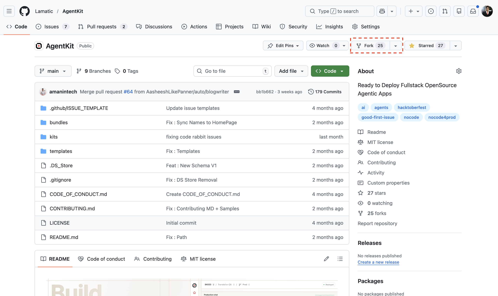

1. Go to [github.com/Lamatic/AgentKit](https://github.com/Lamatic/AgentKit)
2. Click the **Fork** button in the top-right corner

### 1.2 Clone Your Fork

```bash
git clone https://github.com/YOUR-USERNAME/AgentKit.git
cd AgentKit
```

### 1.3 Add Upstream Remote

```bash
git remote add upstream https://github.com/Lamatic/AgentKit.git
```

---

## Step 2: Build Your Kit in Lamatic

### 2.1 Sign In to Lamatic Studio

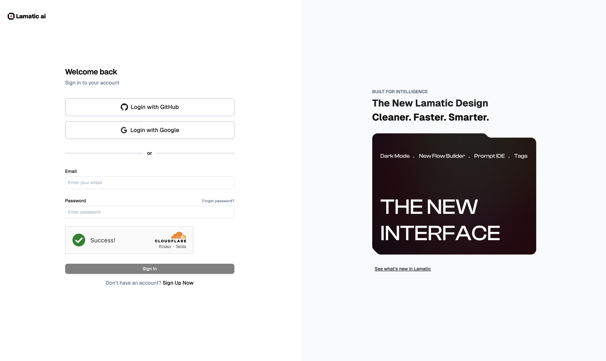

1. Go to [studio.lamatic.ai](https://studio.lamatic.ai)
2. Sign in or create a free account

### 2.2 Create a New Project

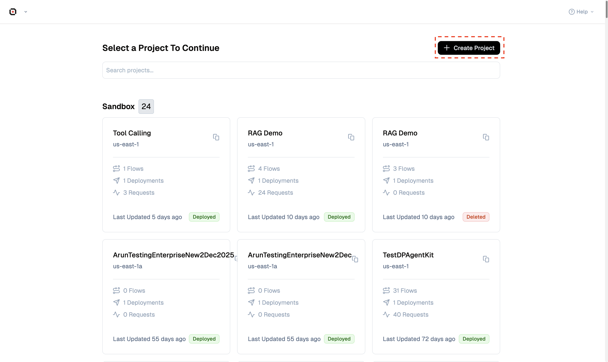

1. From the dashboard, click **"Create Project +"**
2. Enter a project name (e.g., "My Content Generator") and particulars
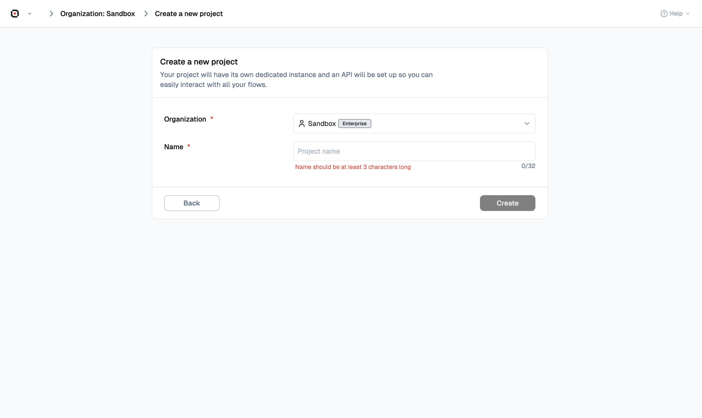
3. Click **"Create"**

### 2.3 Create a New Flow

1. Navigate: **Dashboard → Your Project** and select the project you created
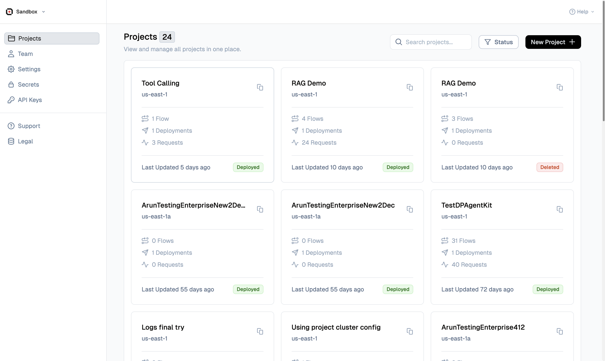

2. Click on **"+ Create"**
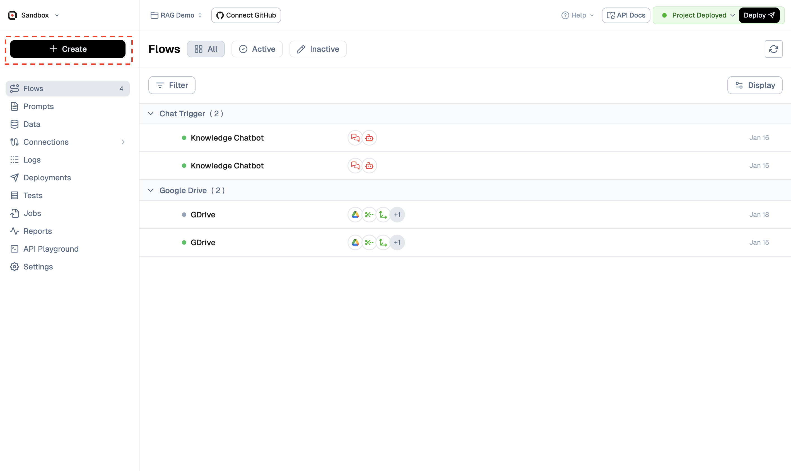

Choose your starting point:
- **Templates:** Select a pre-built template to customize
- **Flow:** Build a flow on the blank canvas

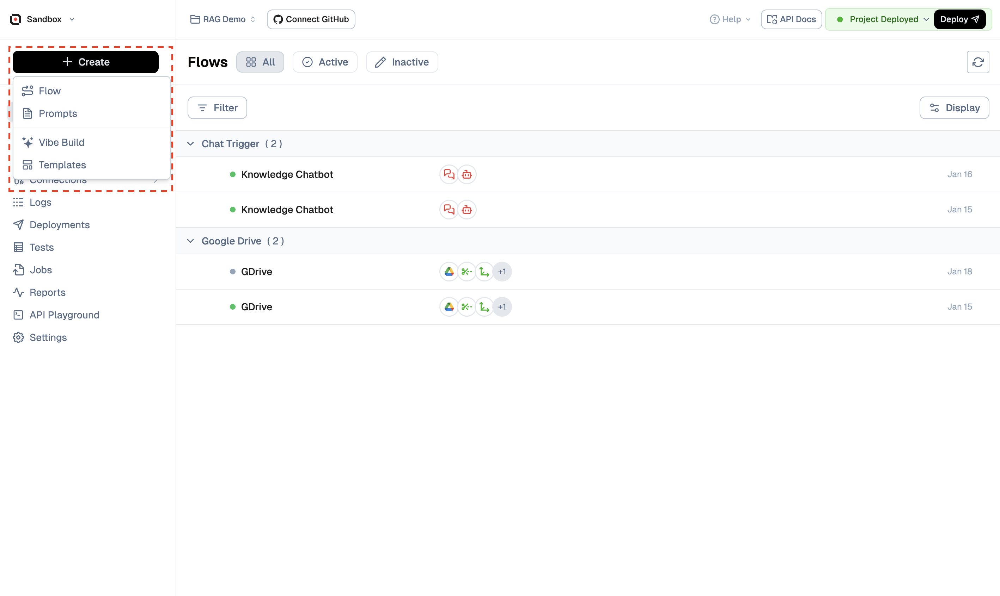

### 2.4 Configure Your Flow

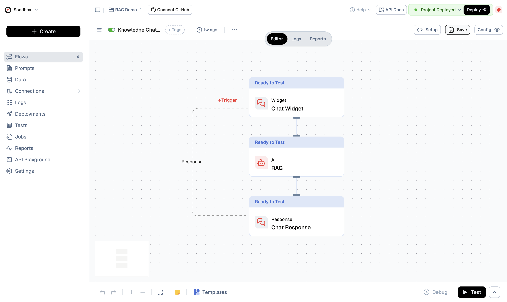

1. Add nodes for your workflow (triggers, LLM, conditions, etc.)
2. Configure providers and API integrations
3. Set up input/output schemas

### 2.5 Deploy Your Flow

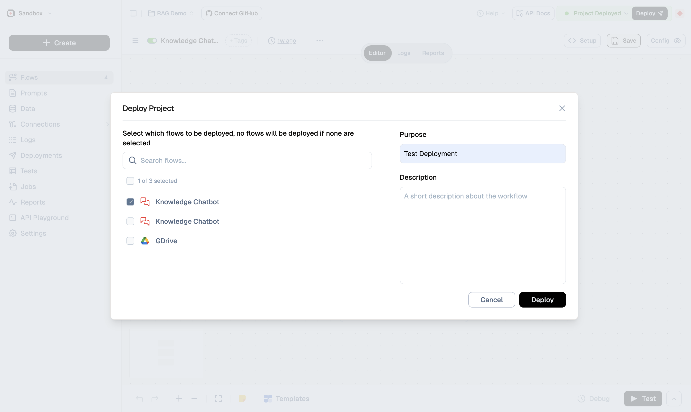

1. Click the **"Deploy"** button in the top-right corner
2. Select flows to deploy and wait for deployment to complete
3. You'll see a green "Deployed" status when ready

---

## Step 3: Export Your Kit

### 3.1 Get Your API Keys

Navigate: **Settings → API Keys** (in the left sidebar)
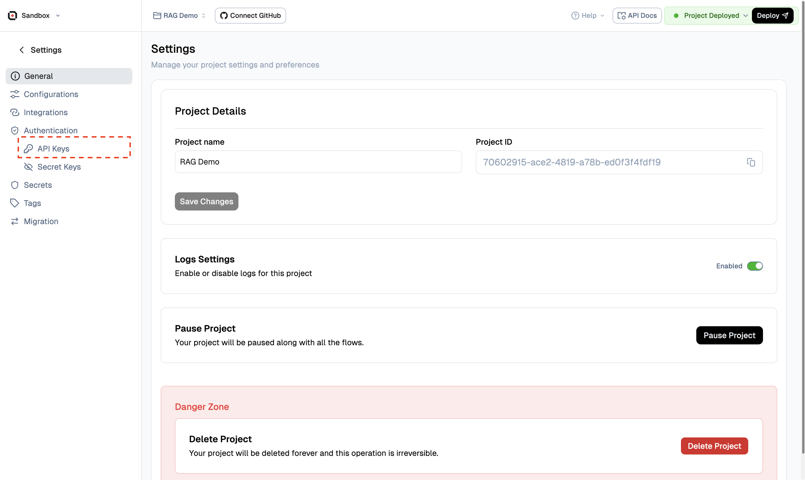

You'll need these values:

| Key | Where to Find It | Screenshot |
|-----|------------------|------------|
| `LAMATIC_API_KEY` | **Settings → API Keys → Copy** | 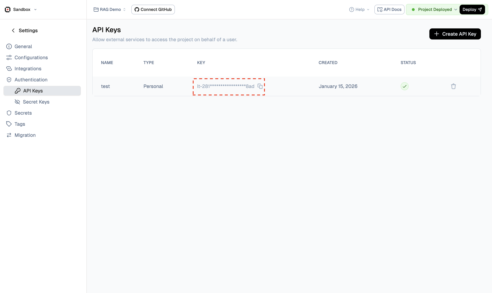 |
| `LAMATIC_PROJECT_ID` | **Settings → Project → Project ID** | 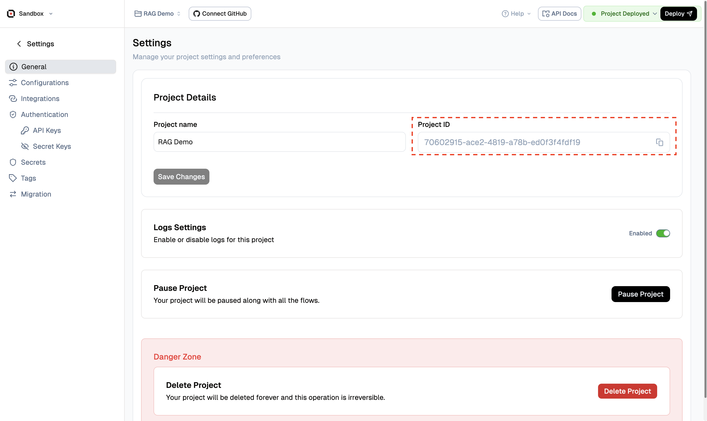 |
| `LAMATIC_API_URL` | **Settings → API Docs Button → API → Endpoint** |  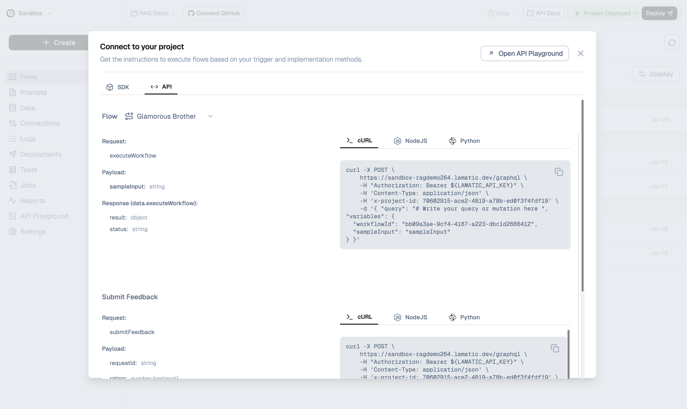 |


### 3.2 Get Your Flow ID

1. Open your deployed flow
2. Look at the URL or the flow details panel (three-dot menu)
3. Copy the **Flow ID** (e.g., `agentic-generate-content`)

Navigate: **Flow → Details Panel → Flow ID**
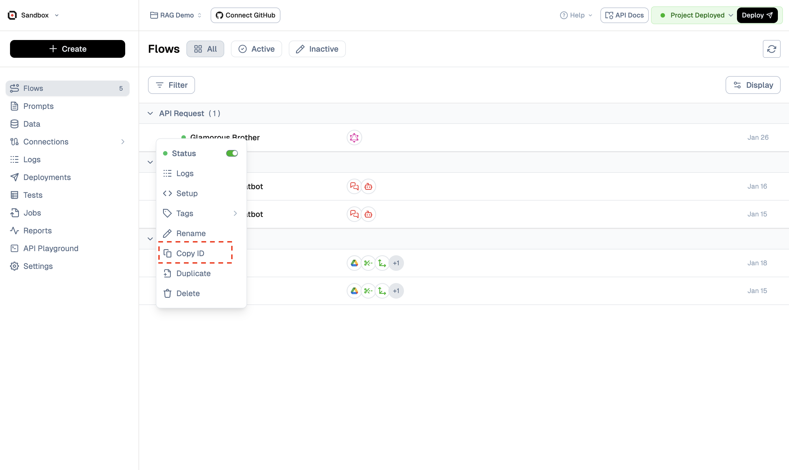

### 3.3 Export Your Flow Files

1. Open your flow in the editor
2. Click the **three-dot menu (⋮)** → **"Export"**
3. Download the exported `.json` files

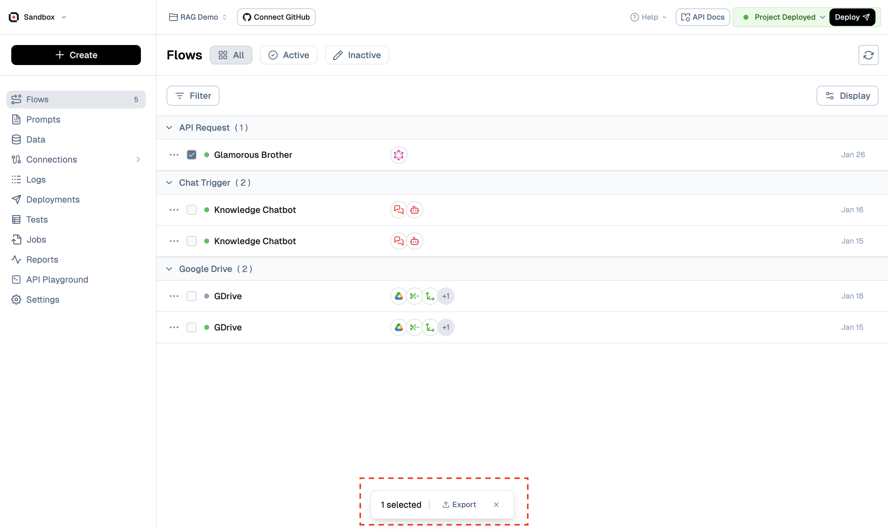

You should receive files like:
- `config.json` - Flow configuration
- `inputs.json` - Input schema
- `meta.json` - Flow metadata
- `README.md` - Auto-generated documentation

---

## Step 4: Create Your Kit Folder

### 4.1 Decide Your Contribution Type

| Type | When to Use | Folder Location |
|------|-------------|-----------------|
| **Kit** | Full project with UI, backend, configs | `kits/<category>/<kit-name>/` |
| **Bundle** | Multiple flows working together | `bundles/<bundle-name>/` |
| **Template** | Single flow, minimal setup | `templates/<template-name>/` |

### 4.2 Copy the Sample Template

For **Kits** (most common):

```bash
# Create your kit folder
mkdir -p kits/<category>/<kit-name>

# Copy the sample template
cp -R kits/sample/content-generation/* kits/<category>/<kit-name>/
```

**Categories:** `agentic`, `assistant`, `automation`, `embed`, or create a new relevant category.

### 4.3 Required Folder Structure (Kits)

Your kit folder should look like this:

```
kits/<category>/<kit-name>/
├── .env.example           # Environment variables template (NO SECRETS!)
├── .gitignore             # Git ignore rules
├── README.md              # Setup & usage instructions
├── config.json            # Kit metadata for the platform
├── package.json           # Dependencies & scripts
├── actions/
│   └── orchestrate.ts     # Server action calling Lamatic flows
├── app/
│   └── page.tsx           # Main UI page
├── components/
│   └── ...                # React components
├── flows/
│   └── <flow-name>/       # Exported flow from Lamatic
│       ├── config.json    # Flow configuration
│       ├── inputs.json    # Input schema
│       ├── meta.json      # Flow metadata
│       └── README.md      # Flow documentation
└── lib/
    └── lamatic-client.ts  # Lamatic SDK client
```

### 4.4 Update Required Files

#### `.env.example` — Environment template (commit this, NO secrets)

```env
AGENTIC_GENERATE_CONTENT = "YOUR_FLOW_ID"
LAMATIC_API_URL = "YOUR_API_ENDPOINT"
LAMATIC_PROJECT_ID = "YOUR_PROJECT_ID"
LAMATIC_API_KEY = "YOUR_API_KEY"
```

> 📎 **See example:** [kits/sample/content-generation/.env.example](./kits/sample/content-generation/.env.example)

#### `config.json` — Kit metadata

```json
{
    "name": "Your Kit Name",
    "description": "Brief description of what your kit does.",
    "tags": ["🤖 Agentic", "✨ Generative"],
    "author": {
        "name": "Your Name",
        "email": "your@email.com"
    },
    "steps": [
        {
            "id": "your-flow-id",
            "type": "mandatory",
            "envKey": "AGENTIC_GENERATE_CONTENT"
        }
    ],
    "integrations": [],
    "features": [],
    "demoUrl": "https://your-demo.vercel.app/",
    "githubUrl": "https://github.com/Lamatic/AgentKit/tree/main/kits/<category>/<kit-name>",
    "deployUrl": "",
    "documentationUrl": ""
}
```

> 📎 **See example:** [kits/sample/content-generation/config.json](./kits/sample/content-generation/config.json)

#### `README.md` — Setup instructions

Your README should include:
- What the kit does and the problem it solves
- Prerequisites and required providers
- Environment variables needed
- Setup and run instructions
- Usage examples
- Screenshots/GIFs (optional but recommended)

> 📎 **See example:** [kits/sample/content-generation/README.md](./kits/sample/content-generation/README.md)

### 4.5 Add Your Exported Flows

1. Create the flows directory:
   ```bash
   mkdir -p kits/<category>/<kit-name>/flows/<flow-name>
   ```

2. Copy your exported flow files into this folder:
   ```bash
   cp -R ~/Downloads/exported-flow/* kits/<category>/<kit-name>/flows/<flow-name>/
   ```

---

## Step 5: Run and Test Locally

> **ℹ️ This step applies to Kits only.** Bundles and Templates only contain flows—skip to Step 7.

### 5.1 Install Dependencies

```bash
cd kits/<category>/<kit-name>
npm install
```

### 5.2 Set Up Environment Variables

```bash
# Copy the example file
cp .env.example .env

# Edit with your actual values
nano .env   # or use any text editor
```

Fill in your actual values from Step 3:
```env
AGENTIC_GENERATE_CONTENT = "your-actual-flow-id"
LAMATIC_API_URL = "https://api.lamatic.ai/v1/..."
LAMATIC_PROJECT_ID = "proj_xxxxxxxxxxxx"
LAMATIC_API_KEY = "lam_xxxxxxxxxxxx"
```

### 5.3 Start Development Server

```bash
npm run dev
```

### 5.4 Test Your Kit

1. Open [http://localhost:3000](http://localhost:3000) in your browser
2. Test all functionality end-to-end
3. Verify your flow is being called correctly

---

## Step 6: Deploy to Vercel

> **ℹ️ This step applies to Kits only.**

### 6.1 Push Your Branch

```bash
git checkout -b feat/<kit-name>
git add .
git commit -m "feat: Add <kit-name> AgentKit"
git push origin feat/<kit-name>
```

### 6.2 Import to Vercel

1. Go to [vercel.com](https://vercel.com) and sign in
2. Click **"Add New..."** → **"Project"**
3. Select your forked repository

### 6.3 Configure Root Directory

**Important:** Set the root directory to your kit folder.

Navigate: **Configure Project → Root Directory**

Enter: `kits/<category>/<kit-name>`

### 6.4 Add Environment Variables

Navigate: **Configure Project → Environment Variables**

Add each variable from your `.env.example`:

| Name | Value |
|------|-------|
| `AGENTIC_GENERATE_CONTENT` | Your flow ID |
| `LAMATIC_API_URL` | Your API endpoint |
| `LAMATIC_PROJECT_ID` | Your project ID |
| `LAMATIC_API_KEY` | Your API key |

### 6.5 Deploy

1. Click **"Deploy"**
2. Wait for the build to complete
3. Test your live preview URL

---

## Step 7: Open a Pull Request

### 7.1 Create Your PR

1. Go to [github.com/Lamatic/AgentKit](https://github.com/Lamatic/AgentKit)
2. Click **"New Pull Request"**
3. Select your fork and branch
4. Add a clear title: `feat: Add <kit-name> AgentKit`

### 7.2 PR Description Template

```markdown
## What This Kit Does
Brief description of the kit's purpose and the problem it solves.

## Providers & Prerequisites
- List any external providers (e.g., OpenAI, Anthropic)
- Note any special setup required

## How to Run Locally
1. `cd kits/<category>/<kit-name>`
2. `npm install`
3. `cp .env.example .env` and fill in values
4. `npm run dev`

## Live Preview
https://your-kit.vercel.app

## Lamatic Flow
Flow ID: `your-flow-id`
```

### 7.3 PR Checklist

#### For Kits:
```markdown
- [ ] Kit runs locally with `npm run dev`
- [ ] `.env.example` has no secrets, only placeholders
- [ ] `README.md` documents setup and usage
- [ ] Folder structure follows `kits/<category>/<kit-name>/`
- [ ] `config.json` is present and valid
- [ ] All flows exported in `flows/` folder
- [ ] Vercel deployment works
- [ ] Live preview URL works end-to-end
```

#### For Bundles:
```markdown
- [ ] Folder structure follows `bundles/<bundle-name>/`
- [ ] `README.md` documents what the bundle does
- [ ] `config.json` is present with correct flow references
- [ ] All flows exported in `flows/` folder
- [ ] No secrets committed
```

#### For Templates:
```markdown
- [ ] Folder structure follows `templates/<template-name>/`
- [ ] All flow files from Lamatic export are present
- [ ] No secrets committed
```

---

## Examples & References

### Sample Kit

The best way to understand the expected structure is to explore the sample kit:

| File | Description |
|------|-------------|
| [Sample Kit Folder](./kits/sample/content-generation/) | Complete working example |
| [config.json](./kits/sample/content-generation/config.json) | Kit metadata format |
| [.env.example](./kits/sample/content-generation/.env.example) | Environment variables template |
| [README.md](./kits/sample/content-generation/README.md) | Documentation template |
| [orchestrate.ts](./kits/sample/content-generation/actions/orchestrate.ts) | Flow orchestration example |
| [flows/](./kits/sample/content-generation/flows/) | Exported flow structure |

---

## Troubleshooting

### Common Issues

| Problem | Solution |
|---------|----------|
| `npm run dev` fails | Check Node.js version: `node --version` (needs 18+) |
| Flow not responding | Verify `.env` values match your deployed flow |
| "API key invalid" error | Check `LAMATIC_API_KEY` is correct |
| Missing flows folder | Re-export flows from Lamatic Studio |
| Vercel build fails | Ensure root directory is set correctly |

### Getting Help

1. Check [existing issues](https://github.com/Lamatic/AgentKit/issues)
2. Ask in [GitHub Discussions](https://github.com/Lamatic/AgentKit/discussions)
3. Review [Lamatic Docs](https://lamatic.ai/docs)

---

## General Guidelines

### Coding Standards
- Write clear, maintainable code
- Use TypeScript where possible
- Follow patterns from the sample kit
- Keep dependencies minimal
- Add comments for complex logic

### Before You Contribute
- Check if a similar kit already exists
- Search open issues to avoid duplicates
- Review this guide completely

### Reporting Bugs
Include:
- Steps to reproduce
- Expected vs. actual behavior
- Environment (Node.js version, OS)
- Relevant logs or screenshots

---

## Community & Support

- **GitHub Discussions:** [github.com/Lamatic/AgentKit/discussions](https://github.com/Lamatic/AgentKit/discussions)
- **Issues:** [github.com/Lamatic/AgentKit/issues](https://github.com/Lamatic/AgentKit/issues)
- **Lamatic Docs:** [lamatic.ai/docs](https://lamatic.ai/docs)

---

We appreciate your contributions to Lamatic AgentKit! 🚀