# Contributing to Lamatic AgentKit

Thank you for your interest in improving AgentKit! This guide walks you through building flows in Lamatic, exporting them, and contributing kits, bundles, or templates to the repository.

---

## Table of Contents

- [Quick Start (TL;DR)](#quick-start-tldr)
- [Prerequisites](#prerequisites)
- [Step 1: Fork the Repository](#step-1-fork-the-repository)
- [Step 2: Build Your Flow in Lamatic](#step-2-build-your-flow-in-lamatic)
- [Step 3: Export Your Flow](#step-3-export-your-flow)
- [Choose Your Contribution Type](#choose-your-contribution-type)
- [Examples & References](#examples--references)
- [Troubleshooting](#troubleshooting)
- [General Guidelines](#general-guidelines)
- [Community & Support](#community--support)

---

## Quick Start (TL;DR)

1. **Fork** the [AgentKit repository](https://github.com/Lamatic/AgentKit)
2. **Build & Deploy** your flow in [Lamatic Studio](https://studio.lamatic.ai)
3. **Export** your flow files and API keys
4. **Follow** the guide for your contribution type: [Kit](contributing/kit-contribution.md) · [Bundle](contributing/bundle-contribution.md) · [Template](contributing/template-contribution.md)
5. **Test** your contribution, then **submit a PR**

---

## Prerequisites

| Tool | Version | Installation |
|------|---------|--------------|
| Node.js | 18+ | [nodejs.org](https://nodejs.org) |
| npm | 9+ | Comes with Node.js |
| Git | Latest | [git-scm.com](https://git-scm.com) |
| GitHub Account | - | [github.com](https://github.com) |
| Lamatic Account | - | [lamatic.ai](https://lamatic.ai) |
| Vercel Account | - | [vercel.com](https://vercel.com) *(optional, for kit deployment)* |

> Node.js and npm are only required for **kit** contributions. Bundles and templates are flow-only.

---

## Step 1: Fork the Repository

> **This is the standard first step for any open source contribution.**

### 1.1 Fork on GitHub


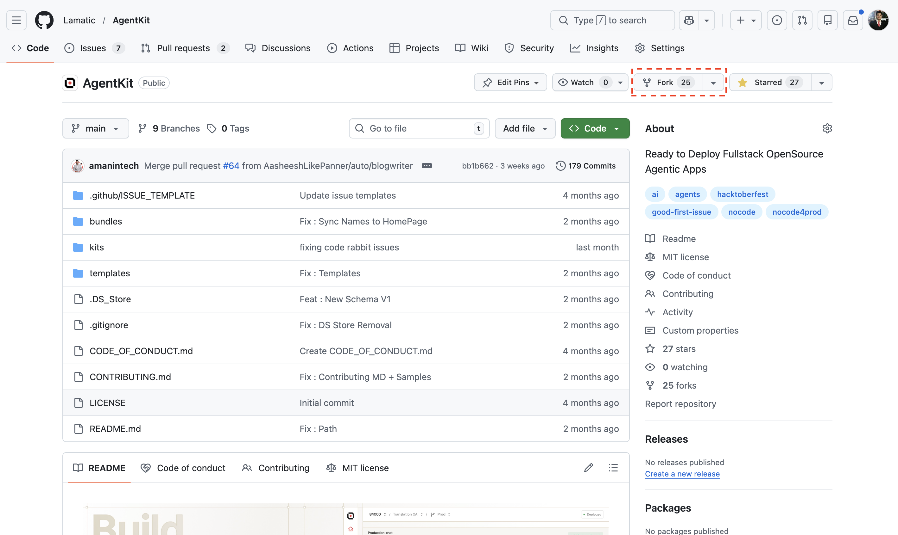

1. Go to [github.com/Lamatic/AgentKit](https://github.com/Lamatic/AgentKit)
2. Click the **Fork** button in the top-right corner

### 1.2 Clone Your Fork

```bash
git clone https://github.com/YOUR-USERNAME/AgentKit.git
cd AgentKit
```

### 1.3 Add Upstream Remote

```bash
git remote add upstream https://github.com/Lamatic/AgentKit.git
```

---

## Step 2: Build Your Flow in Lamatic

### 2.1 Sign In to Lamatic Studio

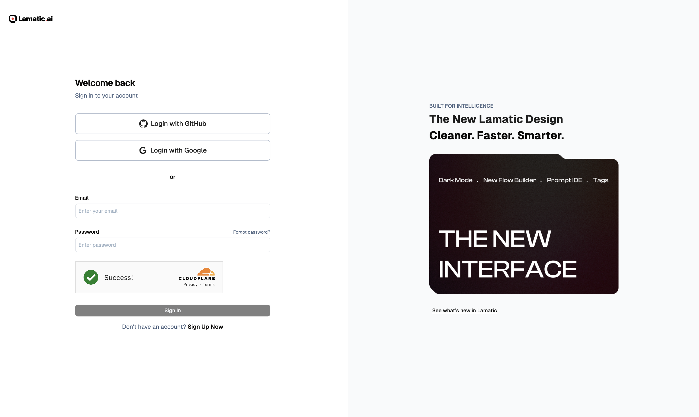

1. Go to [studio.lamatic.ai](https://studio.lamatic.ai)
2. Sign in or create a free account

### 2.2 Create a New Project

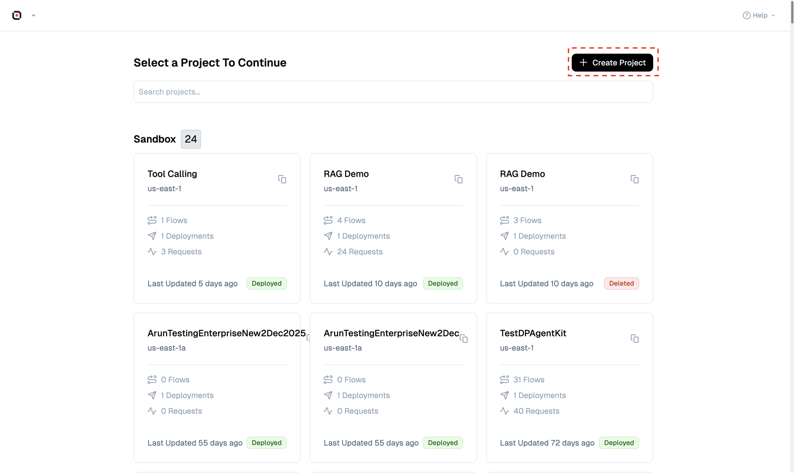

1. From the dashboard, click **"Create Project +"**
2. Enter a project name (e.g., "My Content Generator") and particulars
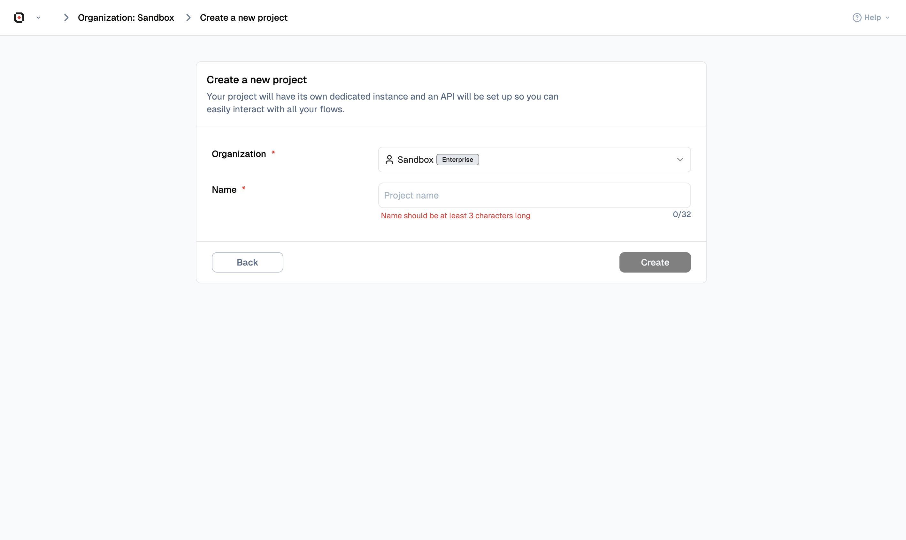
3. Click **"Create"**

### 2.3 Create a New Flow

1. Navigate: **Dashboard → Your Project** and select the project you created
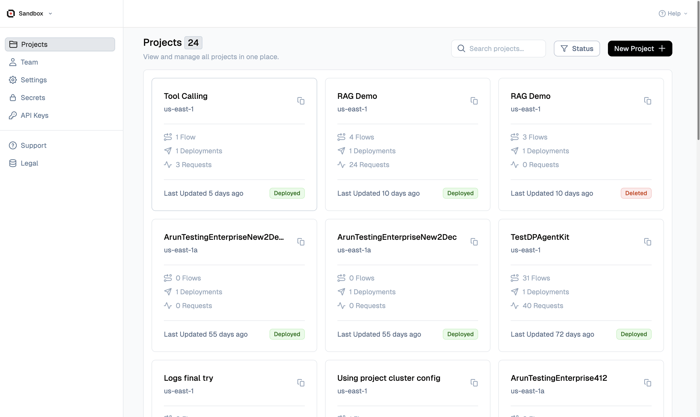

2. Click on **"+ Create"**
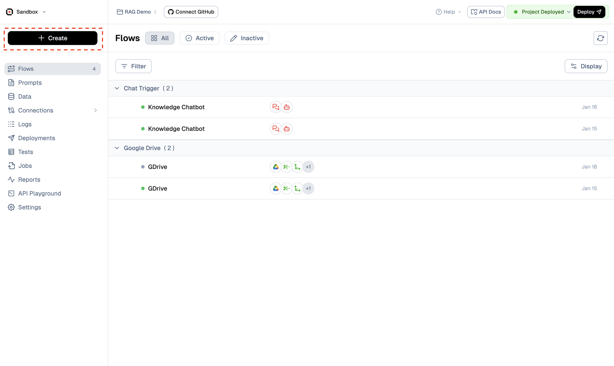

Choose your starting point:
- **Templates:** Select a pre-built template to customize
- **Flow:** Build a flow on the blank canvas

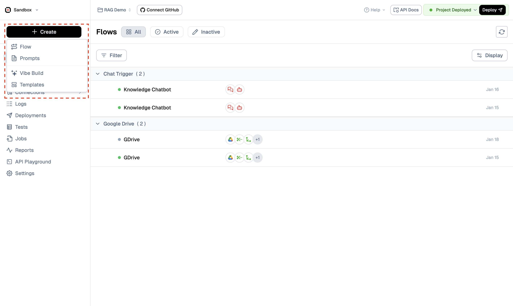

### 2.4 Configure Your Flow

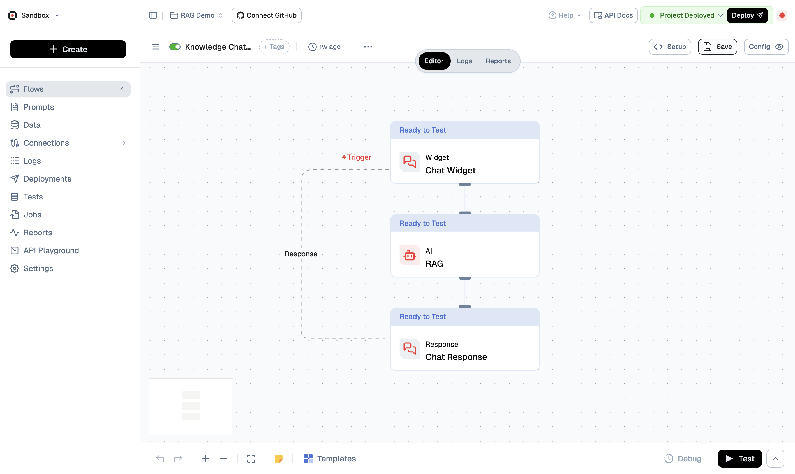

1. Add nodes for your workflow (triggers, LLM, conditions, etc.)
2. Configure providers and API integrations
3. Set up input/output schemas

### 2.5 Deploy Your Flow

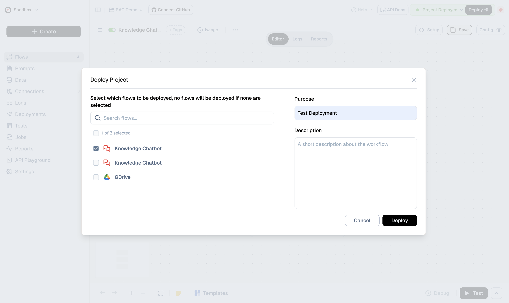

1. Click the **"Deploy"** button in the top-right corner
2. Select flows to deploy and wait for deployment to complete
3. You'll see a green "Deployed" status when ready

---

## Step 3: Export Your Flow

### 3.1 Get Your API Keys

Navigate: **Settings → API Keys** (in the left sidebar)
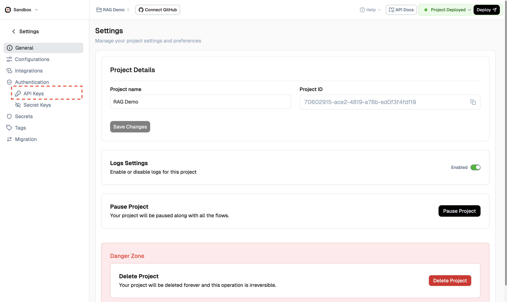

You'll need these values:

| Key | Where to Find It | Screenshot |
|-----|------------------|------------|
| `LAMATIC_API_KEY` | **Settings → API Keys → Copy** | 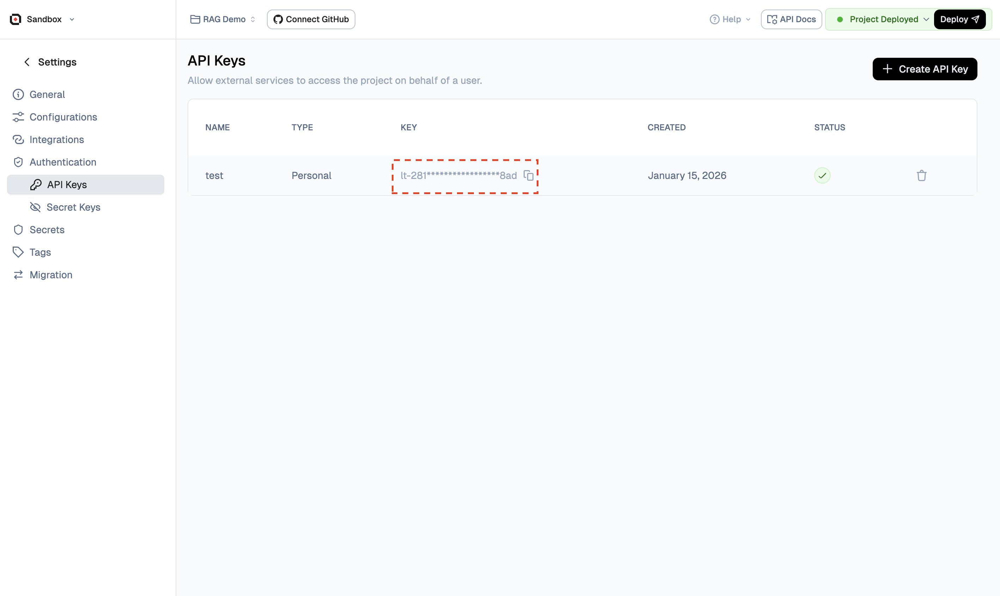 |
| `LAMATIC_PROJECT_ID` | **Settings → Project → Project ID** | 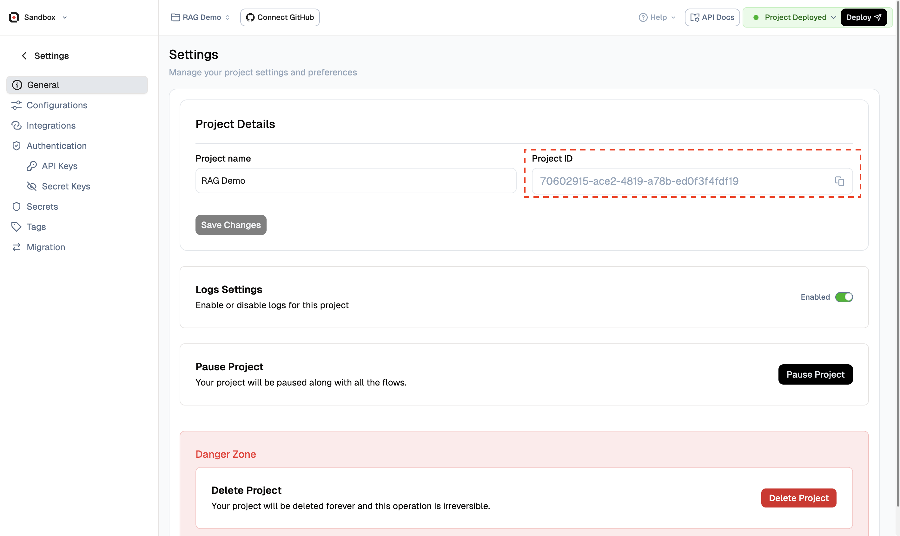 |
| `LAMATIC_API_URL` | **Settings → API Docs Button → API → Endpoint** |  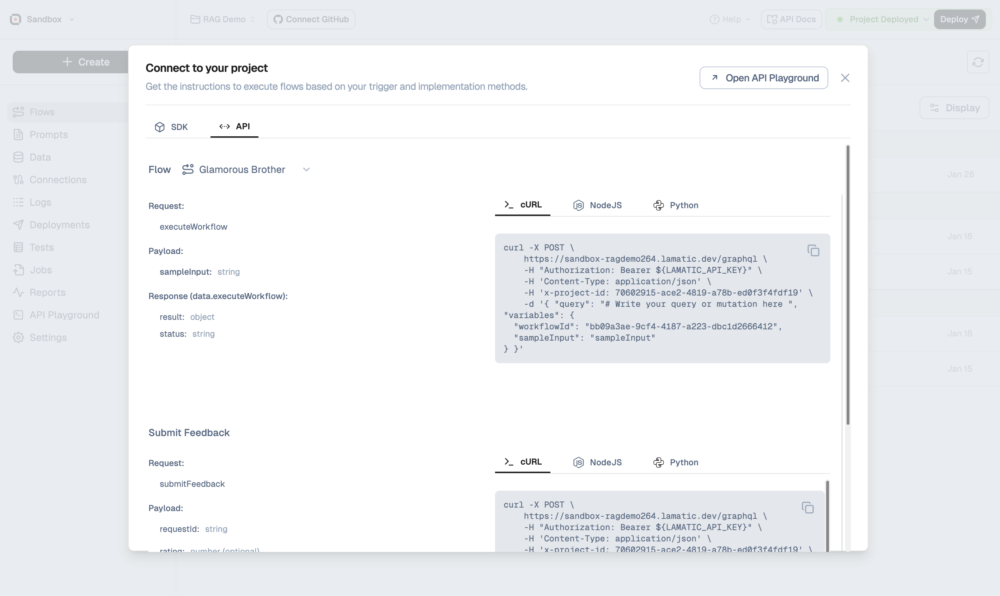 |


### 3.2 Get Your Flow ID

1. Open your deployed flow
2. Look at the URL or the flow details panel (three-dot menu)
3. Copy the **Flow ID** (e.g., `agentic-generate-content`)

Navigate: **Flow → Details Panel → Flow ID**
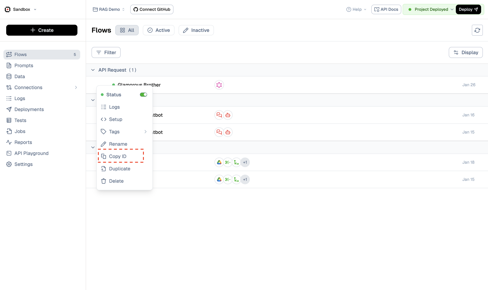

### 3.3 Export Your Flow Files

1. Open your flow in the editor
2. Click the **three-dot menu (⋮)** → **"Export"**
3. Download the exported `.json` files

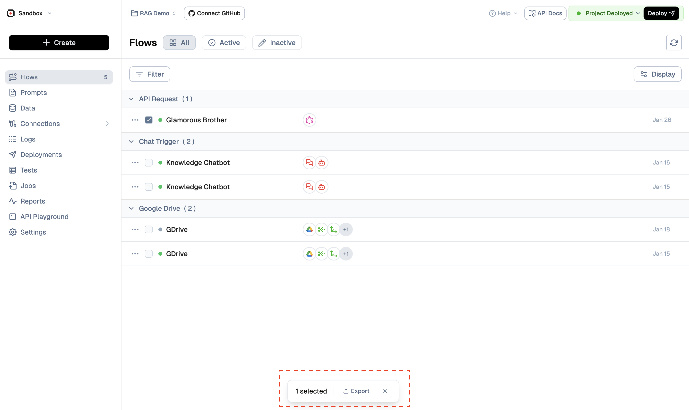

You should receive files like:
- `config.json` - Flow configuration
- `inputs.json` - Input schema
- `meta.json` - Flow metadata
- `README.md` - Auto-generated documentation

---

## Choose Your Contribution Type

Now that you've forked the repo, built your flow, and exported your files, follow the guide for your contribution type.

> Not sure which type to choose? Read the [Quickstart Guide](contributing/quickstart.md) for a detailed comparison and decision guide.

| Type | What it is | When to Use | Guide |
|------|-----------|-------------|-------|
| **Kit** | Full project with UI + flows | You built a complete Next.js app with one or more Lamatic flows | [Kit Contribution Guide](contributing/kit-contribution.md) |
| **Bundle** | Multiple related flows | You have several flows that work together (no web app) | [Bundle Contribution Guide](contributing/bundle-contribution.md) |
| **Template** | Single flow export | You have one flow to share with the community | [Template Contribution Guide](contributing/template-contribution.md) |

Each guide covers folder structure, required files, configuration, and PR checklists specific to that contribution type.

---

## Examples & References

### Sample Kit

| Resource | Description |
|----------|-------------|
| [Sample Kit Folder](./kits/sample/content-generation/) | Complete working kit example |
| [Kit config.json](./kits/sample/content-generation/config.json) | Kit metadata format |
| [.env.example](./kits/sample/content-generation/.env.example) | Environment variables template |
| [orchestrate.ts](./kits/sample/content-generation/actions/orchestrate.ts) | Flow orchestration example |

### Sample Bundle

| Resource | Description |
|----------|-------------|
| [Sample Bundle Folder](./bundles/sample/chatbot/) | Complete working bundle example |
| [Bundle config.json](./bundles/sample/chatbot/config.json) | Bundle metadata with step types |

### Sample Template

| Resource | Description |
|----------|-------------|
| [Get Started Template](./templates/get-started/) | Basic single-flow example |
| [Template meta.json](./templates/get-started/meta.json) | Flow metadata format |

---

## Troubleshooting

### Common Issues

| Problem | Solution |
|---------|----------|
| `npm run dev` fails | Check Node.js version: `node --version` (needs 18+) |
| Flow not responding | Verify `.env` values match your deployed flow |
| "API key invalid" error | Check `LAMATIC_API_KEY` is correct |
| Missing flows folder | Re-export flows from Lamatic Studio |
| Vercel build fails | Ensure root directory is set correctly |

### Getting Help

1. Check [existing issues](https://github.com/Lamatic/AgentKit/issues)
2. Ask in [GitHub Discussions](https://github.com/Lamatic/AgentKit/discussions)
3. Review [Lamatic Docs](https://lamatic.ai/docs)

---

## General Guidelines

### Coding Standards
- Write clear, maintainable code
- Use TypeScript where possible
- Follow patterns from the sample kit
- Keep dependencies minimal
- Add comments for complex logic

### Before You Contribute
- Check if a similar kit/bundle/template already exists
- Search open issues to avoid duplicates
- Review this guide completely

### Reporting Bugs
Include:
- Steps to reproduce
- Expected vs. actual behavior
- Environment (Node.js version, OS)
- Relevant logs or screenshots

---

## Community & Support

- **GitHub Discussions:** [github.com/Lamatic/AgentKit/discussions](https://github.com/Lamatic/AgentKit/discussions)
- **Issues:** [github.com/Lamatic/AgentKit/issues](https://github.com/Lamatic/AgentKit/issues)
- **Lamatic Docs:** [lamatic.ai/docs](https://lamatic.ai/docs)

---

We appreciate your contributions to Lamatic AgentKit!