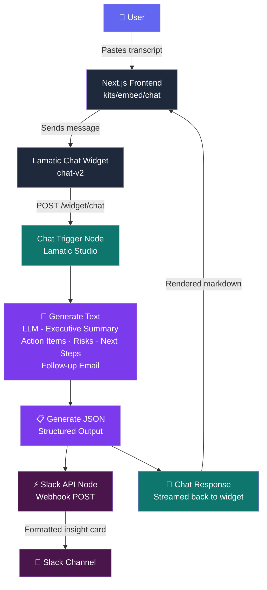

# 🧠 AI Meeting Intelligence Copilot

[](https://github.com/Lamatic/AgentKit/pulls?q=label:agentkit-challenge)
[](https://lamatic.ai)
[](https://nextjs.org)
[](https://slack.com)
[](https://vercel.com)

> **Turn raw meeting transcripts into structured, actionable intelligence — automatically delivered to Slack.**

Built by [Vijayshree Vaibhav](https://github.com/vijayshreepathak).

---

## 🎯 Problem Statement

Teams walk out of meetings with scattered notes, untracked action items, and unclear ownership. Critical insights get lost in long conversation threads. Following up manually is slow and inconsistent.

**This agent solves it in one step:** paste a meeting transcript → receive a structured summary, action items, risks, next steps, and a follow-up email draft — all delivered to Slack automatically.

---

## ✨ What It Does

| Input | Output |
|---|---|
| Raw meeting transcript | Executive summary |
| Any language, any format | Action items with owners |
| Paste or type directly | Risks & blockers |
| | Suggested next steps |
| | Follow-up email draft |
| | Slack notification ⚡ |

---

## 🏗️ Architecture



**Flow inside Lamatic Studio:**

```
Chat Widget ──▶ Generate Text (LLM) ──▶ Generate JSON
                                               │
                              ┌────────────────┤
                              ▼                ▼
                          Slack API      Chat Response
                         (Webhook)     (back to user)
```

---

## 📸 Screenshots

### Live Web App — Transcript Input & Structured Output


### Lamatic Studio — Flow Execution & Preview


### Slack Integration — Auto-delivered Insights


### Frontend Landing Page


---

## 🛠️ Tech Stack

| Layer | Technology |
|---|---|
| Frontend | Next.js 14 (App Router) |
| UI | Tailwind CSS + shadcn/ui |
| AI Workflow | Lamatic Studio |
| Chat Widget | Lamatic `chat-v2` embedded widget |
| LLM | Configured in Lamatic (GPT-4o / Claude) |
| Integrations | Slack Incoming Webhooks |
| Deployment | Vercel |

---

## ⚙️ Quick Start

### 1. Clone

```bash
git clone https://github.com/vijayshreepathak/AgentKit.git
cd AgentKit/kits/embed/chat
```

### 2. Install

```bash
npm install
```

### 3. Configure environment

Create `.env.local` inside `kits/embed/chat/`:

```env
NEXT_PUBLIC_LAMATIC_PROJECT_ID=your_project_id
NEXT_PUBLIC_LAMATIC_FLOW_ID=your_flow_id
NEXT_PUBLIC_LAMATIC_API_URL=https://your-project.lamatic.dev
```

Get these values from your Lamatic Studio project settings.

### 4. Run

```bash
npm run dev
# → http://localhost:3000
```

---

## 🔧 Lamatic Studio Setup

### Flow Structure

Build this flow in [Lamatic Studio](https://studio.lamatic.ai):

```
[Chat Trigger] → [Generate Text] → [Generate JSON] → [Slack API]
                                                    → [Chat Response]
```

### Chat Trigger Configuration

1. Open your flow → click the **Chat Trigger** node
2. Under **Allowed Domains**, add `*` (for development) or your production domain
3. Click **Save** → **Deploy**

### Generate Text Prompt (LLM Node)

```
You are an AI Meeting Intelligence Copilot. Analyze this meeting transcript and produce:

## Executive Summary
[2-3 sentence summary of the meeting]

## Action Items
- **[Owner]:** [Task] — due [date if mentioned]

## Risks & Blockers
- [Risk or blocker identified]

## Next Steps
- [Recommended follow-up action]

## Follow-up Email Draft
Subject: [Meeting Topic] — Decisions & Next Steps
[Professional email body]

Meeting transcript:
{{trigger.chatMessage}}
```

### Slack Webhook

1. Create an [Incoming Webhook](https://api.slack.com/messaging/webhooks) in your Slack workspace
2. Add the webhook URL to the **API Node** in Lamatic
3. The agent automatically sends the structured output to your channel

---

## 🚀 Deploy to Vercel

[](https://vercel.com/new/clone?repository-url=https://github.com/vijayshreepathak/AgentKit&root-directory=kits/embed/chat&env=NEXT_PUBLIC_LAMATIC_PROJECT_ID,NEXT_PUBLIC_LAMATIC_FLOW_ID,NEXT_PUBLIC_LAMATIC_API_URL&envDescription=Lamatic%20project%20credentials&envLink=https://lamatic.ai)

After clicking Deploy:
1. Fill in the three env vars from your Lamatic Studio
2. Vercel builds and deploys automatically
3. Add your Vercel production URL to the Chat Trigger's allowed domains in Lamatic

---

## 📁 Project Structure

```
kits/embed/chat/
├── app/
│   ├── page.js                    # Landing page (Server Component)
│   ├── layout.js                  # Root layout with fonts + analytics
│   ├── globals.css                # Tailwind v4 + CSS variables
│   └── Screenshots/               # Demo screenshots
├── components/
│   ├── LamaticChat.js             # Lamatic widget lifecycle manager
│   ├── HeroActions.jsx            # CTA buttons (Client Component)
│   ├── TranscriptPlayground.jsx   # Transcript input + analyze flow
│   └── ui/                        # shadcn/ui components
├── flows/
│   └── embedded-chatbot-chatbot/  # Exported Lamatic flow config
├── .env.local                     # Local env vars (not committed)
└── package.json
```

---

## 💡 Key Engineering Decisions

**Why `data-*` attributes on the root div?**
The Lamatic `chat-v2` widget reads `data-api-url`, `data-flow-id`, and `data-project-id` from `#lamatic-chat-root` at initialization. These must be set before the script runs.

**Why bootstrap on mount (not on button click)?**
The widget fetches `chatConfig` and creates an IndexedDB session on init. Bootstrapping early means the session is ready before the user sends their first message — preventing "unexpected error" on first send.

**Why not remove the root on unmount?**
The Lamatic widget uses IndexedDB with the session key as a primary key. Removing + re-adding the root causes a `ConstraintError: Key already exists` because the old session record is still in the database. The root is intentionally a page-lifetime singleton.

---

## 🔮 Future Improvements

- [ ] Audio/video transcript upload (Whisper transcription)
- [ ] Multi-language meeting support
- [ ] Meeting history dashboard
- [ ] Calendar integration (Google Meet / Zoom auto-fetch)
- [ ] Team analytics on action item completion rates
- [ ] Export to Notion / Confluence

---

## 👩‍💻 Author

**Vijayshree Vaibhav**

[](https://www.linkedin.com/in/vijayshreevaibhav/)
[](https://github.com/vijayshreepathak)

---

## 📜 License

MIT — see [LICENSE](./LICENSE).
