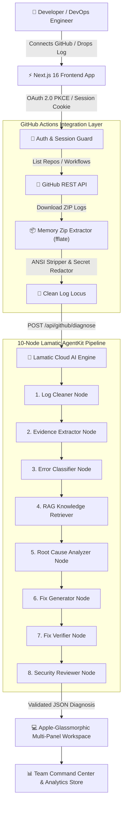

# ⚡ Lamatic AgentKit — AI CI/CD Diagnosis Agent & Command Center

[](https://lamatic.ai)
[](https://nextjs.org)
[](https://www.typescriptlang.org)
[](LICENSE)
[](https://github.com/pawanchhimwal/AgentKit)

An enterprise-grade, autonomous AI CI/CD Diagnosis Agent built with **Lamatic AgentKit**, **Next.js**, **TypeScript**, and **Gemini**. Automatically retrieves failing GitHub Actions workflow execution logs, sanitizes credentials in memory, isolates failure loci, and executes a 10-node RAG diagnostic pipeline to deliver verified root causes, code fixes, and security reviews.
here's link to ci/cd diagnosis https://agent-kit-zeta.vercel.app/

---

## 📸 Architecture & Workflow Overview


```mermaid
graph TD
    A["👤 Developer / DevOps Engineer"] -->|Connects GitHub / Drops Log| B["⚡ Next.js 16 Frontend App"]
    B -->|OAuth 2.0 PKCE / Session Cookie| C["🔑 Auth & Session Guard"]
    
    subgraph GitHub Actions Integration Layer
        C -->|List Repos / Workflows| D["🐙 GitHub REST API"]
        D -->|Download ZIP Logs| E["📦 Memory Zip Extractor (fflate)"]
        E -->|ANSI Stripper & Secret Redactor| F["🧹 Clean Log Locus"]
    end

    subgraph 10-Node Lamatic AgentKit Pipeline
        F -->|POST /api/github/diagnose| G["🧠 Lamatic Cloud AI Engine"]
        G --> H["1. Log Cleaner Node"]
        H --> I["2. Evidence Extractor Node"]
        I --> J["3. Error Classifier Node"]
        J --> K["4. RAG Knowledge Retriever"]
        K --> L["5. Root Cause Analyzer Node"]
        L --> M["6. Fix Generator Node"]
        M --> N["7. Fix Verifier Node"]
        N --> O["8. Security Reviewer Node"]
    end

    O -->|Validated JSON Diagnosis| P["💻 Apple-Glassmorphic Multi-Panel Workspace"]
    P --> Q["📊 Team Command Center & Analytics Store"]
```

---

## 🌟 Key Features

1. **⚡ One-Click Automated GitHub Actions Diagnosis**:
   - OAuth 2.0 PKCE security with AES-256-GCM sealed cookies.
   - Fetches and decompresses GitHub Action `.zip` logs directly in RAM (zero temporary disk footprint).
2. **🖥️ Copilot-Style Multi-Panel Debugging Workspace**:
   - **Left Sidebar**: Branch, 7-char SHA, runner environment, duration, and actor avatar.
   - **Center Panel**: Confidence Ring (`100% Verified`), Root Cause summary, Failure Chronology, and isolated evidence.
   - **Right Panel**: Syntax-highlighted code fixes with **Copy Code**, Security Review, and RAG Knowledge Base guides.
   - **Bottom Log Explorer**: Collapsible raw terminal log viewer with line numbers, search, and error syntax highlighting.
3. **📊 Team Command Center & Audit Log**:
   - Repository health status, failure frequency breakdown, bookmarking, and side-by-side failure comparison.
4. **📥 Multi-Format Report Export**:
   - One-click export to Markdown (`.md`), JSON (`.json`), Plain Text, or copyable Slack/GitHub PR comment text.
5. **🛡️ Security & Production Hardened**:
   - OWASP HTTP security headers, sliding-window rate limiting, structured JSON logging, and `/api/health` probes.

---

## 📂 Repository Structure

```
AgentKit/
├── kits/
│   └── ci-cd-diagnosis-agent/
│       └── apps/                      # Next.js 16 Production Application
│           ├── app/
│           │   ├── api/
│           │   │   ├── auth/          # GitHub OAuth 2.0 PKCE Routes
│           │   │   ├── github/        # Repos, Workflows, Runs & Diagnosis Proxy
│           │   │   ├── diagnose/      # Manual Log Upload AI Endpoint
│           │   │   └── health/        # Live System Health Probe (GET /api/health)
│           │   └── page.tsx           # Main App Route
│           ├── components/
│           │   ├── dashboard/         # Team Command Center, Metrics & Compare Modal
│           │   ├── github/            # Repo Selector & Workflow List Components
│           │   ├── workspace/         # Multi-Panel AI Debugging Workspace Panels
│           │   └── system-health-modal.tsx
│           ├── lib/
│           │   ├── auth/              # OAuth PKCE & AES-256-GCM Session Helpers
│           │   ├── github/            # REST API Client & Log Extractor/Sanitizer
│           │   ├── history/           # Persistent History & Bookmarking Store
│           │   ├── observability/     # Structured JSON Logger
│           │   ├── security/          # Rate Limiting Guard
│           │   └── types.ts           # Zod Schemas & TypeScript Models
│           ├── next.config.js         # OWASP Security Headers
│           └── package.json
├── docs/                              # Architecture, API & Presentation Guides
├── README.md
├── CONTRIBUTING.md
├── SECURITY.md
├── CHANGELOG.md
├── CODE_OF_CONDUCT.md
└── LICENSE
```

---

## 🚀 Quickstart & Setup Guide

### 1. Clone & Install
```bash
git clone https://github.com/pawanchhimwal/AgentKit.git
cd AgentKit/kits/ci-cd-diagnosis-agent/apps
npm install
```

### 2. Configure `.env.local`
```env
LAMATIC_API_URL=https://pawansorganization931-soc2readinessauditor578.lamatic.dev
LAMATIC_API_KEY=your_lamatic_api_key

GITHUB_CLIENT_ID=your_github_client_id
GITHUB_CLIENT_SECRET=your_github_client_secret
SESSION_SECRET=32_character_random_secret_string
```

### 3. Start Application
```bash
npm run dev
```
Open [http://localhost:3000](http://localhost:3000) in your browser.

---

## 📚 Documentation Links

- 📖 [Architecture Documentation](docs/architecture-documentation.md)
- 📡 [API Endpoint Reference](docs/api-documentation.md)
- 🚀 [Deployment Guide](docs/deployment-guide.md)
- 🏆 [Lamatic Challenge Presentation Script](docs/demo-script-and-submission-guide.md)
- 📋 [Open Source & Challenge Readiness Report](docs/open-source-and-challenge-readiness-report.md)

---

## 📜 License

Distributed under the **MIT License**. See [LICENSE](LICENSE) for details.
