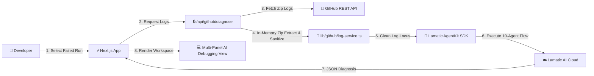

# 🏗️ Technical Architecture Documentation

This document describes the end-to-end technical architecture, component design, data flow, security model, and performance strategy for the **AgentKit CI/CD Diagnosis Agent**.

---

## 1. High-Level Architecture Overview

The system is built as a Next.js 16 App Router application integrated with **Lamatic AgentKit Cloud Studio**, GitHub OAuth 2.0 PKCE authentication, and GitHub Actions REST APIs.

---

## 2. In-Memory Log Retrieval & Sanitization Engine

To maintain enterprise security compliance and prevent temporary disk vulnerability leaks, all log processing takes place strictly in RAM:

1. **ZIP Download**: Raw ZIP logs are retrieved from GitHub as `ArrayBuffer` binaries.
2. **Streaming Decompression**: `fflate.unzipSync()` unpacks files directly into memory buffers.
3. **Failure Isolation**: Scans step filenames and contents for failure keywords (`exit code 137`, `FATAL`, `Killed`, `##[error]`).
4. **ANSI Removal**: Regex `/\u001b\[[0-9;]*[a-zA-Z]/g` strips terminal color codes.
5. **Secret Redaction**: Redacts AWS access keys (`AKIA...`), GitHub PATs (`ghp_...`), and Bearer tokens.
6. **Locus Truncation**: Truncates log locus to 10,000 characters to fit within context limits.

---

## 3. 10-Node Lamatic AgentKit Workflow Flow

The diagnosis engine executes across 10 specialized agent nodes inside Lamatic Studio:

1. **Log Cleaner Node**: Normalizes stack traces and strips progress spinners.
2. **Evidence Extractor Node**: Isolates precise failure lines.
3. **Error Classifier Node**: Categorizes failure (Infrastructure, Dependencies, Code Syntax, Test Failure).
4. **RAG Knowledge Retriever**: Queries vector knowledge base for known fixes.
5. **Root Cause Analyzer Node**: Synthesizes root cause explanation.
6. **Fix Generator Node**: Generates code patches.
7. **Fix Verifier Node**: Validates code patch correctness.
8. **Security Reviewer Node**: Audits code patch for security implications.

---

## 4. Security & Cryptographic Model

- **Session Security**: Sealed cookies using **AES-256-GCM** authenticated encryption with random IVs.
- **CSRF Protection**: OAuth `state` parameter generated with `crypto.randomBytes(32)` stored in HTTP-only `SameSite=Lax` cookies.
- **Rate Limiting**: Sliding-window rate limiter protecting API endpoints against DDoS attacks.
- **OWASP Headers**: Enforces `X-Frame-Options: DENY`, `X-Content-Type-Options: nosniff`, and `Referrer-Policy`.
