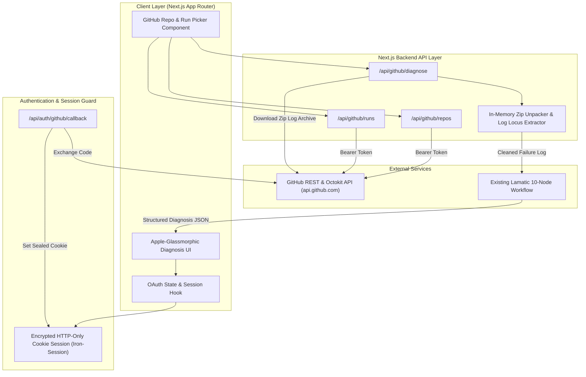
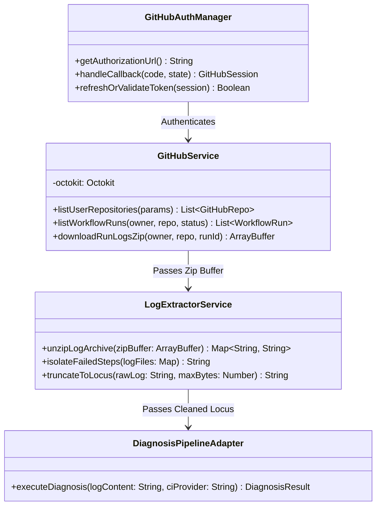
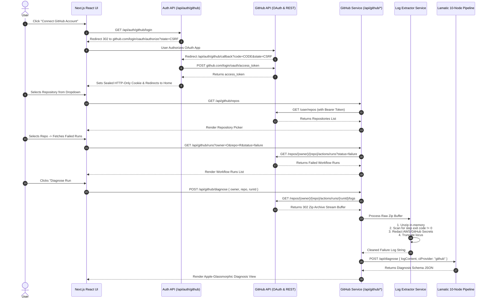

# Phase G0 — GitHub Integration Architecture

## Executive Summary & Vision

This document details the production-grade architectural specification for extending the **CI/CD Diagnosis Agent** with a native **GitHub Integration Module**. 

Currently, the AgentKit application supports manual log uploads and raw text pasting. The GitHub Integration Module eliminates manual log extraction by allowing developers to authenticate via GitHub OAuth, browse their repositories and workflow runs, automatically isolate failed CI/CD execution logs, extract the exact failure locus, and pass it directly into the existing 10-node Lamatic diagnosis pipeline.

---

## 1. High-Level System Architecture



---

## 2. Component Diagram



---

## 3. Data Flow & Sequence Diagram



---

## 4. Authentication Flow & Session Lifecycle

### 4.1 OAuth 2.0 PKCE & CSRF Guard
1. **Initiation (`/api/auth/github/login`)**:
   - Generates a cryptographically secure `state` parameter using `crypto.randomBytes(32).toString('hex')`.
   - Generates a `code_verifier` and `code_challenge` for Proof Key for Code Exchange (PKCE).
   - Stores `state` and `code_verifier` in an unsealed, short-lived (10-minute) HTTP-only temporary cookie (`__Host-gh-oauth-state`).
   - Redirects user to `https://github.com/login/oauth/authorize`.

2. **Callback Verification (`/api/auth/github/callback`)**:
   - Validates that returned `state` matches the value inside `__Host-gh-oauth-state`.
   - Exchanges authorization code for an `access_token` via `https://github.com/login/oauth/access_token`.
   - Deletes temporary state cookie.

### 4.2 OAuth Scopes
- `repo` (Read-only access to private & public repositories, workflow run metadata, and Action log downloads).
- `user:email` (Read user profile email for session identity).

*Note: For organizational security compliance, the architecture supports upgrading to a GitHub App with fine-grained permissions (`actions:read`, `contents:read`). See ADR-001.*

### 4.3 Session Lifecycle & Storage Architecture
- **Stateless Encrypted Cookie Strategy (`iron-session`)**:
  - OAuth tokens are encrypted using **AES-256-GCM** using a server-side secret key (`SESSION_SECRET`).
  - Stored inside an HTTP-only, `SameSite=Lax`, `Secure` cookie named `__Host-agentkit-session`.
  - Zero database dependency required for session storage.
  - Expiration set to 7 days with sliding window auto-renewal.

---

## 5. GitHub API Usage & Rate Limiting Strategy

### 5.1 Endpoints Used
| Resource | GitHub REST Endpoint | Cache TTL | Purpose |
| :--- | :--- | :--- | :--- |
| **User Profile** | `GET /user` | 1 hour | Display user avatar/login |
| **User Repositories** | `GET /user/repos?sort=updated&per_page=100` | 5 minutes | Populate repo selector |
| **Workflow Runs** | `GET /repos/{owner}/{repo}/actions/runs?status=failure` | 30 seconds | List failed CI runs |
| **Run Logs** | `GET /repos/{owner}/{repo}/actions/runs/{run_id}/logs` | No cache (Streamed) | Fetch raw workflow logs |

### 5.2 Rate Limit Management (5,000 req/hr per user)
1. **Header Inspection**: Every Octokit request inspects `x-ratelimit-remaining` and `x-ratelimit-reset`.
2. **Graceful Throttle Guard**: If `x-ratelimit-remaining < 10`, the server responds to the client with `HTTP 429 Too Many Requests` containing `Retry-After: <reset_time_seconds>`.
3. **Client-Side SWR Caching**: React components use `swr` / `@tanstack/react-query` to prevent redundant network fetches when switching tabs.

---

## 6. Log Download & Extraction Architecture

GitHub Actions log downloads return a `.zip` archive containing separate `.txt` log files for each step across all jobs in a matrix.

```
raw_logs.zip
├── 1_build.txt
├── 2_test.txt
├── 3_docker_build.txt  <-- (Contains Exit Code 137)
└── 4_post_job.txt
```

### 6.1 In-Memory Extraction Pipeline
1. **Streaming Download**: The backend fetches the log zip from GitHub API as an `ArrayBuffer` directly in RAM. No temporary disk files are created.
2. **Zip Decompression**: Utilizes `fflate` (lightweight, zero-dependency WebAssembly/JS zip processor) to parse file entries in memory.
3. **Failure Isolation Algorithm**:
   - Iterates through log files in reverse chronological order.
   - Searches for failure patterns: `##[error]`, `Process completed with exit code`, `FATAL ERROR:`, `Killed`, `FAIL`.
   - Extracts the specific failing step file.
4. **Credential & Secret Redaction**:
   - Executes regex scanning for AWS Keys (`AKIA...`), GitHub Personal Access Tokens (`ghp_...`), Bearer Tokens, and Generic API Keys.
   - Replaces matches with `[REDACTED_SECRET]`.
5. **Tail Truncation**:
   - Preserves the last 10,000 characters leading up to and including the failure locus to ensure payload fits comfortably within Lamatic token context limits.

---

## 7. REST Endpoints & Data Contracts

### 7.1 `GET /api/auth/github/login`
Initiates GitHub OAuth flow.
- **Response**: `302 Redirect` to GitHub OAuth URL.

### 7.2 `GET /api/auth/github/callback`
Handles OAuth callback and creates sealed session.
- **Query Params**: `code: string`, `state: string`.
- **Response**: `302 Redirect` to `/` with `Set-Cookie: __Host-agentkit-session=...`.

### 7.3 `GET /api/github/repos`
Retrieves authorized user repositories.
- **Response `200 OK`**:
```json
{
  "repositories": [
    {
      "id": 12345678,
      "name": "my-app",
      "fullName": "octocat/my-app",
      "owner": "octocat",
      "isPrivate": true,
      "defaultBranch": "main",
      "updatedAt": "2026-07-27T10:00:00Z"
    }
  ]
}
```

### 7.4 `GET /api/github/runs`
Fetches workflow runs for a selected repository.
- **Query Params**: `owner=string`, `repo=string`, `status=failure|success|all`.
- **Response `200 OK`**:
```json
{
  "runs": [
    {
      "id": 987654321,
      "name": "Build and Test",
      "headBranch": "main",
      "headSha": "a1b2c3d4e5f6",
      "event": "push",
      "status": "completed",
      "conclusion": "failure",
      "createdAt": "2026-07-27T11:00:00Z",
      "htmlUrl": "https://github.com/octocat/my-app/actions/runs/987654321"
    }
  ]
}
```

### 7.5 `POST /api/github/diagnose`
Fetches log from GitHub, extracts failure locus, and executes Lamatic diagnosis pipeline.
- **Request Body**:
```json
{
  "owner": "octocat",
  "repo": "my-app",
  "runId": 987654321
}
```
- **Response `200 OK`**: Standard `Diagnosis` schema JSON payload.

---

## 8. TypeScript Type Definitions & Interfaces

```typescript
import { z } from "zod";

// ─── GitHub Data Models ──────────────────────────────────────────────────────

export interface GitHubRepo {
  id: number;
  name: string;
  fullName: string;
  owner: string;
  isPrivate: boolean;
  defaultBranch: string;
  updatedAt: string;
}

export interface GitHubWorkflowRun {
  id: number;
  name: string;
  headBranch: string;
  headSha: string;
  event: string;
  status: "queued" | "in_progress" | "completed";
  conclusion: "success" | "failure" | "cancelled" | "timed_out" | null;
  createdAt: string;
  htmlUrl: string;
}

export interface GitHubSession {
  accessToken: string;
  user: {
    login: string;
    avatarUrl: string;
    email?: string;
  };
  expiresAt?: number;
}

// ─── Zod Request Schemas ────────────────────────────────────────────────────

export const GitHubRunsRequestSchema = z.object({
  owner: z.string().min(1),
  repo: z.string().min(1),
  status: z.enum(["failure", "success", "all"]).default("failure"),
});

export const GitHubDiagnoseRequestSchema = z.object({
  owner: z.string().min(1),
  repo: z.string().min(1),
  runId: z.number().int().positive(),
});
```

---

## 9. Folder Structure

```
kits/ci-cd-diagnosis-agent/apps/
├── app/
│   ├── api/
│   │   ├── auth/
│   │   │   └── github/
│   │   │       ├── callback/route.ts   # OAuth Callback handler
│   │   │       ├── login/route.ts      # OAuth Initiation
│   │   │       └── logout/route.ts     # Destroy session cookie
│   │   ├── diagnose/route.ts           # Existing Manual Diagnose API
│   │   ├── github/
│   │   │   ├── diagnose/route.ts       # GitHub Run fetch -> Lamatic execution
│   │   │   ├── repos/route.ts          # Repository list proxy
│   │   │   └── runs/route.ts           # Workflow runs proxy
│   │   └── health/route.ts
│   ├── globals.css
│   ├── layout.tsx
│   └── page.tsx
├── components/
│   ├── diagnosis-workspace.tsx         # Updated with GitHub Tab
│   ├── github/
│   │   ├── github-connect-card.tsx     # OAuth Login CTA
│   │   ├── github-repo-selector.tsx    # Repo dropdown with search
│   │   └── github-run-list.tsx         # List of failed workflow runs
│   └── ui/                             # Glassmorphic base components
├── lib/
│   ├── github/
│   │   ├── auth-config.ts              # Iron-session & OAuth client options
│   │   ├── client.ts                   # Octokit client factory
│   │   └── log-extractor.ts            # Zip unpacking & secret redaction
│   ├── lamatic-client.ts
│   ├── types.ts                        # Shared TypeScript types & schemas
│   └── utils.ts
```

---

## 10. Security Model & Threat Matrix

| Threat | Impact | Mitigation / Control |
| :--- | :--- | :--- |
| **OAuth State Tampering / CSRF** | High | Cryptographically generated `state` verified via HTTP-only cookie during OAuth callback. |
| **OAuth Token Theft** | Critical | Access tokens are encrypted using **AES-256-GCM** inside HTTP-only, `SameSite=Lax`, `Secure` cookies. Never stored in localStorage or exposed to client JS. |
| **Over-Privileged Scopes** | Medium | Requests minimal OAuth scopes. Supports GitHub App model for fine-grained repo-level permission scoping. |
| **Sensitive Log Exposure (PII/Secrets)** | High | In-memory regex scanner sanitizes AWS, GitHub, and API credentials before sending logs to Lamatic. |
| **Disk Exhaustion via Zip Bomb** | High | In-memory zip extraction caps total unpacked bytes at 10 MB per run. Stream terminates immediately if exceeded. |

---

## 11. Architecture Decision Records (ADR)

### ADR-001: OAuth App vs. GitHub App Integration
- **Status**: Accepted
- **Context**: We need to read public & private repository workflows and download build logs.
- **Decision**: Implement OAuth 2.0 PKCE first for simplicity and immediate user onboarding, while designing backend abstractions (`GitHubService`) to seamlessly support GitHub App installation tokens in Phase G1.
- **Trade-offs**: OAuth Apps request broader scopes (`repo`), whereas GitHub Apps allow fine-grained repository selection. However, OAuth Apps require zero installation setup for end-users.

### ADR-002: Encrypted Cookie Session vs. Database Token Store
- **Status**: Accepted
- **Context**: The agent needs to store GitHub OAuth Access Tokens securely across HTTP requests.
- **Decision**: Use stateless sealed cookies (`iron-session` with AES-256-GCM encryption).
- **Rationale**: Keeps the architecture 100% serverless and stateless, eliminating the overhead of managing a database (PostgreSQL/Redis) while ensuring tokens cannot be read or tampered with by the browser client.

### ADR-003: In-Memory Zip Processing vs. Temporary Disk Storage
- **Status**: Accepted
- **Context**: GitHub Actions API returns raw logs as zipped archives.
- **Decision**: Unpack zip streams directly in RAM using `fflate` streaming decompression.
- **Rationale**: Serverless deployment targets (Vercel / AWS Lambda) have read-only file systems or restricted `/tmp` access. In-memory processing guarantees zero-disk footprint and sub-second log parsing.

---

## 12. Future Extensibility (Phase G1 & Beyond)

1. **Automated Pull-Request Fix Commenter**:
   - Upon completing diagnosis, automatically post a formatted markdown summary with verified code patches directly onto the GitHub PR that triggered the failing workflow run.
2. **GitHub App Webhook Listener**:
   - Subscribe to `workflow_run.completed` webhooks to automatically trigger asynchronous background log diagnoses the moment a CI pipeline fails.
3. **Multi-CI Provider Support**:
   - Extend the unified `CILogProvider` interface to support GitLab CI API, Bitbucket Pipelines API, and CircleCI API using identical diagnosis workspace components.
