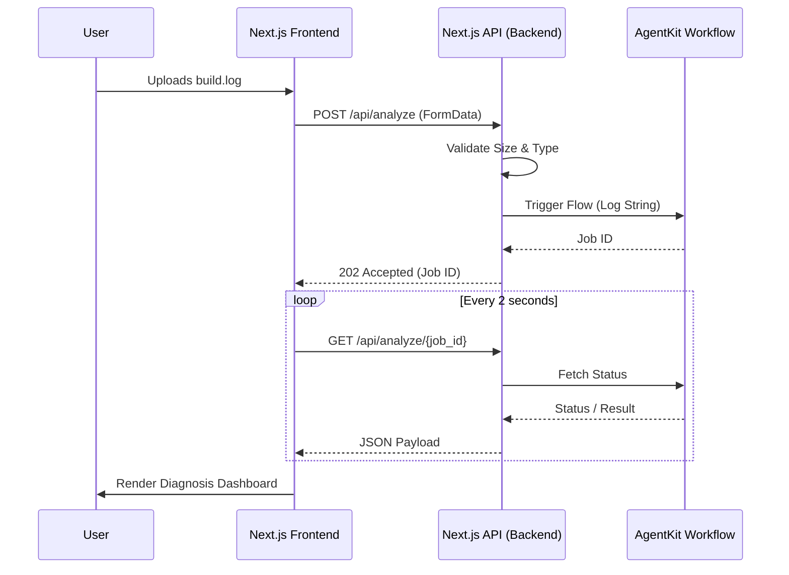

# Integration Architecture: Backend API & Frontend

## 1. Backend Architecture

The backend serves as a thin integration layer between the Next.js frontend and the Lamatic AgentKit workflow. It is built using Next.js App Router API Routes (`app/api/...`), providing a seamless full-stack experience without requiring a separate Node.js server.

*   **API Routes:** RESTful endpoints for file upload and status polling.
*   **Request Lifecycle:** Receives the raw log, performs edge validation (size/type), triggers the Lamatic GraphQL/REST API, and handles the asynchronous response.
*   **Validation:** Uses Zod for strict payload validation before passing data to Lamatic.
*   **Authentication (Future):** Middleware layer (e.g., NextAuth.js or Clerk) to protect routes. MVP is unauthenticated.
*   **Error Handling:** Global try-catch wrappers returning standard HTTP status codes and JSON error envelopes (`{ "error": "Message" }`).
*   **Logging:** Server-side `console.log` and integration with Vercel Analytics/Axiom.
*   **Configuration & Env Vars:** Managed securely via Vercel. `LAMATIC_API_KEY` and `LAMATIC_WORKSPACE_ID` are strictly server-side variables.

---

## 2. REST API Design

### `POST /api/analyze`
*   **Purpose:** Ingests a CI/CD log and initiates the AgentKit workflow.
*   **Request Schema:** `multipart/form-data` containing a `file` field.
*   **Response Schema:**
    ```json
    {
      "job_id": "uuid-1234",
      "status": "processing",
      "status_url": "/api/analyze/uuid-1234"
    }
    ```
*   **Validation:** Reject if file > 5MB. Reject if MIME type is not `text/plain`.
*   **Status Codes:** 202 (Accepted), 400 (Bad Request), 413 (Payload Too Large).

### `GET /api/analyze/:job_id`
*   **Purpose:** Polls the status of the Lamatic workflow.
*   **Response Schema (In Progress):** `{"status": "processing", "current_step": "Fix Generator"}`
*   **Response Schema (Complete):** Returns the final structured JSON Diagnosis.
*   **Status Codes:** 200 (OK), 404 (Not Found).

### `GET /api/health`
*   **Purpose:** Liveness probe. Returns HTTP 200 `{"status": "ok", "version": "1.0.0"}`.

---

## 3. Request Lifecycle

1.  **Upload:** User drops a `build.log` into the UI.
2.  **Edge Validation:** Next.js Route Handler checks file size and type.
3.  **Lamatic Invocation:** Backend makes an authenticated request to the Lamatic API, passing the log string.
4.  **Workflow Execution:** Lamatic DAG processes the log (Clean -> Extract -> RAG -> Fix).
5.  **Polling:** Frontend polls `GET /api/analyze/:id` every 2 seconds.
6.  **Response Parsing:** Lamatic completes, returns the JSON to the Next.js API, which forwards it to the frontend.
7.  **Frontend Rendering:** UI parses the JSON and populates the Result Cards.

### Sequence Diagram


---

## 4. Frontend Architecture

The Next.js App Router structure enforces separation of concerns:

*   `app/`: Core routing (`page.tsx`, `layout.tsx`, `api/`).
*   `components/ui/`: Dumb, reusable visual components (shadcn/ui primitives like Buttons, Cards).
*   `components/features/`: Smart components bound to specific logic (e.g., `LogUploader`, `DiagnosisDashboard`).
*   `lib/`: Utility functions, Zod schemas, API client wrappers.
*   `hooks/`: Custom React hooks (`useUploadLog.ts`, `usePolling.ts`).
*   `types/`: TypeScript interfaces representing the Lamatic JSON output contracts.
*   `styles/`: Global CSS and Tailwind configuration.

---

## 5. Component Design

*   **Navbar:** Contains logo, links to documentation, and dark mode toggle.
*   **Upload Area (Dropzone):** Accepts drag-and-drop or file browsing. Validates file locally before upload.
*   **Progress Indicator:** A dynamic stepper (e.g., "Extracting -> Consulting Knowledge -> Verifying").
*   **Summary Card:** High-level overview (Category Badge, Risk Level Badge).
*   **Evidence Panel:** Syntax-highlighted accordion showing the exact extracted log lines.
*   **Root Cause Card:** Prose explanation of the failure mechanics.
*   **Fix Card:** The core value prop. Syntax-highlighted code block with a "Copy to Clipboard" button.
*   **Risk & Verification Card:** Warnings about destructive commands or security implications.
*   **Error Banner:** Toast notifications for API failures.

---

## 6. State Management

*   **Recommendation:** Use **React Query (TanStack Query)**.
*   **Trade-offs:** Redux is too heavy for a simple upload/poll flow. Context API triggers too many re-renders for polling. React Query natively handles polling (`refetchInterval`), caching, retries, and loading/error states out-of-the-box.
*   **Loading States:** Managed entirely by React Query's `isLoading` and `isFetching` properties.

---

## 7. File Upload Strategy

*   **UX:** Large centered Drag & Drop zone. Also supports pasting raw text directly into a text area fallback.
*   **Limits:** Max 5MB file size. Checked *synchronously* in the browser before network request.
*   **Validation:** Accept `.txt`, `.log`, or no extension. Reject binaries/images.
*   **Large Log Handling:** If the user pastes 100,000 lines, the frontend truncates to the last 10,000 lines *before* uploading, as CI errors usually occur at the tail end of the log.

---

## 8. Response Mapping

Lamatic outputs a strict JSON schema. The frontend maps this directly to components:

*   `classification.category` -> Category Badge in Summary Card.
*   `classification.risk_level` -> Color-coded badge (Green/Yellow/Red) in Risk Card.
*   `analysis.root_cause` -> Text block in Root Cause Card.
*   `analysis.evidence_cited` -> Array rendered as lines in the Evidence Panel accordion.
*   `resolution.fix_snippets` -> Mapped to multiple Fix Cards (rendered via `react-syntax-highlighter`).
*   `resolution.security_warnings` -> Warning Callout / Alert block.

---

## 9. Error Handling

*   **Invalid File / Empty Log:** Form validation error (Red text under dropzone).
*   **Backend Unavailable (5xx):** Toast notification: "Diagnostic service is currently unavailable. Please try again later."
*   **Workflow Timeout:** React Query stops polling after 45s. Displays: "Analysis timed out. The log may be too complex."
*   **Malformed JSON:** Safely caught in the API layer using Zod. Returns a 500 error to the UI rather than crashing the React component tree.

---

## 10. Loading Experience

Because the AgentKit flow takes 15-25 seconds, a spinner is insufficient. We must keep the user engaged.

*   **Animated Timeline:** A vertical stepper that lights up based on mock timing or actual API status polling:
    1.  *Uploading...* (0-1s)
    2.  *Cleaning & Triage...* (1-5s)
    3.  *Retrieving Knowledge Base...* (5-10s)
    4.  *Generating & Verifying Fix...* (10-20s)
*   **Skeleton Loaders:** Once data begins arriving, replace the timeline with pulsing Skeleton cards before fading in the actual Root Cause and Fix data.

---

## 11. UI/UX Design

*   **Palette:** Developer-focused "Dark Mode by Default". Deep grays (Zinc/Slate) with neon accents (Cyan for info, Rose for errors, Emerald for success).
*   **Typography:** `Inter` for UI, `Fira Code` or `JetBrains Mono` for all logs and code snippets.
*   **Cards:** Glassmorphism or flat bordered cards (shadcn default) to separate information clearly.
*   **Accessibility:** ARIA labels on code copy buttons, sufficient contrast ratios, and keyboard-navigable accordions.

---

## 12. Security

*   **Rate Limiting:** Implemented via Vercel Edge Middleware (e.g., Upstash Redis) limiting users to 5 requests per minute.
*   **Secret Handling:** `LAMATIC_API_KEY` is completely isolated in the Next.js backend environment.
*   **CORS:** Next.js API routes configured to strictly accept requests only from the same-origin domain.

---

## 13. Performance

*   **Bundle Optimization:** Use dynamic imports (`next/dynamic`) for heavy libraries like `react-syntax-highlighter` so they only load when the Result page renders.
*   **Frontend Optimization:** Use Tailwind CSS for zero-runtime styling overhead.
*   **API Optimization:** The Next.js API route streams the log to Lamatic rather than buffering it entirely in memory, preventing serverless function memory limits from being breached on large files.

---

## 14. Testing Strategy

*   **Unit Tests (Jest/Vitest):** Test Zod schemas, utility functions, and text truncation logic.
*   **Component Tests (React Testing Library):** Ensure the Dropzone rejects `.jpg` files and the Fix Card renders code correctly.
*   **API Tests:** Test Next.js route handlers with mock Lamatic responses.
*   **E2E Tests (Playwright/Cypress):** Simulate a user uploading a mock log, waiting for the mock polling to finish, and verifying the Root Cause card appears.

---

## 15. Deployment

*   **Platform:** Vercel (seamless Next.js integration).
*   **Environment Variables:** Configured securely in the Vercel dashboard (`LAMATIC_API_KEY`, `LAMATIC_WORKSPACE`).
*   **Monitoring:** Vercel Analytics for Web Vitals, Axiom for backend API logging.
*   **Health Checks:** Use Vercel Cron to ping `/api/health` to prevent serverless cold starts.

---

## 16. Documentation

*   **README.md:** Standard setup instructions (`npm install`, `npm run dev`).
*   **.env.example:** Template for required environment variables.
*   **API Specs:** Include an OpenAPI/Swagger spec or a simple Markdown file documenting `/api/analyze`.
*   **Component Storybook (Optional):** If the team scales, use Storybook to document UI components.

---

## 17. Future Enhancements

The architecture supports seamless expansion:
*   **Authentication (Clerk/NextAuth):** Protect the `/api/analyze` route.
*   **Analysis History:** Store the job ID and returned JSON in a database (PostgreSQL/Supabase) to allow users to view past analyses.
*   **GitHub/Slack Integrations:** Since the Lamatic workflow is decoupled, backend API endpoints can be added for Slack Webhooks or GitHub Apps to trigger the identical workflow without changing the UI.

---

## 18. Final Readiness Checklist

- [ ] Backend API validates file size/type before passing to Lamatic.
- [ ] Lamatic API keys are strictly server-side.
- [ ] React Query handles polling and timeout failures gracefully.
- [ ] UI provides a dynamic loading state (stepper) to handle 20s latency.
- [ ] Code snippets use monospace fonts and include a copy button.
- [ ] Zod schemas on the frontend exactly match Lamatic's output schema.
- [ ] Playwright E2E test confirms successful upload and result rendering.
- [ ] Vercel environment variables are populated in staging/prod.

---

## 19. Practical Implementation Roadmap

Follow this sequence to build and test the integration layer:

1.  **Phase 1: Project Skeleton (Day 1)**
    *   Initialize Next.js App Router project with Tailwind and shadcn/ui.
    *   Create standard folder structure (`app`, `components`, `lib`, etc.).
    *   Define TypeScript interfaces matching the Lamatic Output Schema.
2.  **Phase 2: UI Foundation (Day 2)**
    *   Build the NavBar and Footer.
    *   Build the `LogUploader` component (Drag & Drop, text fallback).
    *   Implement synchronous frontend file validation.
3.  **Phase 3: Backend API (Day 3)**
    *   Create `POST /api/analyze` and `GET /api/analyze/:id`.
    *   Implement Zod validation.
    *   Connect the API to a mock response (hardcoded JSON) for local testing.
4.  **Phase 4: State Management (Day 4)**
    *   Install and configure React Query.
    *   Hook the `LogUploader` to the `POST` endpoint.
    *   Implement the polling logic to the `GET` endpoint.
    *   Build the Animated Timeline / Loading Stepper.
5.  **Phase 5: Result Dashboard (Day 5)**
    *   Build the Summary, Root Cause, Evidence, Fix, and Risk cards.
    *   Integrate syntax highlighting for evidence and code fixes.
    *   Map the React Query data to the dashboard components.
6.  **Phase 6: Lamatic Integration & E2E Testing (Day 6)**
    *   Remove mock API logic. Connect the backend securely to the live Lamatic AgentKit endpoint.
    *   Run end-to-end tests with real log files.
    *   Handle timeouts and error states in the UI.
7.  **Phase 7: Polish & Deploy (Day 7)**
    *   Add responsive design tweaks.
    *   Implement Vercel Edge caching and rate limiting.
    *   Deploy to Vercel production.
