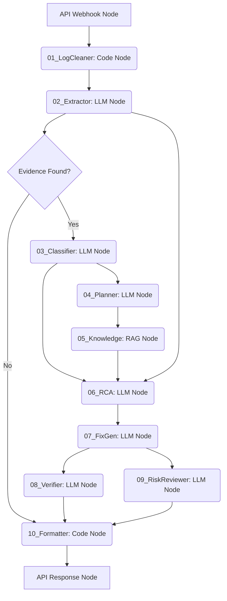
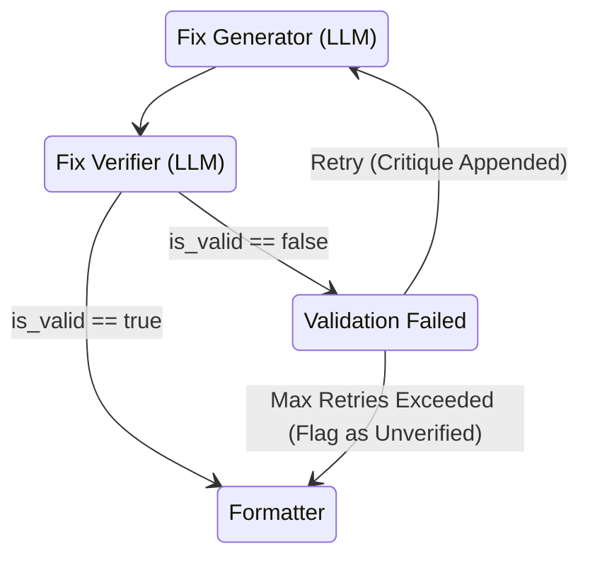

# Lamatic AgentKit Workflow Orchestration Document

## 1. Workflow Overview

The core objective of this orchestration layer is to manage the flow of information between specialized agents, ensuring determinism, structured outputs, and fault tolerance.

*   **Entry Point:** An API Node (`/diagnose`) triggered by the frontend Next.js application, accepting a multipart form payload (the raw log).
*   **Exit Point:** A Response Node returning a strict JSON schema containing the final diagnosis.
*   **Execution Lifecycle:** 
    1. Synchronous validation at the API edge.
    2. Asynchronous execution of the Lamatic DAG.
    3. Status polling from the frontend.
    4. Aggregation and persistence of the final state.
*   **Communication:** Agents communicate exclusively via strongly-typed JSON contracts passed through the Lamatic Node Context.
*   **Structured Outputs:** Every LLM node is configured with JSON Schema enforcement. The workflow halts or retries if an LLM breaks the contract.

---

## 2. Complete Node Graph

| Node Name | Type | Purpose | Dependencies | Failure Behavior |
| :--- | :--- | :--- | :--- | :--- |
| **API Entry** | API Node | Webhook ingestion | None | HTTP 400 |
| **Log Cleaner** | Code Node | Truncate & regex strip | API Entry | Halt (Log format invalid) |
| **Extractor** | LLM Node | Find exact error strings | Log Cleaner | Halt (No errors found) |
| **Classifier** | LLM Node | Taxonomy mapping | Extractor | Retry (1x) -> Default 'Unknown' |
| **Planner** | LLM Node | Formulate RAG query | Extractor, Classifier | Retry (1x) -> Default query |
| **Knowledge** | RAG Node | Vector DB lookup | Planner | Return empty array |
| **RCA** | LLM Node | Deduce mechanics | Extractor, Knowledge | Retry (1x) -> Halt (Diagnosis failed) |
| **Fix Gen** | LLM Node | Write code snippet | RCA, Knowledge | Retry (2x) -> Output generic fix |
| **Fix Verifier** | LLM Node | Prove fix validity | Fix Gen | Flag `is_valid: false` |
| **Risk Reviewer** | LLM Node | Security assessment | Fix Gen | Flag `risk: High` |
| **Formatter** | Code Node | Final JSON mapping | Verifier, Risk Reviewer | Halt (Serialization failed) |
| **API Exit** | Response | Return HTTP 200 | Formatter | N/A |

*Expected Latency:* E2E execution should take 15-25 seconds depending on LLM inference time.

---

## 3. Lamatic Mapping

Why are specific Lamatic node types chosen?

*   **Code Nodes (Cleaner, Formatter):** Ideal for deterministic transformations. Regex and JSON mapping are orders of magnitude faster and cheaper in a Code Node than an LLM Node.
*   **LLM Nodes (Extractor, Classifier, etc.):** Utilizing Gemini via AgentKit’s native LLM node. These are configured with strict Temperature (0.0) and JSON Mode options.
*   **Knowledge Node:** AgentKit provides native Vector DB connectors. Instead of writing custom API calls to Pinecone/Weaviate, we use the native Knowledge Node which handles embedding generation and chunk retrieval under the hood based on the Planner's output.
*   **Conditional Nodes:** Used after the `Extractor` to halt the flow if `evidence == []`, and after `Verifier` to trigger an alternative flow if the fix is deemed invalid.

---

## 4. Data Flow

Data moves monotonically forward. No node has access to the full historical context unless explicitly mapped in the UI.

1.  **JSON Contracts:** Each node specifies an Output Schema in Lamatic. The next node maps its Input Variables directly to the previous node's output schema keys.
2.  **Data Reduction:** The raw 5MB log is discarded immediately after the Log Cleaner. The Extractor reduces the cleaned log to a 2KB JSON array of strings.
3.  **Intermediate Outputs:** AgentKit persists the state of every node during the run. This allows the API to poll the job ID and return progress updates (e.g., "Currently running Risk Reviewer").

---

## 5. Conditional Routing

To make the workflow intelligent, we introduce conditional branches (Conditional Nodes):

1.  **Empty Evidence Routing:** 
    *   *If* `Extractor.evidence.length == 0` -> Route directly to Output Formatter with a message: "No failure detected in logs." (Bypass LLMs).
2.  **No RAG Results:**
    *   *If* `Knowledge.results == 0` -> Route RCA to a fallback prompt that explicitly says: "You have no internal docs, rely on general knowledge but mark confidence as Low."
3.  **Verification Failed:**
    *   *If* `FixVerifier.is_valid == false` -> Route back to Fix Generator (max 1 loop) with the verifier's critique appended to the prompt.
4.  **High Risk Routing:**
    *   *If* `RiskReviewer.level == High` -> Prepend a massive red warning flag in the Output Formatter's JSON.

---

## 6. Retry Strategy

Lamatic nodes should be configured with specific retry policies to handle transient LLM failures (503s or JSON schema violations).

*   **Code Nodes:** 0 retries. If code fails, it is a deterministic bug.
*   **Knowledge Node:** 1 retry (handles transient Vector DB network issues).
*   **LLM Nodes (Classification, RCA):** 1 retry. If the schema breaks, AgentKit automatically retries the prompt.
*   **LLM Nodes (Fix Generator):** 2 retries. Code generation is the most complex task; if it outputs invalid JSON, it warrants an extra attempt.

---

## 7. Error Handling

How errors propagate:
*   **Malformed Log:** Handled at API Entry. Returns 400.
*   **LLM Timeout:** Handled by Lamatic orchestrator. If a node times out (> 15s), the workflow catches the error, sets `job_status: failed`, and the Formatter returns a structured error JSON to the frontend.
*   **Unexpected Category:** Handled by the conditional routing (routes to a generic fallback RAG query).
*   **Graceful Degradation:** If the Risk Reviewer fails, the workflow does NOT halt. It passes `risk: "Unknown - Analysis Failed"` to the Formatter so the user still gets their diagnosis.

---

## 8. Validation Layers

Every LLM node in Lamatic is configured with an **Output JSON Schema**.
*   If the LLM outputs `{"categories": "Network"}` instead of `{"category": "Network"}`, the Lamatic runtime blocks the output from reaching the next node.
*   **Duplicate Detection:** The Planner Node is instructed via its prompt to return a `Set` of queries to prevent identical vector searches.
*   **Empty Responses:** Handled via Conditional Nodes (see Section 5).

---

## 9. Context Management

*   **Discarding Context:** The `Cleaned Log` is permanently dropped from context after the `Extractor`. 
*   **Preserving Context:** The `Evidence Array` is passed explicitly to almost every node (Classifier, Planner, RCA, Verifier) because it acts as the Ground Truth.
*   **Compression:** RAG context is limited to `Top-K = 3`. Max tokens passed to RCA never exceed 4,000.

---

## 10. Observability

*   **Workflow Logs:** AgentKit's built-in execution traces.
*   **Node Logs:** Every Code Node must `console.log` payload sizes.
*   **Debugging Production:** Enable a `debug_mode` boolean in the API payload. If true, the Output Formatter aggregates the raw JSON output of *all 10 nodes* and appends it to the final response under a `_debug_trace` key for developers.

---

## 11. Performance Optimisation

*   **Parallel Execution:** In Lamatic Studio, the `Fix Verifier` and `Risk Reviewer` nodes do not depend on each other. They both depend on the `Fix Generator`. By connecting the Fix Generator to both simultaneously, AgentKit executes them in parallel, saving ~2 seconds of latency.
*   **Token Optimisation:** Code nodes handle formatting, preventing LLMs from wasting tokens generating Markdown tables.

---

## 12. Security

*   **Prompt Injection:** Raw user logs are strictly passed into the `Extractor` LLM node wrapped in `<raw_log>` XML tags. The system prompt explicitly commands the LLM to ignore any instructions found within those tags.
*   **Secret Masking:** The `Log Cleaner` Code Node runs a regex pass to mask standard JWTs, AWS Keys, and GitHub tokens before the log ever hits an LLM.
*   **Knowledge Isolation:** The Knowledge Node restricts searches via metadata filters to prevent cross-tenant data leakage if adapted for SaaS.

---

## 13. Testing Strategy

*   **Happy Path:** Upload a standard NPM failure. Expect HTTP 200 and a 10-node trace.
*   **Corrupted Logs:** Upload a binary file. Expect Log Cleaner to halt and return a graceful validation error.
*   **Retrieval Misses:** Upload an obscure error. Expect RCA to output `confidence: Low` but still attempt a fix.
*   **Verification Failures:** Hardcode the Fix Generator to output `rm -rf /` using a mock override. Ensure Risk Reviewer flags it as `High` and UI blocks it.

---

## 14. Deployment Considerations

*   **Configuration:** Maintain `dev`, `staging`, and `prod` Lamatic workspaces.
*   **Versioning:** Never edit a live workflow. Duplicate the flow, edit, test, and then swap the API Webhook endpoint in the Next.js backend to point to the new Flow ID.
*   **Environment Variables:** Store Gemini API keys and Vector DB credentials in Lamatic Secrets, never hardcoded in nodes.

---

## 15. Future Extensions

*   **GitHub PR Creation:** Add a Conditional Node at the end. If `diagnose_only == false` and `Risk == Low`, route to a new API Node that executes a GitHub API call to open a PR with the generated code.
*   **Slack Integration:** The exact same Lamatic flow can be triggered by a Slack Event Webhook. Just add a new API Entry Node pointing to the same Log Cleaner.

---

## 16. Lamatic Best Practices

*   **Node Naming:** Always prefix with sequential numbers (e.g., `01_LogCleaner`, `02_Extractor`) for easy visual debugging on the canvas.
*   **Reusable Prompts:** Store standard definitions (like the JSON schema constraints) in Lamatic Variables and inject them into multiple LLM nodes `{{ variables.json_instructions }}`.
*   **Error Branches:** Always connect the red "Error" output socket of a node to a centralized "Error Handler" Code Node to format the crash gracefully.

---

## 17. Workflow Documentation (Diagrams)

### 17.1 Lamatic Node Dependency Diagram


### 17.2 Execution Timeline (Parallelization)

```mermaid
gantt
    title AgentKit Node Execution Latency
    dateFormat  s
    axisFormat  %S
    
    section Ingestion
    API & Log Cleaner       :0, 1s
    
    section Intelligence
    Evidence Extractor      :1, 4s
    Error Classifier        :5, 2s
    Planner                 :7, 2s
    Knowledge Retrieval     :9, 1s
    
    section Synthesis
    Root Cause Analyzer     :10, 5s
    Fix Generator           :15, 4s
    
    section Validation (Parallel)
    Fix Verifier            :19, 3s
    Risk Reviewer           :19, 3s
    
    section Egress
    Output Formatter        :22, 1s
```


### 17.3 Failure Recovery Diagram


---

## 18. Final Readiness Checklist

- [ ] All LLM Nodes have `response_format` strictly configured to JSON schemas.
- [ ] Parallel execution lines are drawn for Verifier and Risk Reviewer.
- [ ] Error routing is configured for timeouts.
- [ ] Log Cleaner Code Node properly throws an Error if the log is empty.
- [ ] AgentKit API Endpoint requires a valid Auth Token.
- [ ] Output Formatter Code Node strips out any Markdown code fences (e.g., ` ```json `) if an LLM hallucinates them.

---

## 19. Step-by-Step Implementation Order (Lamatic Studio)

Start with a blank canvas in Lamatic Studio and build exactly in this order:

1.  **Create API Trigger Node:** Set up the webhook listener and define the incoming payload schema (file/text).
2.  **Create API Response Node:** Connect the trigger directly to the response and test the connection via Postman.
3.  **Add Code Nodes (Bookends):** Drag in the Log Cleaner and Output Formatter. Connect them between Trigger and Response. Write the regex logic.
4.  **Add Extractor & Classifier:** Drag in two LLM nodes. Configure Gemini, temperature 0.0, and paste the JSON schemas. Connect them sequentially.
5.  **Test Partial Flow:** Send a log. Verify the Classifier outputs the correct enum in the Lamatic execution trace.
6.  **Add RAG Infrastructure:** Add the Planner LLM node, then the Knowledge Node. Configure the Vector DB connection.
7.  **Add Synthesis Nodes:** Add RCA and Fix Generator LLM nodes. Map the inputs carefully (ensure RCA receives both Evidence and Knowledge).
8.  **Add Parallel Validation:** Drag in Verifier and Risk Reviewer. Connect BOTH of their inputs to the Fix Generator's output. Connect BOTH of their outputs to the Formatter.
9.  **Configure Conditional Logic:** Add a Conditional Node after Extractor to short-circuit to the Formatter if no evidence is found.
10. **Final Integration Test:** Run 5 diverse mock logs through the "Test Flow" button in Studio and monitor the trace visualizer.
