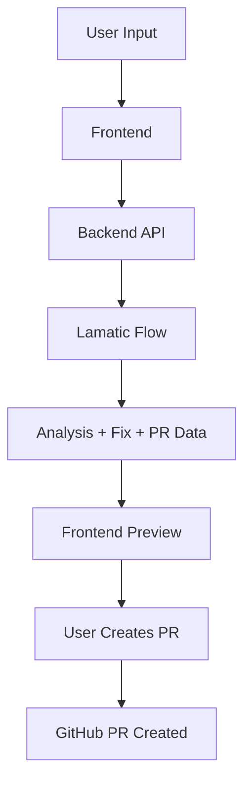
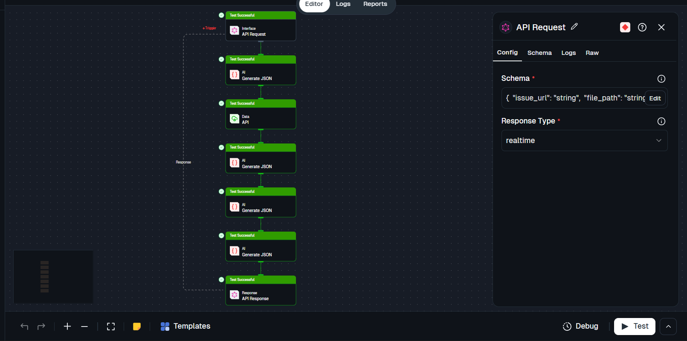

# GitHub Auto Fix Agent

An AI-powered agent that analyzes GitHub issues and generates code fixes with ready-to-create pull requests.

---

## Features

-  Understands GitHub issues automatically
-  Identifies root cause of bugs
-  Generates minimal code fixes (diff-based)
-  Prepares PR metadata (title, body, branch)
-  One-click PR creation

---

## How It Works

1. User provides a GitHub issue URL
2. Lamatic flow analyzes the issue
3. AI generates:
   - Issue summary
   - Root cause
   - Code fix (diff)
   - PR metadata
4. User reviews and creates PR

---

## Flow Overview



## Lamatic Workflow

<p align="center">
  
</p>

## Setup Locally

```bash
cd kits/agentic/github-auto-fix-agent
npm install
cp .env.example .env
npm run dev