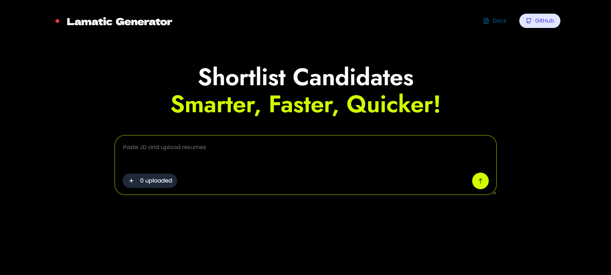
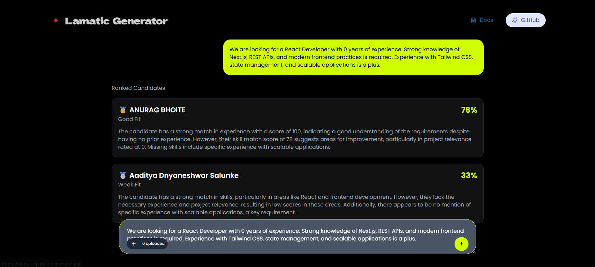

# Hiring Copilot Agent 🚀

## 💡 What This Kit Does

Hiring Copilot Agent is an AI-powered recruiter assistant designed to **automate resume screening and candidate evaluation**. It helps HR teams reduce manual effort, speed up hiring decisions, and improve candidate selection using intelligent AI workflows.

---

## 🎯 Problem It Solves

Recruiters often spend **hours manually reviewing hundreds of resumes**, leading to:

* Slow hiring processes
* Human bias in screening
* Missed high-quality candidates

This agent reduces that effort by:

* Automatically analyzing resumes
* Scoring candidates based on relevance
* Generating hiring recommendations

👉 Result: **Faster, smarter, and more efficient hiring**

---

## ⚡ Features

* 📄 **Resume Analysis** — Extracts and understands candidate information
* 📊 **Candidate Scoring** — Ranks candidates based on relevance
* 🤖 **AI Hiring Recommendations** — Suggests whether to shortlist or reject

---

## 🛠 Tech Stack

* **Next.js** — Frontend framework
* **TypeScript** — Type-safe development
* **Lamatic AI** — Agent orchestration & flow execution
* **Tailwind CSS** — UI styling
* **Open AI** — File Scanning

---

## 🔑 Prerequisites

Before running this project, make sure you have:

* Node.js (v18 or higher)
* npm (v9 or higher)
* Lamatic account → https://lamatic.ai
* Deployed Lamatic flow

---

## 🔐 Environment Variables

Create a `.env` file from `.env.example` and fill in:

```env
AGENTIC_GENERATE_CONTENT="YOUR_FLOW_ID"
LAMATIC_API_URL="YOUR_API_URL"
LAMATIC_PROJECT_ID="YOUR_PROJECT_ID"
LAMATIC_API_KEY="YOUR_API_KEY"
```

⚠️ Do NOT commit `.env` (contains secrets)

---

## ⚙️ Setup & Run Locally

```bash
# Navigate to kit
cd kits/agentic/hiring-copilot-agent

# Install dependencies
npm install

# Setup environment variables
cp .env.example .env

# Start development server
npm run dev
```

Open:
👉 http://localhost:3000

---

## 🚀 Usage

1. Uplpoad candidate resume and paste JD
2. The AI analyzes the resume
3. Get:

   * Candidate score
   * Hiring recommendation
   * Insights for decision-making

---

## 🌐 Live Demo

👉 https://hiring-copilot-agent.vercel.app

---

## 🔗 Lamatic Flow

Flow ID: `your-flow-id`

---

## 📸 Screenshots (Recommended)





---

## 📂 Folder Structure

```
kits/agentic/hiring-copilot-agent/
├── actions/
├── app/
├── components/
├── flows/
├── lib/
├── hooks/
├── public/
├── config.json
├── README.md
├── .env.example
```

---


## 📌 Notes

* Ensure your Lamatic flow is deployed before running
* Verify API keys and environment variables if errors occur

---

## 🧠 Why This Matters

This kit demonstrates how AI can **transform traditional hiring workflows** by reducing manual effort and improving decision quality — making recruitment faster, scalable, and data-driven.