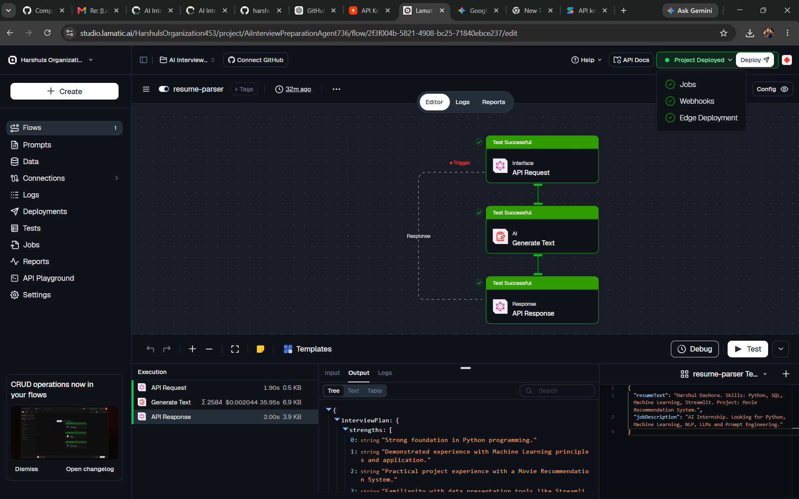

# AI Interview Preparation Agent

## Problem

Candidates often prepare for interviews using generic questions that do not match their resume or the requirements of a specific job description.

This leads to inefficient preparation and missed opportunities to identify important skill gaps.

## Solution

AI Interview Preparation Agent analyzes a candidate's resume together with a job description and generates:

* Strength analysis
* Skill gap analysis
* Personalized interview questions
* Ideal answer guidance

## Features

### Resume Analysis

Extracts candidate strengths and relevant experience.

### Skill Gap Detection

Compares resume content against job requirements.

### Tailored Interview Questions

Generates role-specific technical and behavioral questions.

### Interview Preparation Guidance

Provides ideal answer directions for each question.

## Input

```json
{
  "resumeText": "...",
  "jobDescription": "..."
}
```

## Output

```json
{
  "strengths": [],
  "gaps": [],
  "questions": []
}
```

## Technology

* Lamatic AgentKit
* Gemini / LLM Models
* Structured JSON Output

## Demo Video

Watch the demo here:

https://drive.google.com/file/d/1Da8nCZi_T6x1yJvCoDAsLesAXbICV1mh/view?usp=drive_link

## Screenshots

### Home Screen




## Example Use Cases

* AI Internship Preparation
* Software Engineering Interviews
* Resume Screening
* Technical Assessment Preparation
