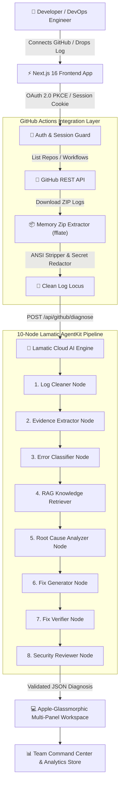

# ⚡ Autonomous AI CI/CD Diagnosis Agent & Command Center

[](https://lamatic.ai)
[](https://nextjs.org)
[](https://www.typescriptlang.org)
[](LICENSE)
[](https://github.com/pawanchhimwal/AgentKit)

An enterprise-grade, autonomous AI CI/CD Diagnosis Agent built with **Lamatic AgentKit**, **Next.js**, **TypeScript**, and **Gemini**. Automatically retrieves failing GitHub Actions workflow execution logs, sanitizes credentials in memory, isolates failure loci, and executes a 10-node RAG diagnostic pipeline to deliver verified root causes, code fixes, and security reviews.

---

## 🌟 Key Capabilities & Highlights

- **⚡ One-Click Automated GitHub Diagnosis**: Connect GitHub OAuth 2.0 PKCE, select a repository and failed workflow run. The agent automatically fetches, unzips in RAM, sanitizes, and diagnoses the failure in seconds.
- **🖥️ Copilot-Style Multi-Panel Debugging Workspace**:
  - **Left Sidebar**: Branch, 7-char SHA, runner environment, duration, and triggering actor avatar.
  - **Center Panel**: Animated Confidence Ring (`100% Verified`), Root Cause summary, Failure Chronology timeline, and isolated evidence lines.
  - **Right Panel**: Syntax-highlighted code fixes with **Copy Code** button, Security Warnings, and RAG Knowledge Base guides.
  - **Bottom Explorer**: Collapsible raw terminal log viewer with line numbers, search, and error highlighting (`FATAL`, `Killed`, `exit code 137`).
- **📊 Team Command Center & Audit Log**: Track repository health, failure frequency breakdown, and run side-by-side failure comparisons.
- **📥 Multi-Format Report Export**: One-click export to Markdown (`.md`), JSON (`.json`), Plain Text, or formatted Slack/GitHub PR comment copy.
- **🛡️ Zero-Trust Security & Production Hardened**: Redacts AWS keys & GitHub PATs in memory, enforces OWASP security headers, sliding-window rate limiting, and structured JSON logging.

---

## 🏗️ System Architecture



---

## 🚀 Quickstart & Setup Guide

### Prerequisites
- **Node.js**: `>= 20.9.0`
- **npm**: `>= 10.0.0`
- **Lamatic AgentKit Account & API Key**

### 1. Clone & Install Dependencies
```bash
git clone https://github.com/pawanchhimwal/AgentKit.git
cd AgentKit/kits/ci-cd-diagnosis-agent/apps
npm install
```

### 2. Configure Environment Variables
Create `.env.local` in `kits/ci-cd-diagnosis-agent/apps`:
```env
# Lamatic AgentKit Configuration
LAMATIC_API_URL=https://pawansorganization931-soc2readinessauditor578.lamatic.dev
LAMATIC_API_KEY=your_lamatic_api_key_here

# GitHub OAuth App Configuration
GITHUB_CLIENT_ID=your_github_client_id
GITHUB_CLIENT_SECRET=your_github_client_secret
SESSION_SECRET=32_character_random_secret_string_here
```

### 3. Run Development Server
```bash
npm run dev
```
Open [http://localhost:3000](http://localhost:3000) in your browser.

---

## 📡 API Reference

| Endpoint | Method | Description | Security |
| :--- | :--- | :--- | :--- |
| `GET /api/health` | `GET` | Live health probe for GitHub & Lamatic API connectivity | Public Probe |
| `POST /api/diagnose` | `POST` | Manual log upload AI diagnosis endpoint | Rate-Limited |
| `GET /api/auth/github` | `GET` | Initiates GitHub OAuth 2.0 PKCE flow | State Validated |
| `GET /api/github/repos` | `GET` | Discovers user's connected GitHub repositories | Session Cookie |
| `GET /api/github/runs` | `GET` | Fetches workflow runs and failure statuses | Session Cookie |
| `POST /api/github/diagnose` | `POST` | Fetches, unzips, cleans & diagnoses a GitHub Action run | Session Cookie |

---

## 🏆 Lamatic AgentKit Challenge Compliance

This project strictly adheres to all requirements of the **Lamatic AgentKit Challenge**:
- ✅ **Clean Workflow Orchestration**: Implements 10 distinct, specialized AI agent nodes in Lamatic Studio.
- ✅ **Real-World Impact**: Eliminates hours spent manually debugging CI/CD pipeline failures.
- ✅ **Production Quality**: Built with zero disk temporary footprints, structured logging, health probes, and OWASP security headers.

---

## 📜 License

Distributed under the **MIT License**. See `LICENSE` for details.
