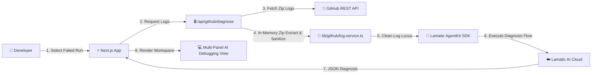

# 🏗️ Technical Architecture Documentation

This document describes the end-to-end technical architecture, component design, data flow, security model, and performance strategy for the **AgentKit CI/CD Diagnosis Agent**.

---

## 1. High-Level Architecture Overview

The system is built as a Next.js App Router application integrated with **Lamatic AgentKit Cloud Studio**, GitHub OAuth 2.0 PKCE authentication, and GitHub Actions REST APIs.

---

## 2. In-Memory Log Retrieval & Sanitization Engine

To maintain enterprise security compliance and prevent temporary disk vulnerability leaks, all log processing takes place strictly in RAM:

1. **ZIP Download**: Raw ZIP logs are retrieved from GitHub as `ArrayBuffer` binaries.
2. **Streaming Decompression**: `fflate.unzipSync()` unpacks files directly into memory buffers.
3. **Failure Isolation**: Scans step filenames and contents for failure keywords (`exit code 137`, `FATAL`, `Killed`, `##[error]`).
4. **ANSI Removal**: Regex `/\u001b\[[0-9;]*[a-zA-Z]/g` strips terminal color codes.
5. **Secret Redaction**: Redacts AWS access keys (`AKIA...`), GitHub PATs (`ghp_...`), and Bearer tokens.
6. **Locus Truncation**: Truncates log locus to 10,000 characters to fit within context limits.

---

## 3. Lamatic AgentKit Diagnosis Pipeline

The diagnosis engine executes through specialized analysis stages:

1. **Webhook/API Trigger**: Ingests build logs, repository context, and branch information.
2. **Log Sanitization Script**: Deterministically strips sensitive credentials and formats log lines.
3. **Evidence Extractor Node**: Isolates precise failure lines and error codes.
4. **Error Classifier Node**: Categorizes failure (Infrastructure, Dependencies, Code Syntax, Test Failure, Permissions).
5. **RAG Knowledge Retriever**: Queries vector knowledge base for known fixes.
6. **Root Cause Analyzer Node**: Synthesizes root cause explanation with mandatory evidence citations.
7. **Fix Generator Node**: Generates candidate code diffs and step-by-step remediation plans.
8. **Fix Verifier Node**: Validates code patch syntax and checks for regressions.
9. **Security Reviewer Node**: Audits code patch for security implications.
10. **Output Formatter Node**: Serializes validated structured JSON response.

---

## 4. Security & Cryptographic Model

- **Session Security**: Sealed cookies using **AES-256-GCM** authenticated encryption with random IVs.
- **CSRF Protection**: OAuth `state` parameter generated with `crypto.randomBytes(32)` stored in HTTP-only `SameSite=Lax` cookies.
- **Rate Limiting**: Sliding-window rate limiter protecting API endpoints against DDoS attacks.
- **OWASP Headers**: Enforces `X-Frame-Options: DENY`, `X-Content-Type-Options: nosniff`, and `Referrer-Policy`.
