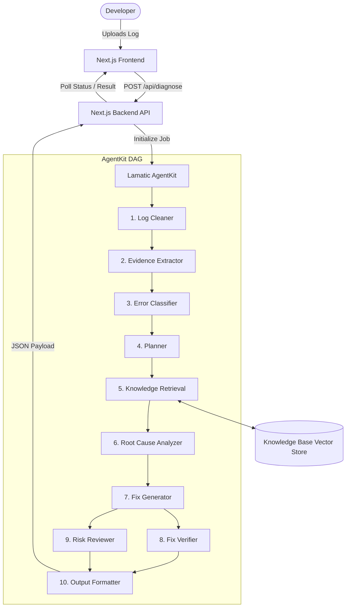
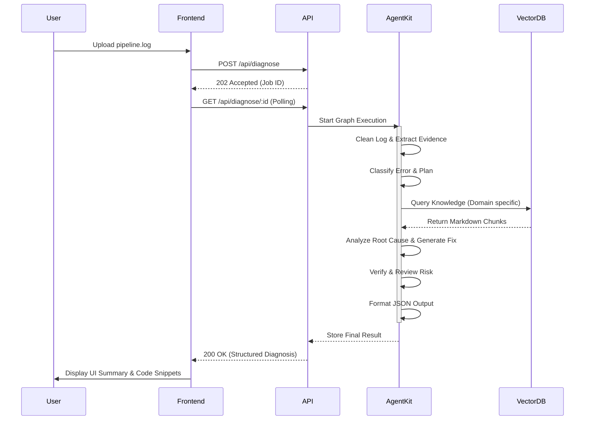
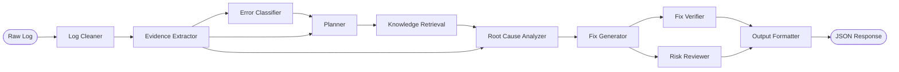
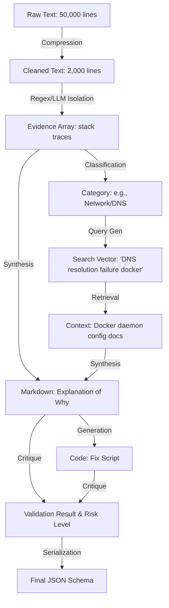
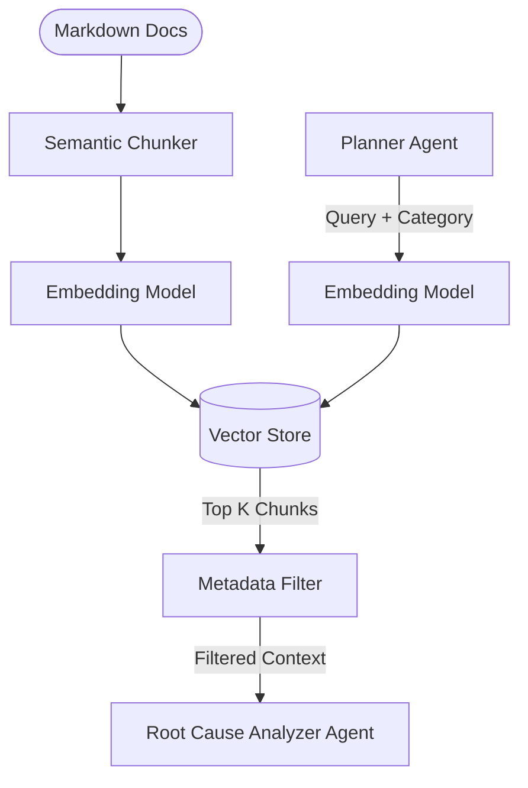
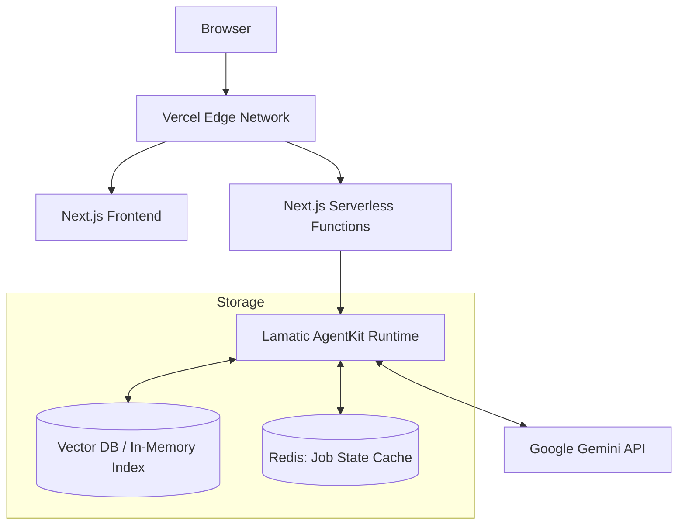

# Architecture Document: CI/CD Failure Diagnosis Agent

## 1. Executive Summary

**Problem Statement:** Developers and DevOps engineers frequently waste hours deciphering cryptic, sprawling CI/CD logs from GitHub Actions or GitLab CI. Finding the actual cause of a build or deployment failure amidst thousands of lines of boilerplate is tedious, error-prone, and blocks rapid delivery.

**Target Audience:** DevOps Engineers, Site Reliability Engineers (SREs), and Software Developers who rely on CI/CD pipelines.

**Solution:** An AI-powered CI/CD Failure Diagnosis Agent that autonomously ingests, cleans, analyzes, and diagnoses CI/CD pipeline failures. It leverages a multi-agent orchestrated workflow to pinpoint root causes and recommend verified fixes.

**Why AgentKit?** Lamatic AgentKit provides a robust graph-based orchestration framework tailored for multi-agent workflows. It ensures that complex diagnostic tasks can be decomposed into single-responsibility nodes (agents). This separation of concerns prevents LLM confusion (common in monolithic prompts), allows structured data hand-offs, facilitates specialized tooling per node, and ensures the pipeline is highly maintainable, testable, and explainable.

---

## 2. System Architecture

The system follows a modular, decoupled architecture driven by an orchestrated Directed Acyclic Graph (DAG) of agents.

**Components:**
1. **Frontend Client:** A Next.js application providing a unified UI for log uploads, real-time workflow visualization, and structured result presentation.
2. **API Layer:** Next.js Route Handlers exposing endpoints for task initiation and status polling.
3. **Lamatic AgentKit Orchestrator:** The core backend engine managing the execution flow, state transitions, and inter-agent data passing.
4. **Agent Graph:** A sequenced pipeline of 10 specialized LLM nodes (powered by Google Gemini), each with a discrete responsibility.
5. **Knowledge Base (RAG):** A local repository of Markdown files indexed via a vector store, providing domain-specific context (e.g., Docker, Terraform, npm quirks).

**Data Flow (Request Lifecycle):**
1. User uploads a raw CI/CD log file via the Frontend.
2. The Frontend POSTs the file to the backend API.
3. The API validates the request, initializes a Lamatic AgentKit diagnostic flow, and returns a Job ID.
4. The Orchestrator pipes the raw log through the **Log Cleaner**, **Evidence Extractor**, and **Error Classifier**.
5. The **Planner** consumes the classified evidence to formulate a diagnostic strategy.
6. The **Knowledge Retrieval** agent executes RAG against the Knowledge Base to fetch relevant documentation.
7. The **Root Cause Analyzer** synthesizes evidence and knowledge to determine the exact failure.
8. The **Fix Generator** creates an actionable remedy, which the **Fix Verifier** and **Risk Reviewer** subsequently evaluate.
9. Finally, the **Output Formatter** compiles the entire execution trace into a strict JSON payload.
10. The Frontend polls for completion and renders the structured diagnosis to the user.

---

## 3. Agent Design

Every agent in the workflow operates under the single responsibility principle.

### 1. Log Cleaner
*   **Purpose:** Sanitize and compress raw logs.
*   **Inputs:** Raw CI log (String).
*   **Outputs:** Cleaned log (String) with timestamps, boilerplate, and sensitive secrets redacted.
*   **Internal Reasoning Goal:** Identify and strip out irrelevant noise (e.g., progress bars, success steps) while preserving error contexts.
*   **Constraints:** Must not delete stack traces or error codes.
*   **Why it exists:** LLMs suffer from attention dilution and context window limits when fed massive raw logs.
*   **Failure Cases:** Over-truncating logs, destroying evidence.
*   **Success Criteria:** Log volume reduced by >60% while retaining all error states.

### 2. Evidence Extractor
*   **Purpose:** Isolate the specific lines indicating failure.
*   **Inputs:** Cleaned log.
*   **Outputs:** Array of evidence objects (stack traces, failed commands, exit codes).
*   **Internal Reasoning Goal:** Scan for critical keywords (`ERROR`, `FATAL`, `Exception`, `Exit code 1`).
*   **Constraints:** Must return exact quotes from the log, not summaries.
*   **Why it exists:** Focuses downstream agents purely on the failure mechanism rather than the whole log.
*   **Failure Cases:** Missing a silent failure or selecting generic wrapper errors (e.g., `make: *** [all] Error 2`).
*   **Success Criteria:** Accurately isolates the exact underlying stack trace or error message.

### 3. Error Classifier
*   **Purpose:** Categorize the failure into a predefined domain.
*   **Inputs:** Extracted evidence.
*   **Outputs:** Category (e.g., `Dependency`, `Network`, `Permissions`, `Infrastructure`, `Syntax`, `Configuration`) and Sub-category.
*   **Internal Reasoning Goal:** Map the evidence pattern to a high-level system domain.
*   **Constraints:** Output must rigidly adhere to an enumerated list of categories.
*   **Why it exists:** Informs the Planner and Knowledge Retrieval agents on where to look for solutions.
*   **Failure Cases:** Misclassification leading to irrelevant RAG retrieval.
*   **Success Criteria:** Correctly maps an error to a distinct domain >95% of the time.

### 4. Planner
*   **Purpose:** Formulate a step-by-step diagnostic and retrieval strategy.
*   **Inputs:** Extracted evidence, Error classification.
*   **Outputs:** Array of required knowledge topics/search queries, logical steps to evaluate the root cause.
*   **Internal Reasoning Goal:** Ask "What information do I need to solve this?"
*   **Constraints:** Must limit search queries to 3 maximum to prevent RAG bloat.
*   **Why it exists:** Simulates human engineering thought processes (planning before acting).
*   **Failure Cases:** Planning overly broad or unrelated queries.
*   **Success Criteria:** Generates highly targeted search queries aligned with the error class.

### 5. Knowledge Retrieval (RAG)
*   **Purpose:** Fetch relevant domain context from the Knowledge Base.
*   **Inputs:** Queries generated by Planner, Error Classification.
*   **Outputs:** Array of relevant Markdown excerpts.
*   **Internal Reasoning Goal:** Translate the plan into vector searches and rank the top K results.
*   **Constraints:** Must only retrieve from the specified knowledge domains.
*   **Why it exists:** LLMs may lack knowledge of highly specific, internal, or recent tooling configurations.
*   **Failure Cases:** Zero relevant results retrieved, or fetching outdated docs.
*   **Success Criteria:** Injects highly relevant context that directly addresses the evidence.

### 6. Root Cause Analyzer
*   **Purpose:** Synthesize evidence and knowledge to diagnose the underlying issue.
*   **Inputs:** Extracted evidence, Knowledge Base excerpts.
*   **Outputs:** Detailed root cause explanation (Markdown).
*   **Internal Reasoning Goal:** Connect the dots between the raw error, the domain, and the documentation to establish *why* the failure occurred.
*   **Constraints:** Must explicitly reference the extracted evidence in its explanation.
*   **Why it exists:** This is the core intelligence of the system, separating raw symptoms from the actual disease.
*   **Failure Cases:** Hallucinating a cause not supported by evidence.
*   **Success Criteria:** Produces an accurate, logically sound explanation of the failure.

### 7. Fix Generator
*   **Purpose:** Provide actionable remediation steps.
*   **Inputs:** Root Cause Analysis, Extracted Evidence, Knowledge Base excerpts.
*   **Outputs:** Code snippets, shell commands, or configuration changes.
*   **Internal Reasoning Goal:** "How do I reverse or patch the root cause?"
*   **Constraints:** Output must be concrete code or commands, not vague suggestions.
*   **Why it exists:** Moves the system from diagnostic (read-only) to prescriptive.
*   **Failure Cases:** Generating syntactically incorrect code or outdated commands.
*   **Success Criteria:** The proposed fix perfectly patches the identified root cause.

### 8. Fix Verifier
*   **Purpose:** Synthetically validate the proposed fix against the root cause.
*   **Inputs:** Fix Generator output, Root Cause Analysis, Evidence.
*   **Outputs:** Validation Boolean, critique/notes.
*   **Internal Reasoning Goal:** "If I apply this fix, does it explicitly resolve the error shown in the evidence?"
*   **Constraints:** Must act as an adversarial critic.
*   **Why it exists:** Reduces hallucinated or incomplete solutions.
*   **Failure Cases:** False positives (approving a bad fix).
*   **Success Criteria:** Accurately flags 100% of nonsensical or incomplete fixes.

### 9. Risk Reviewer
*   **Purpose:** Evaluate the proposed fix for security or stability risks.
*   **Inputs:** Fix Generator output, Root Cause Analysis.
*   **Outputs:** Risk Level (`Low`, `Medium`, `High`), Security Warning (String).
*   **Internal Reasoning Goal:** "Does this fix introduce a vulnerability, bypass a safeguard, or cause downtime?" (e.g., `chmod 777`).
*   **Constraints:** Must flag credential hardcoding or overly permissive IAM roles.
*   **Why it exists:** Ensures the AI does not recommend dangerous shortcuts.
*   **Failure Cases:** Failing to flag a destructive command.
*   **Success Criteria:** Never approves a fix that compromises system security or integrity.

### 10. Output Formatter
*   **Purpose:** Aggregate the pipeline state into a unified, strict JSON response.
*   **Inputs:** The outputs of all previous nodes.
*   **Outputs:** Final structured JSON payload matching the API schema.
*   **Internal Reasoning Goal:** Assemble the final artifact for UI consumption.
*   **Constraints:** Must perfectly validate against the response schema. No Markdown wrapper blocks outside string fields.
*   **Why it exists:** Protects the frontend from parsing errors and unpredictable LLM formatting.
*   **Failure Cases:** JSON schema violations.
*   **Success Criteria:** 100% valid JSON matching the UI's exact data requirements.

---

## 4. Data Contracts

Each node outputs structured JSON to be consumed by downstream nodes. Below are the key data contracts.

**1. EvidenceExtractorOutput**
```json
{
  "failed_commands": ["npm ci", "docker build ."],
  "stack_traces": [
    "Error: Cannot find module 'react'\n    at Function.Module._resolveFilename..."
  ],
  "exit_codes": [1]
}
```

**2. ErrorClassifierOutput**
```json
{
  "category": "Dependency",
  "sub_category": "Missing Package",
  "confidence_score": 0.95
}
```

**3. PlannerOutput**
```json
{
  "search_queries": ["npm ci missing module react", "npm package-lock.json out of sync"],
  "diagnostic_steps": [
    "Check if package.json includes react",
    "Verify if package-lock.json matches package.json"
  ]
}
```

**4. RootCauseAnalyzerOutput**
```json
{
  "root_cause_summary": "The 'react' package is missing during the 'npm ci' step.",
  "detailed_explanation": "The build failed because 'npm ci' relies on 'package-lock.json'. The lockfile does not contain the 'react' dependency, likely because it was installed locally without updating the lockfile.",
  "evidence_referenced": ["Error: Cannot find module 'react'"]
}
```

**5. Final Diagnosis Schema (OutputFormatter)**
```json
{
  "metadata": {
    "job_id": "job_12345",
    "timestamp": "2023-10-27T10:00:00Z"
  },
  "classification": {
    "category": "Dependency",
    "risk_level": "Low"
  },
  "analysis": {
    "root_cause": "The 'react' package is missing in package-lock.json.",
    "explanation": "..."
  },
  "resolution": {
    "fix_snippets": [
      {
        "language": "bash",
        "code": "npm install react --save\ngit add package.json package-lock.json\ngit commit -m 'chore: add react dependency'"
      }
    ],
    "verification_notes": "This command correctly updates the lockfile.",
    "security_warnings": "None. Safe to run."
  }
}
```

---

## 5. Knowledge Retrieval Strategy

**Why RAG is Required:**
LLMs possess generalized knowledge, but CI/CD failures often hinge on highly specific team environments, proprietary infrastructure, or recent versions of tools (like Terraform AWS provider changes) that fall outside the LLM's training cutoff.

**Strategy:**
*   **Chunking Strategy:** Semantic chunking based on Markdown headers (`##`). Each chunk represents a specific concept (e.g., "Docker Authentication Errors", "NPM Authentication").
*   **Metadata:** Every chunk is tagged with `domain` (e.g., `docker`, `npm`), `error_code`, and `tool_version`.
*   **Retrieval Logic:** Hybrid search.
    *   *Semantic Search:* Vector similarity using the queries generated by the Planner.
    *   *Keyword/Metadata Filtering:* Hard filtering based on the `ErrorClassifier` output (e.g., if category is `Docker`, only search the `docker` and `linux` metadata tags).
*   **Ranking:** Top-K (K=3) results based on cosine similarity, re-ranked to prioritize chunks that contain exact error messages found in the `EvidenceExtractor`.
*   **Context Injection:** Injected as an isolated XML block (`<knowledge_base>...</knowledge_base>`) into the Root Cause Analyzer's prompt to prevent prompt confusion.

*Trade-off / Recommendation:* Instead of embedding massive PDFs, stick to targeted Markdown files. Markdown retains structural semantics which embedding models parse exceptionally well.

---

## 6. Prompt Strategy

Avoid monolithic prompts. Every agent has a focused system prompt.

**1. Log Cleaner**
*   *Role:* Brutally efficient log parser.
*   *Objective:* Strip noise, keep errors.
*   *Guardrails:* Never remove text containing "Error", "Exception", "Fail".

**2. Evidence Extractor**
*   *Role:* Forensic investigator.
*   *Objective:* Extract exact verbatim strings of failure.
*   *Guardrails:* Do not summarize. Quote exactly.

**3. Error Classifier**
*   *Role:* Triage specialist.
*   *Objective:* Bucket the error into a strict taxonomy.
*   *Expected Format:* JSON enum mapping.

**4. Planner**
*   *Role:* Senior Systems Architect.
*   *Objective:* Define the information gathering strategy.
*   *Guardrails:* Max 3 concise search queries.

**5. Root Cause Analyzer**
*   *Role:* Principal Engineer.
*   *Objective:* Combine evidence and docs to deduce the `why`.
*   *Context:* Receives `<evidence>` and `<knowledge>`.
*   *Guardrails:* Must explicitly cite the evidence used.

**6. Fix Generator**
*   *Role:* Developer.
*   *Objective:* Write the code to fix the issue.
*   *Guardrails:* Output only actionable code, no conversational filler.

**7. Fix Verifier**
*   *Role:* Code Reviewer.
*   *Objective:* Prove the fix resolves the root cause.

**8. Risk Reviewer**
*   *Role:* Security Auditor (SecOps).
*   *Objective:* Find security flaws in the proposed fix.
*   *Guardrails:* Default to high alert for IAM/Permissions/Network changes.

**9. Output Formatter**
*   *Role:* API Data Serializer.
*   *Objective:* Assemble JSON.
*   *Guardrails:* No Markdown backticks wrapping the JSON.

---

## 7. Folder Structure

```text
kits/ci-cd-diagnosis-agent/
├── apps/                       # Next.js Full-Stack Application
│   ├── app/                    # App Router (pages: /, API endpoints: /api/...)
│   ├── components/             # React workspace & dashboard components
│   ├── lib/                    # Auth, GitHub, Lamatic clients, & recovery engine
│   ├── .env.example            # Next.js environment configuration template
│   └── package.json            # Application dependencies & scripts
├── flows/                      # Lamatic Flow Definitions
│   └── cicd.ts                 # Declarative 12-node flow graph exported for Lamatic Studio
├── prompts/                    # Externalized Markdown Prompts (14 templates)
├── model-configs/              # Model Inference Parameters (7 model configs)
├── scripts/                    # Flow Code Scripts (evidence extractor, knowledge, formatter)
├── constitutions/              # AI Safety & Guardrails
│   └── default.md
├── knowledge/                  # RAG Failure Remediation Documents
│   ├── platforms/github-actions/
│   ├── infrastructure/docker/
│   ├── languages/node/
│   └── security/permissions/
├── docs/                       # Comprehensive Architecture & Design Docs
├── lamatic.config.ts           # Kit manifest and metadata
├── agent.md                    # Agent Kit documentation
└── README.md                   # Kit overview and quickstart
```

**Why this structure?**
This structure adheres to the AgentKit kit specification, cleanly packaging the Next.js presentation application inside `apps/`, standardizing AI safety guardrails in `constitutions/`, and decoupling flow definitions (`flows/`), prompts (`prompts/`), model configurations (`model-configs/`), and RAG knowledge base articles (`knowledge/`).

---

## 8. API Design

**Endpoint:** `POST /api/v1/diagnose`

*   **Request Schema (multipart/form-data):**
    *   `file`: The `.log` or `.txt` file.
    *   `ci_provider`: enum (`github`, `gitlab`).
*   **Response Schema (202 Accepted):**
    ```json
    {
      "job_id": "uuid",
      "status_url": "/api/v1/diagnose/uuid"
    }
    ```

**Endpoint:** `GET /api/v1/diagnose/:job_id`

*   **Response Schema (200 OK):**
    ```json
    {
      "job_id": "uuid",
      "status": "in_progress",
      "current_agent": "Knowledge Retrieval",
      "progress_percentage": 50
    }
    ```
    *Once complete, returns the `Final Diagnosis Schema` defined in Section 4.*

*   **Error Responses (400 Bad Request):** File too large, invalid format.
*   **Error Responses (429 Too Many Requests):** Rate limit exceeded.
*   **Error Responses (500 Internal Server Error):** AgentKit flow failure.

---

## 9. UI Planning

**User Journey:**
1.  **Upload Page (`/`):** A clean, drag-and-drop interface. Contains provider selection (GitHub/GitLab) and an optional text-area for pasting raw logs.
2.  **Progress Screen (`/job/:id`):** A dynamic Stepper component showing the 10 agents. As the backend API is polled, the UI lights up the current active agent (e.g., "Extracting Evidence...", "Consulting Knowledge Base..."). This provides crucial explainability and builds user trust.
3.  **Results Page:**
    *   **Header:** High-level summary (Error Category + Risk Level badge).
    *   **Root Cause Panel:** Clear explanation of why it broke.
    *   **Fix Panel:** Syntax-highlighted code blocks with copy-to-clipboard buttons.
    *   **Evidence Accordion (Collapsed by default):** Shows the exact log lines that triggered the diagnosis.
    *   **Risk/Security Warning:** Highlighted in yellow/red if the Risk Reviewer flagged issues.

**Empty/Loading States:** Skeleton loaders for the results page. Humorous/Reassuring copy during the 10-30 second agent execution time.

---

## 10. Security

*   **File Upload Validation:** Strict checking of MIME types (`text/plain`). Max file size limits (e.g., 5MB) enforced at the reverse proxy/Next.js layer before hitting the Agent orchestration.
*   **Prompt Injection Risks:** Raw user logs are treated as untrusted input. Injected via strict XML boundaries (`<raw_log>{{ log_content }}</raw_log>`) and processed by the Log Cleaner first to strip anomalous command attempts.
*   **Large Log Protection:** If logs exceed token limits even after cleaning, implement sliding-window extraction (chunking the log and extracting errors per chunk).
*   **API Abuse:** Rate limiting (e.g., 5 requests per IP per minute) via Vercel Edge middleware.
*   **Environment Variables:** Strict separation of LLM API keys. Never exposed to the frontend.

---

## 11. Scalability

**Stage 2 & 3 Evolution:**
*   **GitHub/GitLab Webhook Integration:** Bypass the UI entirely. The system listens for failed pipeline webhooks, fetches the log autonomously, runs the AgentKit flow, and posts the JSON result directly as a Pull Request comment.
*   **Slack Integration:** A Slackbot where a user pastes a GitHub Actions link, and the bot replies with the Root Cause and Fix.
*   **Historical Memory:** Successful fixes are ingested back into the Vector DB. If the same obscure bug happens in Month 6, the RAG agent retrieves the incident report from Month 1, reducing resolution time to near-zero.
*   **Multi-Tenant:** The `knowledge/` directory scales into a multi-tenant SaaS model, where different organizations have isolated Vector Namespaces containing their proprietary internal documentation.

---

## 12. Risks and Mitigations

| Risk | Impact | Mitigation Strategy |
| :--- | :--- | :--- |
| **LLM Hallucinations** (e.g., suggesting non-existent CLI flags) | High | Implementation of the **Fix Verifier** node to critique the fix, coupled with strict RAG context injection. |
| **Context Window Exhaustion** | High | The **Log Cleaner** is the very first node, acting as a mandatory compressor. |
| **High Latency** (10 sequential LLM calls taking 60+ seconds) | Medium | Run independent nodes in parallel (e.g., Fix Verifier and Risk Reviewer can run concurrently after the Fix Generator). Use websockets/polling on the UI to keep the user engaged. |
| **RAG Irrelevance** | Medium | The **Error Classifier** rigidly scopes the RAG search space to prevent retrieving Node.js docs for a Terraform error. |

---

## 13. Architecture Decisions (ADR)

**ADR 1: Why a Multi-Agent Graph over a Monolithic Prompt?**
*   *Context:* It is tempting to pass the log and ask an LLM: "Find the error, explain it, and fix it."
*   *Decision:* We use a 10-node AgentKit graph.
*   *Reasoning:* Monolithic prompts fail on large inputs due to attention degradation. By dividing tasks (Clean -> Extract -> Classify -> Plan -> RAG -> Diagnose -> Fix -> Verify), each LLM call is highly focused. This allows us to use smaller, faster, cheaper models for simple tasks (Extraction) and reserve heavier models (Gemini Pro) for Root Cause Analysis. It also allows structured JSON validation at every step.

**ADR 2: Why Markdown Knowledge Base instead of Confluence/Notion API?**
*   *Context:* Need domain knowledge for RAG.
*   *Decision:* Local Markdown files in the repo.
*   *Reasoning:* For Stage 1 (MVP), integrating third-party APIs introduces authentication complexity, rate limits, and network latency. Markdown files are version-controlled, easily reviewed via PRs, and segment cleanly into Vector DB chunks.

**ADR 3: Why Synthetic Verification?**
*   *Context:* LLMs often produce confident but wrong code.
*   *Decision:* Add a Fix Verifier and Risk Reviewer agent.
*   *Reasoning:* We cannot execute the code in the user's secure environment. The next best thing is an adversarial LLM prompt designed specifically to tear down and critique the generated fix before presenting it to the user.

---

## 14. Success Metrics (KPIs)

1.  **Diagnosis Accuracy:** >85% of generated fixes are mechanically correct and resolve the underlying issue (measured via user feedback thumbs up/down).
2.  **Context Reduction Ratio:** The Log Cleaner reduces token count by >70% on average without dropping evidence.
3.  **End-to-End Latency:** Total diagnostic pipeline execution time under 45 seconds for a 2MB log file.
4.  **Schema Adherence:** Output Formatter produces valid JSON 100% of the time.
5.  **Explainability Index:** 100% of Root Cause Analyses successfully cite extracted log lines as evidence.

---

## 15. Mermaid Diagrams

### 15.1 Overall System Architecture


### 15.2 Sequence Diagram (Request Lifecycle)


### 15.3 Agent Workflow (DAG)


### 15.4 Data Flow


### 15.5 Knowledge Retrieval Flow


### 15.6 Deployment Architecture

