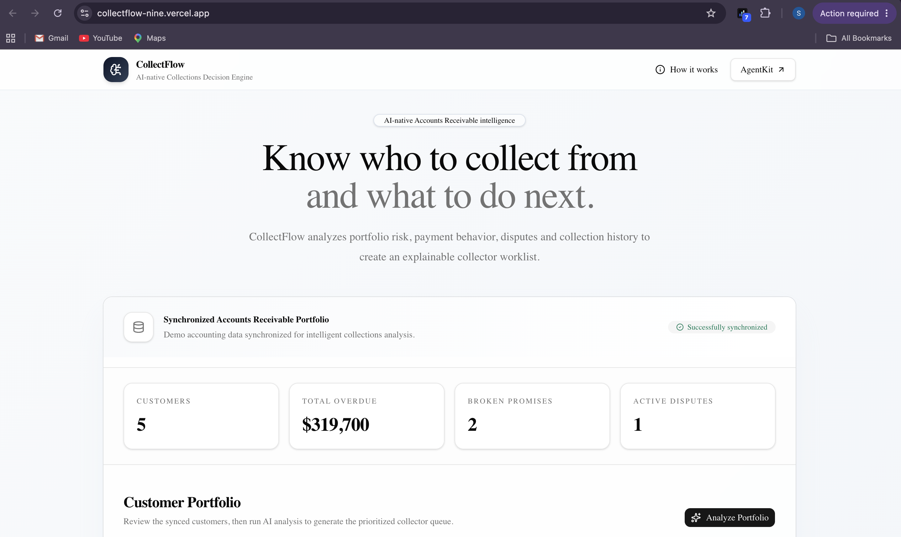
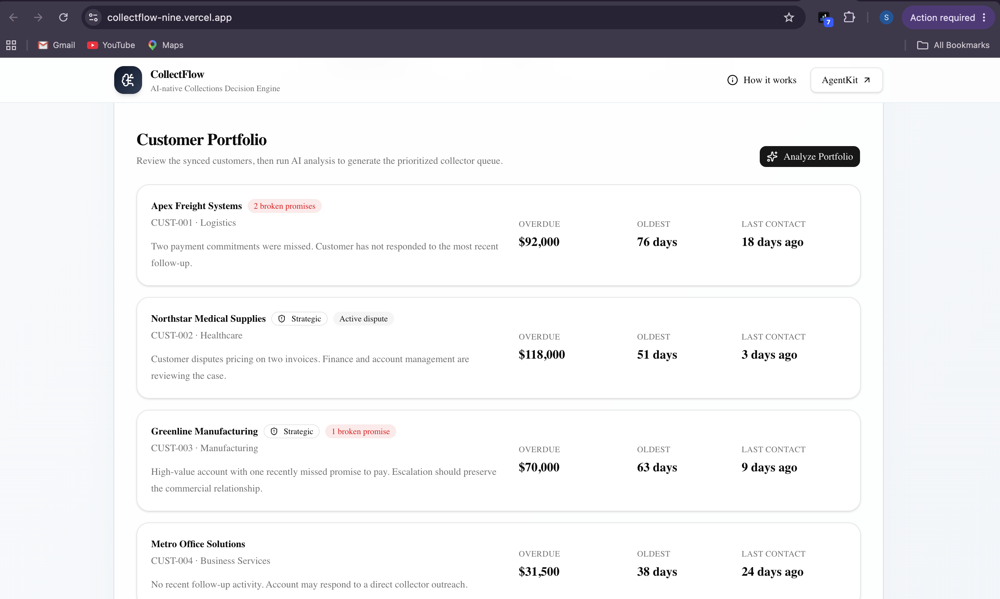
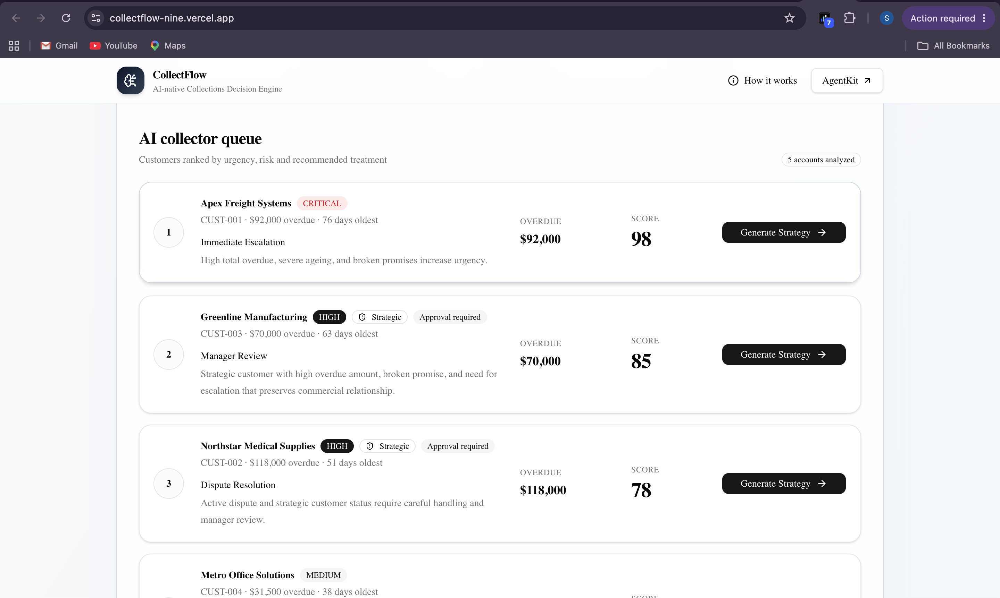
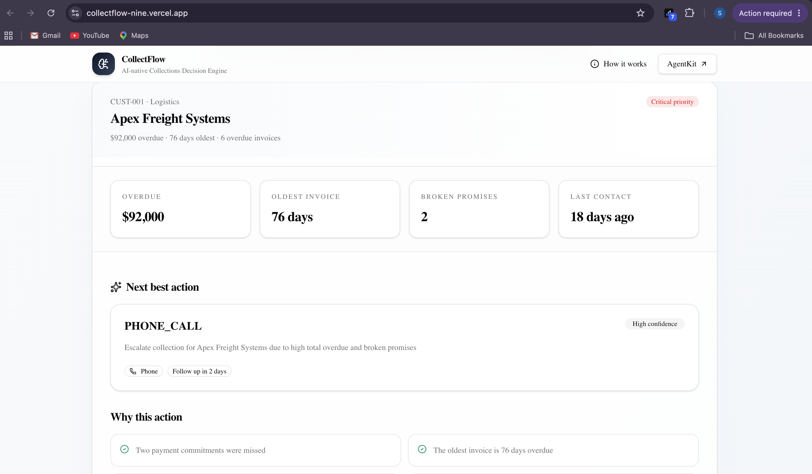
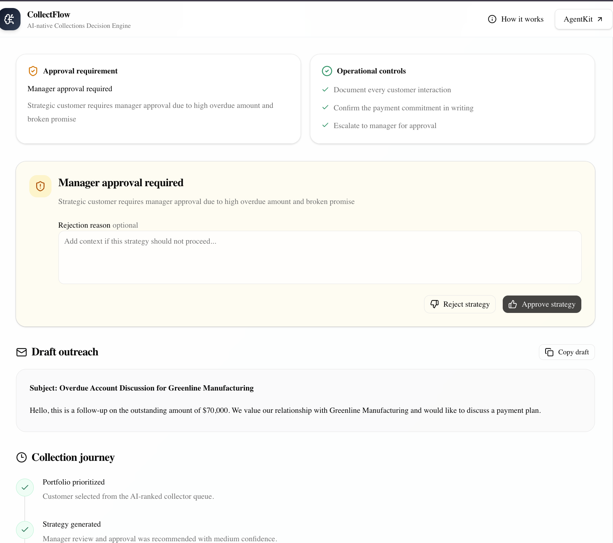
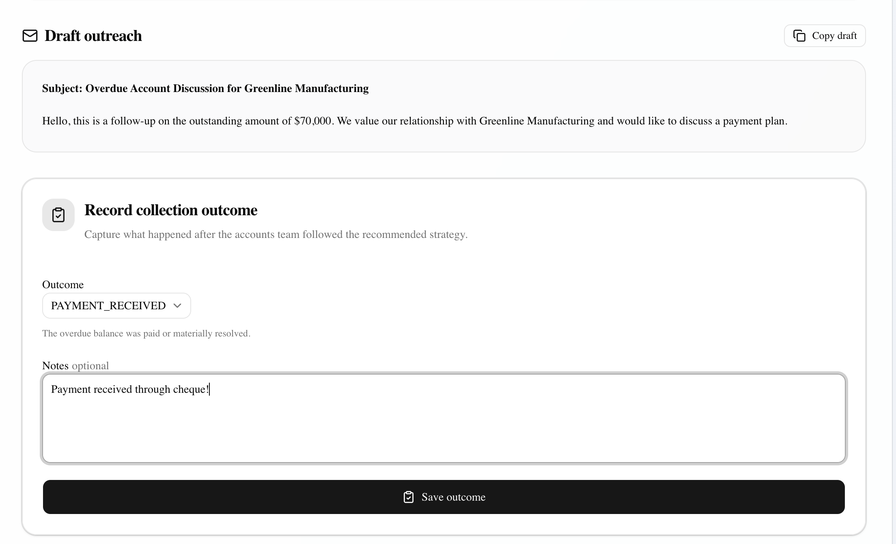
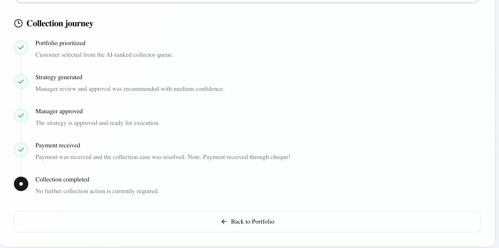

# CollectFlow

> AI-powered collection strategy engine that transforms Accounts Receivable portfolios into explainable, human-guided workflows. Built with [Lamatic AgentKit](https://lamatic.ai).

**[Live Demo](https://collectflow-nine.vercel.app)** ·
**[Walkthrough](#product-walkthrough)**
**[Architecture](#how-it-works)**

---

## The Problem

Accounts Receivable teams spend hours manually reviewing ageing reports, collector notes, and disputes to answer one question: **"Who should I call and why?"**

Traditional AR workflows explain _what is overdue_. They rarely explain _what should happen next_.

Ageing reports are static. Customer circumstances change. Disputes emerge. Payment promises break. Yet every decision still relies on manual analysis, tribal knowledge, and inconsistent prioritization.

This inefficiency costs time, consistency, and revenue recovery.

## The Solution

CollectFlow uses AI to transform AR portfolio data into an explainable collection workflow that:

- **Analyzes customer risk** across multiple dimensions (ageing, dispute history, payment patterns)
- **Prioritizes your portfolio** with explainable reasoning your team understands
- **Generates strategies** customized to each customer's situation
- **Requires human approval** before execution (AI assists, humans decide)
- **Tracks outcomes** and evolves the collection journey in real-time

The result: collectors spend less time deciding _who_ and more time collecting _how_.

---

## Product Walkthrough

### 1. Dashboard Overview

CollectFlow syncs your AR portfolio and presents an at-a-glance view of aging, disputes, and collection status.



### 2. Customer Portfolio

Review synchronized customer accounts with ageing buckets, payment status, and dispute flags before AI analysis begins.



### 3. AI Portfolio Intelligence

Customers are automatically ranked based on overdue amount, ageing, payment behavior, disputes, and broken promises. Explainable scores show _why_ each customer matters.



### 4. Customer Strategy Generation

AI generates an explainable Next Best Action with reasoning, recommended communication channels, and draft outreach templates tailored to each customer's situation.



### 5. Manager Approval Gate

High-risk strategies and large overdue amounts require human approval before execution. This preserves operational safety and keeps AI in a decision-support role.



### 6. Outcome Recording

Collectors record execution results and update customer status in real-time.



### 7. Collection Timeline

The complete collection lifecycle from prioritization through resolution is captured and available for review at any time.



---

## How It Works

### Architecture

```
Synchronized AR Portfolio
            │
            ▼
    Portfolio Intelligence
       (AI Workflow #1)
            │
            ▼
   Ranked Collector Queue
            │
            ▼
   Customer Strategy Gen
       (AI Workflow #2)
            │
            ▼
    Manager Approval Gate
            │
            ▼
    Outcome Recording
            │
            ▼
   Collection Timeline
```

### Two Core AI Workflows

| Workflow                   | Input                       | Output                                                                                        |
| -------------------------- | --------------------------- | --------------------------------------------------------------------------------------------- |
| **Portfolio Intelligence** | AR portfolio snapshot       | Ranked queue, priority scores, risk levels, treatment lanes, portfolio summary                |
| **Customer Strategy**      | Selected customer + history | Next Best Action, AI reasoning, channel recommendation, draft messaging, approval requirement |

Both workflows are orchestrated using Lamatic AgentKit and use Groq for fast, structured inference, producing explainable recommendations for collectors.

---

## Features

### Portfolio Intelligence

- Multi-factor prioritization (ageing, risk, payment history, dispute status)
- Explainable priority scores with transparent reasoning
- Risk classification and treatment lane assignment
- Portfolio health summary and trend insights

### Customer Strategy

- AI-generated Next Best Action (contact, escalate, dispute resolution, payment plan, etc.)
- Recommended communication channel and optimal timing
- Draft customer communication templates ready to send
- Follow-up scheduling recommendations
- Captured AI reasoning for audit trails and compliance

### Human Approval

- Manager approval gate for high-stakes strategies
- Prevents autonomous execution—AI remains decision support
- Approval workflows preserve operational safety and compliance

### Collection Journey

Record outcomes and track progress in real-time:

- Contacted Customer
- Promise to Pay
- Dispute Raised
- No Response
- Payment Received

Timeline updates immediately and persists throughout the session.

---

## Tech Stack

| Layer               | Technology                                                                   |
| ------------------- | ---------------------------------------------------------------------------- |
| **Agent Framework** | [Lamatic AgentKit](https://lamatic.ai)                                       |
| **Frontend**        | [Next.js](https://nextjs.org) + [TypeScript](https://www.typescriptlang.org) |
| **Styling**         | [Tailwind CSS](https://tailwindcss.com) + [shadcn/ui](https://ui.shadcn.com) |
| **LLM**             | [Groq](https://groq.com) (fast inference)                                    |
| **Deployment**      | [Vercel](https://vercel.com)                                                 |

---

## Quick Start

```bash
git clone https://github.com/Sms1818/AgentKit.git
cd AgentKit/kits/collectflow/apps

npm install
cp .env.example .env.local
npm run dev
```

Visit `http://localhost:3000` to access the dashboard.

See [Environment Setup](#environment-variables) for configuration details.

## Project Structure

```
kits/collectflow/
├── apps/                          # Next.js frontend & API routes
├── assets/                        # README screenshots
├── flows/                         # Lamatic workflow definitions
├── prompts/                       # AI workflow prompts & instructions
├── model-configs/                 # LLM model configurations
├── constitutions/                 # Guardrails & safety constraints
├── lamatic.config.ts              # Lamatic AgentKit configuration
├── agent.md                       # Detailed agent architecture
└── README.md
```

## Environment Variables

```env
LAMATIC_API_URL=
LAMATIC_PROJECT_ID=
LAMATIC_API_KEY=
LAMATIC_PORTFOLIO_FLOW_ID=
LAMATIC_CUSTOMER_STRATEGY_FLOW_ID=
```

Get API credentials from your [Lamatic workspace](https://lamatic.ai/dashboard).

---

## MVP Scope

This MVP demonstrates one complete, production-ready collection workflow loop:

```
Portfolio Analysis → Customer Prioritization → Strategy Generation
         ↓
    Manager Approval → Outcome Recording → Timeline Update
```

**Why this scope?** It proves the core concept—AI-assisted collection workflows that respect human decision-making—without unnecessary complexity.

## What's Out of Scope (Intentional)

The following are planned for future releases but outside the MVP:

- ❌ ERP integrations (QuickBooks, SAP, NetSuite)
- ❌ Persistent database and customer timelines
- ❌ Automated email & SMS delivery
- ❌ Collector assignment optimization
- ❌ Payment portal integration
- ❌ Authentication & multi-user collaboration
- ❌ Learning-based prioritization models

## Design Philosophy: Responsible AI in Collections

CollectFlow demonstrates how AI can support AR teams without replacing human judgment:

| Responsibility         | Owner | Rationale                                      |
| ---------------------- | ----- | ---------------------------------------------- |
| Analysis & Reasoning   | AI    | Fast, consistent evaluation of complex factors |
| Approval & Execution   | Human | Maintains accountability and compliance        |
| Customer Communication | Human | Preserves relationship nuance                  |
| Outcome Recording      | Human | Ensures data quality and feedback loops        |
| Learning & Iteration   | Human | Keeps humans in control of system evolution    |

**Result:** Transparent, explainable, operationally safe workflows. AI augments; humans decide.

---

## Roadmap

- [ ] Live ERP integrations (QuickBooks, SAP, NetSuite)
- [ ] Persistent collection timelines and customer history
- [ ] Automated channel delivery (email, SMS, payment links)
- [ ] Collector assignment optimization
- [ ] Payment portal integration
- [ ] Learning-based prioritization models
- [ ] Multi-user collaboration & audit trails

---

## Contributing

We welcome contributions from AR professionals, AI engineers, and open source maintainers.

For guidelines, see [CONTRIBUTING.md].

---

## Support & Documentation

- **Agent Architecture:** See `agent.md`
- **Lamatic Documentation:** https://lamatic.ai/docs

---

## License

MIT

---

**Built for the [Lamatic AgentKit Challenge](https://lamatic.ai/challenge).**
