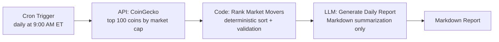

# Top Crypto Movers

A scheduled [Lamatic AgentKit](https://lamatic.ai) agent that monitors the top 100 cryptocurrencies by market cap, deterministically ranks the five largest 24-hour gainers and losers, and uses an LLM to summarize the results into a clean, human-readable Markdown report.

## Overview

Top Crypto Movers runs on a fixed schedule, pulls live market data from the [CoinGecko](https://www.coingecko.com/) public API, ranks the biggest 24-hour gainers and losers using plain deterministic code, and hands that pre-ranked data to an LLM whose only job is to format it into a readable report. No ranking, filtering, or numerical reasoning is delegated to the model — it summarizes; it does not compute.

## Features

- **Automated scheduling** — runs unattended on a cron trigger, no manual invocation required.
- **Live market data** — sources current price, 24-hour change, market-cap rank, and trading volume directly from CoinGecko.
- **Deterministic ranking** — gainers and losers are computed with plain, testable code, not model inference.
- **Hallucination-resistant reporting** — the LLM is constrained to summarization only, with an explicit constitution and prompt guardrails against fabricated prices, rankings, or investment advice.
- **Unicode-safe** — coin names and symbols (including non-Latin scripts) are passed through unmodified.
- **Structured, predictable output** — every report follows the same Markdown structure, making it easy to consume downstream (email, Slack, dashboards, etc.).

## Architecture

The flow is a single linear pipeline with four functional stages:

```
Cron Trigger → CoinGecko API → Code (deterministic ranking) → Generate Text (LLM report)
```

| Stage | Node | Responsibility |
|---|---|---|
| Trigger | `triggerNode_1` (Cron) | Fires the flow on a fixed schedule. |
| Fetch | `apiNode_407` (API) | Retrieves the top 100 coins by market cap from CoinGecko. |
| Rank | `codeNode_672` (Code) | Validates the payload and deterministically ranks the top 5 gainers and top 5 losers by 24h % change. |
| Report | `LLMNode_261` (Generate Text) | Summarizes the ranked data into a Markdown report. Performs no ranking or calculation. |

### Flow diagram



## How It Works

1. **Trigger** — A cron schedule (`0 9 * * *`, America/New_York) fires the flow once per day at 9:00 AM Eastern time.
2. **Fetch** — An API node calls CoinGecko's `/coins/markets` endpoint for the top 100 cryptocurrencies by market cap, including 24-hour price change data.
3. **Rank** — A code node filters out any malformed entries, then sorts the remaining coins by 24-hour percentage change to deterministically select the top 5 gainers and top 5 losers. It outputs a compact JSON payload: `analyzed_coin_count`, `top_gainers`, and `top_losers`.
4. **Report** — An LLM node receives that JSON and formats it into a fixed Markdown structure: a market snapshot, gainers, losers, three factual observations, and a disclaimer. The model is explicitly instructed not to invent values, infer causes, or give investment advice.

## Project Structure

```
.
├── lamatic.config.ts                                     # Project metadata (name, type, tags, author)
├── agent.md                                               # Agent identity, capabilities, and guardrails
├── constitutions/
│   └── default.md                                         # Global + domain-specific behavioral rules
├── flows/
│   └── top-crypto-movers.ts                                # Flow definition: nodes, edges, references
├── model-configs/
│   └── top-crypto-movers_llmnode-261_generative-model-name.ts  # LLM provider/model configuration
├── prompts/
│   ├── top-crypto-movers_llmnode-261_system_0.md            # System prompt (role + guardrails)
│   └── top-crypto-movers_llmnode-261_user_1.md               # User prompt (task + report structure)
└── scripts/
    └── top-crypto-movers_code-node-672_code.ts               # Deterministic ranking logic
```

## Configuration

| Setting | Location | Value |
|---|---|---|
| Schedule | `flows/top-crypto-movers.ts` → `triggerNode_1` | `0 9 * * *` (America/New_York) — once daily at 9:00 AM ET |
| Data source | `flows/top-crypto-movers.ts` → `apiNode_407` | CoinGecko `/coins/markets` endpoint |
| LLM provider | `model-configs/.../generative-model-name.ts` | OpenAI (`gpt-5.2-2025-12-11`) via a Lamatic credential |
| Prompts | `prompts/` | System prompt (guardrails) + user prompt (task/data) |

To change the schedule, edit the `cronExpression` on the trigger node. To change the model, update `model_name` in the model config — no other file needs to change, since the flow references the model config by path.

## Data Source

Market data is retrieved from the public [CoinGecko API](https://www.coingecko.com/en/api/documentation):

```
GET https://api.coingecko.com/api/v3/coins/markets
    ?vs_currency=usd
    &order=market_cap_desc
    &per_page=100
    &page=1
    &sparkline=false
    &price_change_percentage=24h
```

This returns the top 100 coins by market capitalization along with current price, 24-hour percentage change, market-cap rank, and trading volume. No API key is required for this endpoint at the request volume this flow uses.

## Example Output

The following is an illustrative example of the report structure (values are placeholders, not live data):

```markdown
# Daily Crypto Market Movers

## Market Snapshot
100 cryptocurrencies were analyzed using 24-hour price change data.

## Top 5 Gainers
1. **Example Coin (EXC)** — $1.23 | +18.42% | Rank #42 | Volume: $12,345,678
...

## Top 5 Losers
1. **Sample Token (SMP)** — $0.567834 | -14.20% | Rank #77 | Volume: $3,456,789
...

## Observations
- The top gainer outperformed the top loser by roughly 32.6 percentage points.
- Trading volume among the top gainers exceeded $50M in aggregate.
- Losses among the bottom 5 ranged from -6% to -14%.

## Disclaimer
This report is for informational purposes only and does not constitute financial advice.
```

## Why Deterministic Code?

Filtering, validation, sorting, and ranking are handled by plain code because those operations are deterministic and testable — for a given dataset, there is exactly one correct answer, every time. The LLM is intentionally limited to converting that already-ranked, already-validated result into a human-readable report; it never filters, sorts, ranks, or computes a value itself.

This separation of concerns is deliberate:

- **Correctness** — ranking logic is plain, testable code rather than a model's numerical reasoning, which removes an entire class of failure modes (miscounting, misreading percentages, subtly reordering entries) that are a known risk when asking an LLM to sort or compare numbers across a 100-item list.
- **Reproducibility** — the same input always produces the same ranking, with no run-to-run variance.
- **Observability** — each stage (fetch, rank, summarize) can be logged, tested, and debugged independently.
- **Reduced hallucination risk** — the LLM receives only the five gainers and five losers it needs to describe, and is instructed (via the constitution and both prompts) never to invent values, infer causes for price movement, or offer investment advice.

## Limitations

- CoinGecko's free public API is rate-limited; sustained high-frequency polling may result in throttled or failed requests.
- The flow does not persist historical reports — each run is stateless and reflects only the data at the time of the API call.
- Coins with missing or non-finite price, percentage-change, or volume fields are excluded from ranking rather than partially reported.
- The report reflects a point-in-time snapshot; it does not account for data revisions CoinGecko may make after the fact.
- LLM output, while constrained by prompt and constitution rules, is not guaranteed to be perfectly formatted on every run — no output-schema validation is currently applied downstream of the LLM node.

## Future Improvements

- Add automated tests for the ranking logic in `scripts/top-crypto-movers_code-node-672_code.ts`.
- Validate the LLM's Markdown output against the expected structure before delivery, with a retry on malformed output.
- Add a delivery step (e.g. email, Slack, or webhook) so reports reach recipients without manual polling.
- Persist historical reports to support trend analysis across runs.
- Add configurable thresholds (e.g. minimum market cap or volume) to filter out illiquid or newly listed coins.
