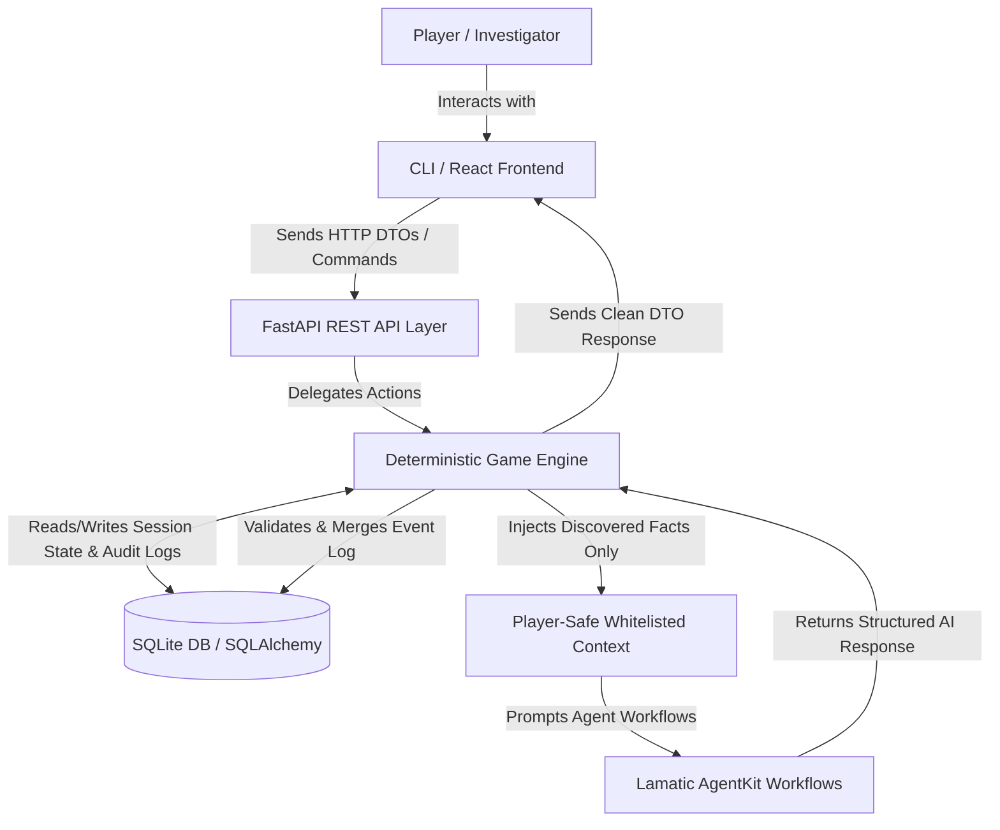

# DetectiveAI Kit by Lamatic.ai

**DetectiveAI** is a hybrid AI-deterministic mystery investigation game engine and playable simulation kit. It utilizes Lamatic AgentKit to orchestrate contextual conversational suspects, forensic evidence analysis, and case solution grading, while keeping the absolute source of truth and state rules locked inside an authoritative FastAPI backend.

---

## 1. Problem
Traditional detective video games rely on static branching dialogue trees and rigid trigger points. Fully LLM-driven games suffer from hallucinations, state inconsistency (e.g. changing the culprit mid-investigation), and inability to enforce action point budgets, stage requirements, or locked rooms.

DetectiveAI solves this by separating **authoritative game logic** (owned by the Python backend) from **AI reasoning & conversational agents** (powered by Lamatic AgentKit).

---

## 2. Approach
* **Deterministic GameEngine:** Validates legal player actions (move, inspect, interrogate), updates inventories, logs audit events, and tracks progression stages.
* **Ground-Truth Isolation:** Ensures that the LLMs never receive the secret alibis, culprit identity (`culprit_id`, `is_culprit` flag), motive, or undiscovered clue details.
* **Lamatic Flows:** Orchesrates three specialized workflows:
  * `suspect-interrogation`: Dynamically interviews suspects based on whitelisted alibis.
  * `evidence-examination`: Conducts forensic review of found clues.
  * `solution-evaluation`: Grades motives and crime timelines.
* **Multi-Interface Support:** Includes a React + Vite dashboard and a Typer-powered terminal CLI.

---

## 3. Architecture



---

## 4. Quick Start

### 4.1 Prerequisites
* Python 3.12+
* Node.js 18+ & npm 9+
* A Lamatic Studio Account

### 4.2 Installation
From the `kits/detective-ai/apps` directory, install all dependencies:

```bash
cd kits/detective-ai/apps

# Install React and Python dependencies
npm run install:all
```

### 4.3 Environment Variables
Configure your credentials by copying `.env.example` to `.env`:

```bash
cp .env.example .env
```
Ensure you set your `LAMATIC_API_KEY`, `LAMATIC_PROJECT_ID`, `LAMATIC_ENDPOINT`, and deployed Flow IDs.

### 4.4 Running Locally

**Start both Web Frontend and FastAPI Backend concurrently:**
```bash
npm run dev
```
* React Web UI: `http://localhost:5173`
* FastAPI Swagger docs: `http://localhost:8000/docs`

**Start the interactive Terminal CLI game:**
```bash
# Register scenario and start playing
python -m cli play the_midnight_archive
```

---

## 5. Gameplay Example
1. **Start Session:** Select **The Midnight Archive** scenario.
2. **Move:** Navigate to the `Security Room` (deducts action points).
3. **Inspect:** Search the room to discover `Access Logs`.
4. **Examine Evidence:** Run forensic analysis on `Access Logs` via AI agent.
5. **Interrogate Suspect:** Dialogue with `Sofia Bennett` regarding her alibi.
6. **Advance Stage:** Unlock the locked `Director Office` when alibis conflict.
7. **Solve Case:** Submit a case hypothesis detailing culprit, motive, cited evidence, and timeline.
8. **Evaluation:** View the final rubric scorecard and judge's feedback.

---

## 6. Testing

### Backend Tests
Verify deterministic state machine transitions and offline fallbacks (138 tests):
```bash
pytest backend
```

### Frontend Tests
Verify UI components and forms using Vitest and Happy DOM (12 tests):
```bash
npm run test:frontend
```

---

## 7. Tradeoffs & Assumptions
* **Stateless AI:** Conversation history is kept in the SQLite database and compiled dynamically for each prompt turn.
* **Offline Mode:** If Lamatic is down or unconfigured, the game automatically drops back to deterministic text fallbacks.
* **SQLite Storage:** Database is configured to resolve relative to module path, ensuring the CLI and FastAPI web server share game sessions dynamically.
