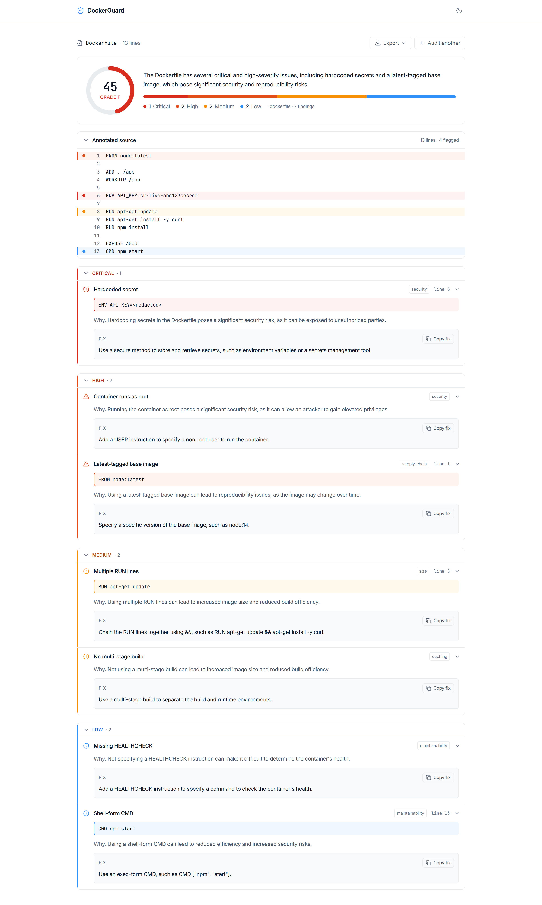
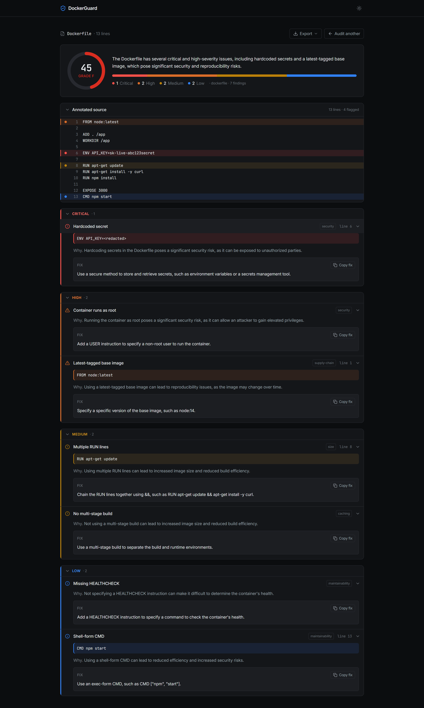

# DockerGuard

DockerGuard is a tool that reviews the setup file used to build software containers and tells you what is wrong with it. You paste in the file; it gives you back a report with a score, a plain-English explanation of each problem, and the exact fix for it. It is built on [Lamatic.ai](https://lamatic.ai) and comes with a simple web page you can run yourself.

**Live demo:** [agent-kit-roan.vercel.app](https://agent-kit-roan.vercel.app)

[](https://vercel.com/new/clone?repository-url=https://github.com/Lamatic/AgentKit&root-directory=kits%2Fdockerguard%2Fapps&env=DOCKERGUARD_AUDIT,LAMATIC_API_URL,LAMATIC_PROJECT_ID,LAMATIC_API_KEY&envDescription=Your%20Lamatic%20flow%20ID%20and%20API%20credentials%20are%20required.&envLink=https://lamatic.ai/docs)

---

## Screenshots

The audit report, shown in light and dark mode:





## The problem this solves

Software is often shipped inside a "container"; a container is described by a small text file (a Dockerfile, or a docker-compose file). Most security mistakes are made right here, in that text file, before anything is even built. Common examples are leaving a password inside the file, giving the program more power than it needs, or pulling in an unnamed version of something that can change without warning.

There are existing tools that scan a container after it has been built, but by then the mistake is already inside it. DockerGuard reads the setup file first and points out the problems while they are still cheap to fix. It only reads the file; it never runs, downloads, or builds anything.

## What you get back

You give it the file; it returns a report. The report contains:

- a score out of 100 and a letter grade, so you can see the overall health at a glance;
- a one-line summary of the file's condition;
- a list of findings, ordered from most to least serious; each finding names the exact line, explains in plain words why it is a problem, and gives you the corrected line to use instead;
- a list of the good practices the file already follows, so it is not only bad news.

Here is a shortened example of the report, using a file that has a password written directly inside it:

```json
{
  "input_type": "dockerfile",
  "score": 47,
  "grade": "F",
  "summary": "The container runs with full privileges, uses an unnamed base version, and has a password written inside it.",
  "findings": [
    {
      "id": "DG-1",
      "severity": "critical",
      "category": "security",
      "title": "Password written inside the file",
      "line": 5,
      "why": "Anything written here is permanently stored inside the container and can be read by anyone who gets a copy of it.",
      "fix": "Provide the password when the container starts instead of writing it into the file."
    }
  ],
  "passed_checks": ["Sets a clear working folder instead of switching folders inside commands"]
}
```

## What it checks for

The review is grouped into four areas:

- Security; for example a password left in the file, the program running with more power than it needs, or downloading and running code straight from the internet.
- Trust and repeatability; for example relying on an unnamed version of something, which means two builds on two days can quietly differ.
- Size and speed; for example steps ordered in a way that makes every build slower than it needs to be, or leftover files that make the container larger than it should be.
- Everyday maintainability; for example missing a basic health check, or writing commands in a form that is harder to read and run reliably.

---

## How to set it up

There are two parts. First you build the agent inside Lamatic; then you connect this web page to it.

### Part one; build the agent in Lamatic

1. Sign in at [studio.lamatic.ai](https://studio.lamatic.ai) and open a project, or create one.
2. Create a new flow and name it `dockerguard-audit`. It has three steps:
   - an entry step that receives the file (an "API Request" node);
   - a thinking step that does the review (an "LLM" node); paste the two prompt files from the `prompts/` folder into it, and choose a model that can return clean data, such as GPT-4o-mini, Claude Haiku, or Gemini Flash, set to a low temperature so the output stays consistent;
   - an exit step that returns the report (an "API Response" node); set its output to `report` = `{{LLMNode_1.output.generatedResponse}}`.
3. Deploy the flow and copy its Flow ID.
4. Open Settings, then API Keys, and copy the API URL, the Project ID, and the API Key.

### Part two; connect this web page

1. Go into the `apps` folder and make your own settings file: `cp .env.example .env.local`, then paste in the four values from above.
2. Install and run it:

```bash
cd apps
npm install
npm run dev
```

Then open http://localhost:3000 in your browser, paste in a Dockerfile, and run the audit.

You can also put it online in one click using the "Deploy with Vercel" button at the top; when it asks, set the four values as environment variables and set the root directory to `kits/dockerguard/apps`.

## The settings you need to fill in

Your `apps/.env.local` file should contain these four lines, with the real values in place of the descriptions:

```bash
DOCKERGUARD_AUDIT="the Flow ID you copied after deploying"
LAMATIC_API_URL="your project's API address"
LAMATIC_PROJECT_ID="your project's ID"
LAMATIC_API_KEY="your API key"
```

---

## How the folder is organised

```
kits/dockerguard/
  lamatic.config.ts            the kit's description and settings
  agent.md                     what the agent is and how it behaves
  README.md                    this file
  constitutions/default.md     the ground rules the agent must follow
  flows/dockerguard-audit.ts   the flow: receive file, review it, return report
  prompts/                     the exact instructions given to the model
  model-configs/               which model the review step uses
  apps/                        the web page
    orchestrate.js             reads your settings from the environment
    actions/orchestrate.ts     sends the file to the flow and reads the report back
    lib/lamatic-client.ts      the connection to Lamatic
    app/                       the page itself
    components/                the pieces the page is built from
```

## License

MIT License; see [LICENSE](../../LICENSE).
