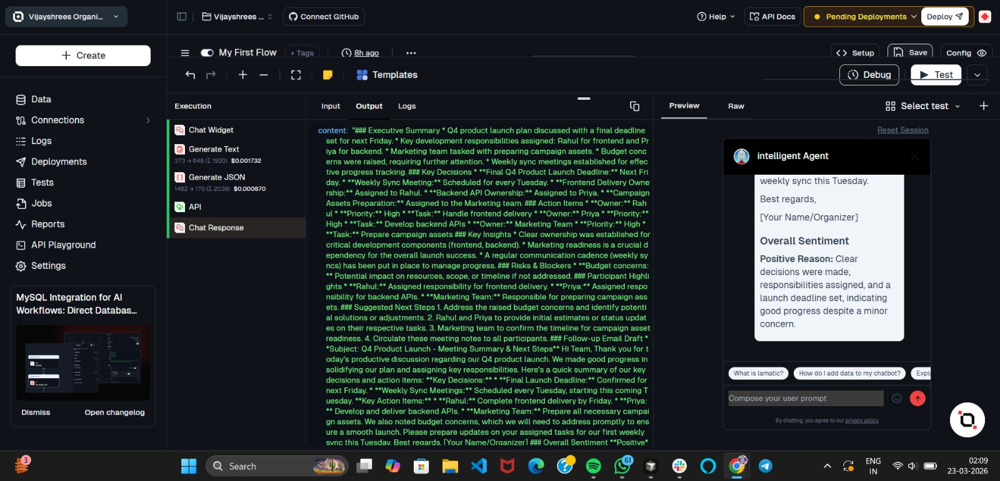
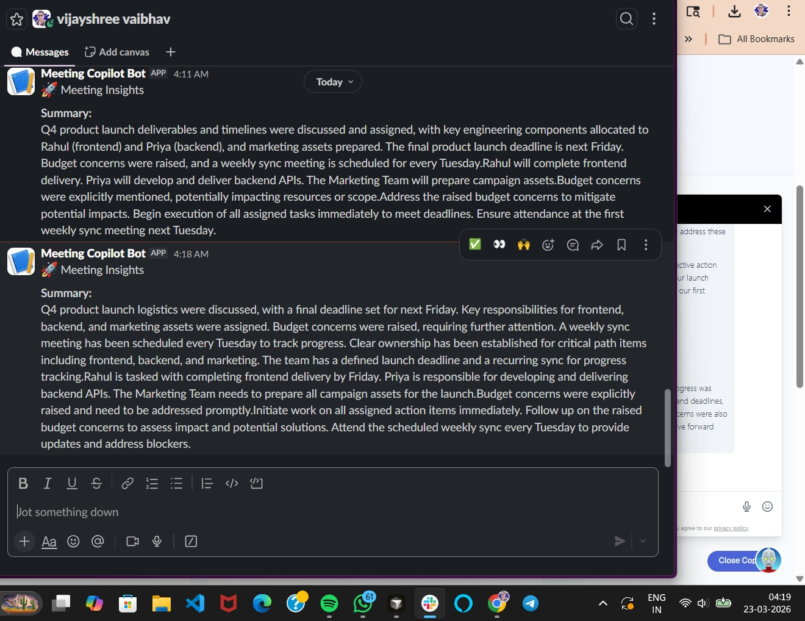
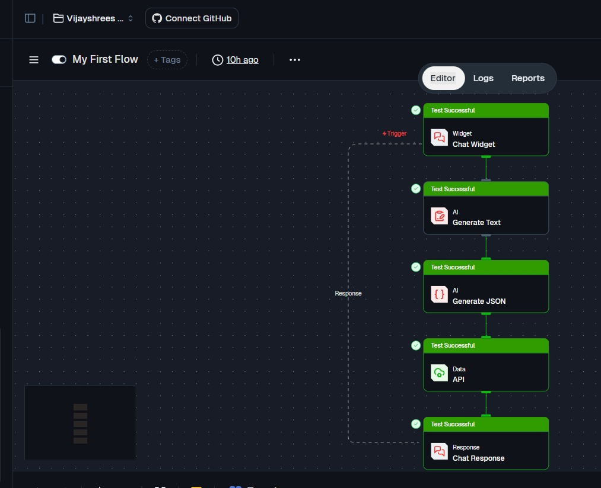

# 🧠 AI Meeting Intelligence Copilot

[](https://vercel.com/new/clone?repository-url=https://github.com/Lamatic/AgentKit&root-directory=kits/embed/meeting-intelligence&env=NEXT_PUBLIC_LAMATIC_PROJECT_ID,NEXT_PUBLIC_LAMATIC_FLOW_ID,NEXT_PUBLIC_LAMATIC_API_URL&envDescription=Get%20these%20from%20Lamatic%20Studio)

> Turn raw meeting transcripts into structured, actionable intelligence — delivered automatically to Slack.

Part of the [Lamatic AgentKit](https://github.com/Lamatic/AgentKit) · Built by [Vijayshree Vaibhav](https://github.com/vijayshreepathak)

---

## 🎯 Problem Statement

Teams walk out of meetings with scattered notes, untracked action items, and unclear ownership. This kit solves it in one step: paste a transcript → receive a structured summary, action items, risks, next steps, and a follow-up email draft — all sent to Slack automatically.

---

## ✨ What This Kit Does

| Input | Output |
|---|---|
| Raw meeting transcript | Executive summary |
| Any format, any length | Action items with owners & priority |
| | Risks & blockers |
| | Suggested next steps |
| | Follow-up email draft |
| | Overall sentiment |
| | Slack notification ⚡ |

---

## 🏗️ Architecture

```
User pastes transcript
        ↓
Next.js Frontend (TranscriptPlayground)
        ↓
Lamatic Chat Widget (chat-v2 embedded)
        ↓
Chat Trigger → Generate Text (LLM) → Generate JSON
                                            ↙        ↘
                                     Slack API   Chat Response
                                    (webhook)   (streamed to UI)
```

---

## 📸 Screenshots

### Web App — Transcript Input & Structured Output


### Lamatic Studio — Flow Execution & Preview


### Slack Integration — Auto-delivered Insights


### Landing Page


---

## 📂 Structure

```
kits/embed/meeting-intelligence/
├── app/
│   ├── page.js                    # Landing page (Server Component)
│   ├── layout.js                  # Root layout with Geist fonts + Analytics
│   ├── globals.css                # Tailwind v4 theme + CSS variables
│   └── Screenshots/               # Demo screenshots
├── components/
│   ├── LamaticChat.js             # Widget bootstrap + lifecycle manager
│   ├── HeroActions.jsx            # CTA buttons (Client Component)
│   ├── TranscriptPlayground.jsx   # Transcript input + Analyze button
│   └── ui/                        # shadcn/ui primitives (button, badge, card, textarea)
├── flows/
│   └── meeting-intelligence-chatbot/
│       ├── config.json            # Lamatic flow configuration
│       ├── meta.json              # Flow metadata
│       ├── inputs.json            # Configurable inputs (model, Slack URL)
│       └── README.md              # Flow setup guide
├── lib/
│   └── utils.ts                   # cn() utility
├── .env.example                   # Environment variable template
├── .gitignore
├── components.json                # shadcn/ui config
├── next.config.mjs
├── package.json
├── postcss.config.mjs
└── tsconfig.json
```

---

## ⚙️ Setup

### 1. Prerequisites

- [Lamatic account](https://lamatic.ai) with the meeting intelligence flow deployed
- A Slack incoming webhook URL

### 2. Build the Lamatic flow

1. Sign in to [Lamatic Studio](https://studio.lamatic.ai)
2. Create a new flow and import `flows/meeting-intelligence-chatbot/config.json`
3. Set your LLM credentials (Gemini, GPT-4o, or Claude)
4. Replace `YOUR_SLACK_WEBHOOK_URL` in the API node with your Slack webhook
5. In the Chat Trigger node, add `*` to Allowed Domains
6. Click **Save** → **Deploy**
7. Copy your Project ID, Flow ID, and API URL

### 3. Install and run locally

```bash
cd kits/embed/meeting-intelligence
npm install
```

Create `.env.local`:

```env
NEXT_PUBLIC_LAMATIC_PROJECT_ID=your_project_id
NEXT_PUBLIC_LAMATIC_FLOW_ID=your_flow_id
NEXT_PUBLIC_LAMATIC_API_URL=https://your-project.lamatic.dev
```

```bash
npm run dev
# → http://localhost:3000
```

### 4. Deploy to Vercel

Click the **Deploy with Vercel** button at the top, or:

```bash
vercel --root kits/embed/meeting-intelligence
```

Add your production domain to the Chat Trigger's Allowed Domains in Lamatic Studio, then redeploy the flow.

---

## 🛠️ Tech Stack

| Layer | Technology |
|---|---|
| Frontend | Next.js 14 (App Router) |
| UI | Tailwind CSS v4 + shadcn/ui |
| AI Workflow | Lamatic Studio |
| LLM | Gemini 2.5 Flash (swappable) |
| Chat Widget | Lamatic `chat-v2` |
| Integration | Slack Incoming Webhooks |
| Deployment | Vercel |

---

## 📜 License

MIT — see [LICENSE](../../LICENSE).
