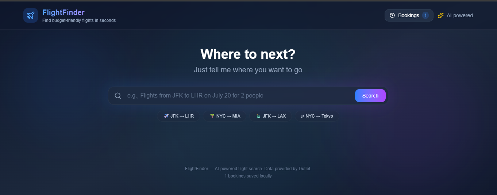

# ✈️ Flight Booking Agent

**Live Demo:**
An AI-powered flight search agent that finds the cheapest flights using natural language.



---

## Features

- Natural Language Search – "Flights from JFK to LHR on July 20 for 2 people"
- Real-Time Pricing – Duffel API integration with 300+ airlines
- Currency Conversion – USD → ZAR, NGN, EUR, GBP, and more
- Smart Filtering – Shows the 5 cheapest options
- Cabin Class Support – Economy, Premium Economy, Business, First
- Price Range Display – Cheapest and most expensive flights
- Round-Trip Support – Handles both one-way and round-trip searches
  -Booking History – Saves bookings locally in the browser

---

## Tech Stack

- Lamatic.ai (AI workflow)
- Duffel API (flight data)
- Next.js 14
- TypeScript
- Tailwind CSS
- Framer Motion

---

## Getting Started

### Prerequisites

- Node.js 18+ and npm
- Lamatic.ai account (for AI workflow)
- Duffel API account (for flight data)

### Installation

```bash
git clone git@github.com:YOUR_USERNAME/AgentKit.git
cd AgentKit/kits/flight-booking-agent
npm install
```

### Environment Variables

```
# Lamatic API
LAMATIC_API_KEY=your_lamatic_api_key
LAMATIC_PROJECT_ID=your_project_id
LAMATIC_WORKFLOW_ID=your_workflow_id
LAMATIC_API_URL=your_api_url
```

### Run locally

netlify dev

## Deployment to Netlify

Push your repository to GitHub.

Log in to Vercel and click Add New → Project

Connect your GitHub repo and select the AgentKit repository.

Set the Root Directory to kits/flight-booking-agent/apps

Build settings will be auto‑detected (Next.js).

Add the environment variables in Vercel dashboard (same as above).

Deploy.

## Future Improvements

1. **Real Booking Integration** – Connect Duffel's order creation API to enable actual flight bookings with payment processing (Stripe/PayPal). This would transform the app from a search tool into a complete booking platform.

2. **Price Alerts** – Allow users to track specific routes and receive email or push notifications when flight prices drop, helping them book at the optimal time.

3. **Multi-City & Complex Itineraries** – Support flights with multiple stops or complex routes (e.g., "JFK → LHR → CDG → JFK"), handling more sophisticated travel plans beyond simple one-way and round-trip searches.

## Acknowledgements

Duffel API – Real-time flight data and pricing

Lamatic.ai – AI workflow and LLM orchestration

Exchange Rate API – Currency conversion data

Next.js – React framework

Tailwind CSS – Styling

Framer Motion – Animations
