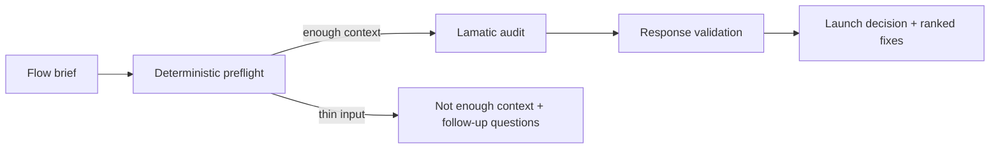

# Flow Launch Auditor

Flow Launch Auditor reviews one Lamatic Flow before go-live and returns an evidence-backed launch decision, top risks, and ranked fixes across evals, tool boundaries, failure paths, security/privacy, setup documentation, observability, and cost/latency.

A Flow can succeed on its happy path in Studio and still be difficult to launch safely for a customer. Missing evals, unclear tool contracts, weak failure handling, undocumented setup, or limited observability often surface during onboarding or after handoff. This kit turns those risks into a concise, inspectable review before deployment.

For Lamatic onboarding and launch work, that means a customer-facing engineer can explain what is ready, what needs attention, and what to fix first. Repeated findings can also become product feedback for Studio checks, starter templates, and documentation improvements.

[Try the live demo](https://flow-launch-auditor.vercel.app) · [](https://vercel.com/new/clone?repository-url=https://github.com/Lamatic/AgentKit&root-directory=kits%2Fflow-launch-auditor%2Fapps&env=LAMATIC_API_URL,LAMATIC_API_KEY,LAMATIC_PROJECT_ID,LAMATIC_FLOW_ID,TRUST_PROXY_HEADERS&envDescription=Lamatic%20runtime%20values%20and%20trusted-proxy%20configuration%20are%20required.%20See%20the%20kit%20README%20for%20setup.&envLink=https://github.com/Lamatic/AgentKit/tree/main/kits/flow-launch-auditor%23run-the-app)

> The Deploy Button targets the canonical `Lamatic/AgentKit` repository and becomes cloneable after this kit is merged into upstream `main`. Until then, use the live demo or run the kit locally.

## The Launch Review

Applied AI Engineers, solution engineers, maintainers, and customer-facing product teams can use the kit to review one Flow before customer go-live, handoff, or publication. It returns:

- One launch decision: `ready`, `needs-review`, `not-ready`, or `not-enough-context`.
- Confidence in that decision, an operational summary, and up to three top risks.
- Evidence-backed findings with concrete fixes ranked by launch impact.
- Targeted follow-up questions when the submitted material is too thin for a responsible audit.

The Lamatic Flow checks seven launch-readiness categories:

- `evals-and-tests`: sample inputs, golden paths, edge cases, assertions, and malformed-input coverage.
- `tool-boundaries`: API, webhook, credential, environment, and integration boundaries.
- `failure-paths`: retries, fallbacks, timeouts, rate limits, exceptions, and degraded behavior.
- `security-and-privacy`: PII handling, auth, secrets, tokens, permissions, and data exposure.
- `env-and-setup-docs`: README/setup clarity, required env vars, `.env.example`, and deployment notes.
- `observability-and-logging`: logs, traces, metrics, monitoring, debugging, and audit trail expectations.
- `cost-and-latency`: only evidence-backed issues such as loops, per-row model calls, no caching, oversized context, avoidable serial work, or explicit latency risks.

## How It Works



The app sanitizes the submitted text, derives lightweight signals, and stops very thin submissions from producing a speculative audit. The Lamatic Flow makes the launch judgment. The app then validates the structured response before presenting the decision, evidence, risks, and ranked fixes. This separation keeps the result inspectable without treating the preflight as a Flow parser or a second auditor.

## Input Contract

The Studio Flow accepts this request shape through API Request. The app sends the same shape as the GraphQL `executeWorkflow` `payload` variable.

```json
{
  "flowBrief": "Required plain-text problem, user, workflow, inputs, tools, outputs, launch notes, and known risks.",
  "optionalFlowExport": "Optional pasted Lamatic Flow export, config, README excerpt, setup notes, or prompt text.",
  "detectedSignals": {
    "hasEnoughContext": true,
    "envLikeTokens": ["LAMATIC_API_KEY", "LAMATIC_FLOW_ID"],
    "categorySignals": {
      "evals-and-tests": ["five fixtures"],
      "tool-boundaries": ["webhook", "read-only billing API"],
      "failure-paths": ["timeout fallback"],
      "security-and-privacy": ["logs omit full email body"],
      "env-and-setup-docs": [".env.example"],
      "observability-and-logging": ["ticket ID logs"],
      "cost-and-latency": []
    }
  }
}
```

`flowBrief`, `optionalFlowExport`, and `detectedSignals` are required by the Flow contract. The brief should identify the customer problem, intended users, trigger, main model/tool steps, output contract, setup notes, and success or failure criteria. `optionalFlowExport` can be an empty string.

In normal app usage, the app fills `detectedSignals` before calling Lamatic. Direct API callers must provide the same object shape, using sanitized signal names only and never secret values. The app's `/api/audit` route does not trust caller-supplied signals: it recomputes them from the sanitized text and treats the local preflight object as authoritative when validating Lamatic output.

## Output Contract

The Flow returns strict JSON for the app and for downstream launch review.

```json
{
  "launchDecision": "ready | needs-review | not-ready | not-enough-context",
  "confidence": "high | medium",
  "summary": "Short launch-readiness summary.",
  "detectedSignals": {},
  "topRisks": ["Up to three launch risks."],
  "findings": [
    {
      "category": "env-and-setup-docs",
      "severity": "critical | high | medium | low",
      "title": "Short finding title",
      "evidence": "Evidence from the submitted brief or Flow text.",
      "whyItMatters": "Why this can affect launch.",
      "recommendedFix": "Concrete next action."
    }
  ],
  "recommendedFixes": [
    {
      "priority": 1,
      "fix": "Concrete fix",
      "estimatedEffort": "small | medium | large",
      "launchImpact": "high | medium | low"
    }
  ],
  "questionsToContinue": []
}
```

`confidence` describes confidence in the decision. A clearly thin brief can return `not-enough-context` with `confidence: "high"` because the Flow is confident that a responsible audit is not yet possible. In that state, risks, findings, and fixes are empty, and `questionsToContinue` identifies the missing launch context.

For example, a billing-email Flow with fixtures, a documented timeout fallback, privacy-conscious logs, and one missing failed-webhook replay procedure can return `needs-review`, cite the documentation gap as its top risk, and rank a Studio replay walkthrough as the first fix. The review preserves the evidence already supplied instead of inventing unverified runtime behavior.

## Run the App

From the AgentKit repository root:

```bash
cd kits/flow-launch-auditor/apps
npm install
cp .env.example .env.local
npm run dev
```

Set these values in `.env.local` to call a deployed Lamatic Flow:

```bash
LAMATIC_API_URL=replace-with-lamatic-api-url
LAMATIC_API_KEY=replace-with-lamatic-api-key
LAMATIC_PROJECT_ID=replace-with-project-id
LAMATIC_FLOW_ID=replace-with-flow-id
LAMATIC_TIMEOUT_MS=60000
DISABLE_MOCK=false
TRUST_PROXY_HEADERS=false
```

The four Lamatic runtime values are required for live execution; `LAMATIC_TIMEOUT_MS` is optional and defaults to 60000 ms. The app calls GraphQL `executeWorkflow(workflowId, payload)` with bearer-token auth and an `x-project-id` header.

If the live Lamatic values are absent and `DISABLE_MOCK` is not enabled, the app uses its local demo path so reviewers can inspect the UI. Set `DISABLE_MOCK=true` to require live Lamatic configuration and skip that fallback.

The server sends each `executeWorkflow` mutation once. Transient HTTP failures remain visible rather than being retried because the runtime does not provide an idempotency guarantee for workflow execution; callers can decide whether a replay is safe.

## Studio and Deployment Notes

The exported Flow has three nodes:

- Trigger: API Request.
- LLM node: Generate JSON.
- Response node: API Response.

Its request fields are `flowBrief`, `optionalFlowExport`, and `detectedSignals`. The exported model config preserves the Azure OpenAI provider shape but replaces workspace-specific credential details with placeholders. Before deploying or testing the Flow in another Lamatic workspace, configure the LLM node with an available model and credential.

The Flow was tested in Studio with a thin brief, a launchable Flow with a documentation gap, a ready Flow, and a fragile lead-enrichment Flow with launch blockers. Each run completed through API Request, Generate JSON, and API Response. Live app smoke tests also confirmed the GraphQL runtime path with the final `LAMATIC_API_URL`, `LAMATIC_PROJECT_ID`, and `LAMATIC_FLOW_ID` shape.

The reviewer demo runs at [flow-launch-auditor.vercel.app](https://flow-launch-auditor.vercel.app) with the deployed Lamatic Flow and retains the local mock path for local review or a deployment without Lamatic credentials. `lamatic.config.ts` exposes the demo and the canonical Vercel Deploy Button. The button preserves `root-directory=kits%2Fflow-launch-auditor%2Fapps` and prompts for the four required Lamatic runtime values plus `TRUST_PROXY_HEADERS`; set the latter to `true` only on Vercel or another trusted proxy that overwrites the client-IP header.

## Accepted Limitations and Security Guidance

- Audits one Flow at a time; it is not a portfolio scanner or multi-Flow release gate.
- Does not modify Studio Flows, create evals, update prompts, or write setup docs automatically.
- Treats pasted exports and configs as supporting text; v1 is not a structured Flow graph parser.
- Flags cost and latency only when the submitted material provides concrete evidence.
- Uses LLM guardrails and evidence requirements, but prompt-injection resistance is not a formal security boundary.
- Keeps limited inline script/style allowances in its Content Security Policy for Next.js compatibility in this demo surface; tighten CSP before production deployment.
- Uses a same-origin API and does not advertise wildcard browser CORS. Add an explicit allowlist only if a future deployment needs trusted cross-origin clients.
- Sets HSTS without `includeSubDomains` because AgentKit demos may be hosted under shared platform domains. Add `includeSubDomains` only under a domain whose subdomains you control.
- Sends `X-Robots-Tag: noindex, nofollow` and includes `public/robots.txt` for the review/demo surface. Remove those before promoting the app as an indexed public production page.
- Uses a process-local in-app rate limit. Local development can use one local bucket; production fails closed unless `TRUST_PROXY_HEADERS=true` is set behind a trusted proxy that overwrites `x-real-ip` or `x-forwarded-for` with one sanitized client IP. Requests without one sanitized trusted-proxy client header, including multi-entry forwarded-IP chains, receive a retryable `503` rather than sharing a global direct-traffic bucket. Use platform-native or shared-store rate limiting before public multi-instance deployment.

## Why This Belongs in AgentKit

AgentKit helps builders turn Lamatic patterns into working products. Flow Launch Auditor adds the review loop that customer onboarding and launch work need: one focused Flow, a strict output contract, evidence requirements, and a reviewer-facing app that makes the go-live decision easy to inspect and discuss.

It also closes a useful product-feedback loop. Launch risks that recur across customer Flows can inform better Studio checks, starter templates, platform defaults, and operator documentation without expanding this kit into a release platform.
