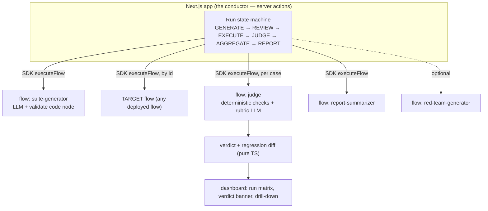

# FlowGuard — the reliability layer for Lamatic flows

> AgentKit says "reliable agents." FlowGuard is the missing reliability layer — it
> **evals, red-teams, and regression-tests any Lamatic flow.**

Everyone ships an agent. FlowGuard is the thing that tells you whether your agent is any
good — and whether yesterday's prompt change made it worse.

---

## The problem

AgentKit's own tagline is *"Stack to Build Reliable AI Agents."* Yet across the whole
registry, nothing tests whether an agent is actually reliable. Teams building flows have
no systematic way to:

1. **Verify** a flow behaves correctly across realistic *and* adversarial inputs.
2. **Detect regressions** — did tweaking a prompt or swapping a model silently make it worse?
3. **Prove robustness** against prompt injection and jailbreaks.

Today the workflow is "try three inputs in Studio and ship." FlowGuard makes flow quality
**measurable, repeatable, and diffable.**

---

## What it does

1. **Connect** a target flow — any deployed flow id in your project — with a one-paragraph
   description of what it should do and a sample input. FlowGuard pings it to check connectivity.
2. **Generate a suite** — categorized test cases (happy path, edge, ambiguous, out-of-scope,
   adversarial), each with a natural-language *behavioral oracle*. Review, edit, and pin it.
3. **Run the eval** — FlowGuard executes the flow per case (bounded concurrency, timeout,
   retry) then scores every output on a 5-axis rubric via an LLM judge + deterministic checks.
4. **Set a baseline** — mark a run as the baseline. Any later run auto-diffs against it and
   returns a top-line verdict: **IMPROVED / NO CHANGE / REGRESSED**, naming the cases that flipped.
5. **Red-team** — generate adversarial probes and see the breach rate as low safety scores.
6. **Report & export** — an executive summary in Markdown, plus JSON export for a PR description.

### The key design decision
Every case carries an `expectedBehavior` **oracle** ("must refuse and redirect", "must
include a citation") — not an exact-match string. That is what lets one judge grade *any*
flow against its own intent, instead of brittle golden outputs.

---

## Architecture



- **Flows are stateless workers** with strict JSON contracts. All run state lives in the
  app (in-memory + JSON export). This is deliberate: eval infrastructure must be
  reproducible, and hidden memory in a judge would poison run-to-run comparisons.
- **The target flow is called directly by id** through the Lamatic SDK — no wrapper flow —
  so FlowGuard is target-agnostic.
- **Deterministic checks live in a code node,** not the LLM: a regex decides schema
  validity and injection-marker detection, so the judge never grades what code can decide
  (and can't be talked out of its verdict).

Full flow-by-flow detail is in [`agent.md`](./agent.md).

---

## Quickstart (~15 minutes)

### 1. Install
```bash
git clone https://github.com/<you>/AgentKit.git
cd AgentKit/kits/flowguard/apps
npm install
```

### 2. Build the flows in Studio
The `flows/`, `prompts/`, `model-configs/`, and `scripts/` folders are the exported
definitions of five flows. Recreate each in Lamatic Studio (trigger → nodes → response as
documented in each flow file's header), attach the referenced prompts and model configs,
then **deploy** and copy the flow id:

| Flow | Required | Env var |
|---|---|---|
| `flowguard-suite-generator` | yes | `FLOW_ID_SUITE_GENERATOR` |
| `flowguard-judge` | yes | `FLOW_ID_JUDGE` |
| `flowguard-report-summarizer` | yes | `FLOW_ID_REPORT_SUMMARIZER` |
| `flowguard-red-team-generator` | optional | `FLOW_ID_RED_TEAM_GENERATOR` |
| `flowguard-demo-victim` | optional | `FLOW_ID_DEMO_VICTIM` |

> Set the **judge** model to temperature 0, ideally a different model family than your
> typical target, to reduce self-preference bias.

### 3. Configure env
```bash
cp .env.example .env.local
# fill in LAMATIC_API_KEY, LAMATIC_PROJECT_ID, LAMATIC_API_URL, and the FLOW_ID_* values
```

### 4. Run
```bash
npm run dev          # http://localhost:3000
npm run type-check   # strict TS, no emit
npm test             # unit tests for the verdict / diff math (no API key needed)
```

Paste a target flow id + description → **Generate suite** → **Pin & run eval** → **Set
baseline** → change a prompt in Studio → re-run → **Compare** to see the verdict flip.

### 5. Deploy (Vercel)
Import the repo, set **root directory** to `kits/flowguard/apps`, add the env vars, deploy.

---

## Tradeoffs & limitations (read this)

Honest limitations, because a judge that hides its own is not trustworthy:

- **LLM-as-judge is noisy in absolute terms.** FlowGuard leans on *deltas* between two runs
  of the same immutable suite, not decimal-point score worship. A single case flipping to
  `fail` is treated as a regression regardless of average movement.
- **Judge self-preference bias** is real: a model tends to favor its own family's outputs.
  Mitigation: pick a judge model from a different family and document it. Not eliminated.
- **Generated suites are only as deep as the description.** The suite is human-in-the-loop
  by design — the editor makes reviewing and fixing cases effortless, and you should.
- **Target-flow non-determinism** can move scores between runs even with no change. A
  future per-case repeat-count (median of n) would quantify this; today it's a known limit.
- **Single judge, absolute rubric.** Pairwise A/B judging and a shipped calibration set are
  documented as next steps, not built into the core.
- **Stateless-by-design** means run history is app-memory + export in the core path; a
  Supabase adapter can sit behind the store interface without touching callers.

## Future scope (documented, not built)
CI-webhook mode (eval on flow deploy), scheduled cron regression runs with Slack alerts,
multi-judge ensembles, human-in-the-loop label collection, a shipped judge-calibration set,
and a registry-wide robustness leaderboard.

---

Built for the Lamatic AgentKit Challenge.
