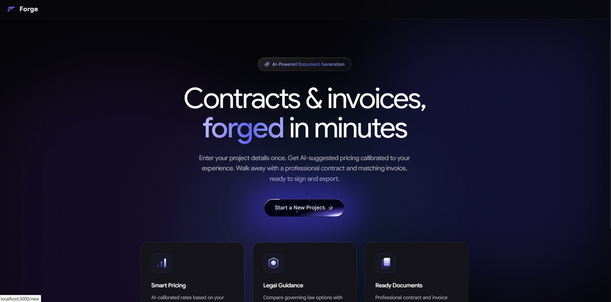

# Forge - AI Contract & Invoice Generator

> Enter your project details once. Get AI-calibrated pricing. Select a governing law. Walk away with a professional contract and matching invoice - signed and exported as PDFs, in minutes.


[**Live Demo →**](https://forge-wheat-one.vercel.app/)



---

## 1. The Problem

Cross-border freelancers, especially in Africa, South Asia, and Latin America, routinely work without professional contracts. They send vague invoices, have no governing law clause, and price their services based on gut feeling rather than market data. When disputes arise, they have zero legal protection.

Hiring a lawyer to draft a cross-border services agreement costs $500–$2,000. Most freelancers skip it entirely.

---

## 2. The Approach

Forge completely automates the creation of professional freelance contracts and invoices using 4 Lamatic AI flows in a guided wizard:

**Flow 1 - Pricing Analysis (`forge-pricing`):**
Takes the freelancer's field, experience level, country, and deliverables - returns AI-calibrated per-item pricing with market context and justification for each rate. The freelancer can edit rates before confirming.

**Flow 2 - Governing Law Tradeoff (`forge-tradeoff`):**
Analyses both parties' countries, the payment structure, and the freelancer's primary concern (IP, getting paid, scope creep, disputes). Returns 3 governing law options with pros, cons, and a recommendation.

**Flow 3 - Contract Generation (`forge-contract`):**
Takes all accumulated data - project details, confirmed pricing, chosen governing law - and generates a full 13-section services agreement: parties, recitals, scope, timeline, payment terms, IP, confidentiality, revision policy, late payment, termination, governing law, dispute resolution, and signatures.

**Flow 4 - Invoice Generation (`forge-invoice`):**
Generates a professional invoice with the confirmed line items, freelancer/client details, payment instructions, and notes referencing the contract date.

Both documents can be **signed** with an e-signature canvas and **exported as multi-page PDFs**.

---

## 3. The Result

A freelancer fills out one form, waits ~60 seconds, and receives a contract and invoice that would have taken a lawyer hours to draft. The documents are tailored to their specific jurisdiction, payment method, and experience level. No auth, no database, no subscription - just Lamatic as the backend.

---

## 4. Tradeoffs & Assumptions

**Tradeoffs:**
- **No persistent storage:** All state lives in `localStorage`. Closing the browser loses the session. This keeps the architecture simple (no database, no auth) but means the tool is session-based.
- **API key security vs. simplicity:** Flow IDs use `NEXT_PUBLIC_` prefix (visible to the browser) since they aren't secrets. The actual `LAMATIC_API_KEY` stays server-side and is proxied through `/api/flow`.
- **PDF quality:** We use `html2canvas` + `jsPDF` for export. This produces good results for most documents but isn't pixel-perfect like a server-side PDF engine (e.g., Puppeteer). The tradeoff is zero server infrastructure.

**Assumptions:**
- The user is a freelancer doing remote/digital work (code, design, writing, consulting). Physical trades or heavily regulated industries may need more specialised contract language.
- The AI-generated contract is a strong starting point, not a substitute for legal advice on high-stakes engagements.

---

## Tech Stack

| Layer | Technology |
|-------|-----------|
| Flow orchestration | **Lamatic.ai** (4 flows) |
| Frontend | **Next.js 14** (App Router, TypeScript) |
| Styling | **Tailwind CSS** |
| PDF export | **jsPDF** + **html2canvas** |
| E-signature | **react-signature-canvas** |
| Icons | **lucide-react** |

---

## Prerequisites

- Node.js 18+ and npm 9+
- A [Lamatic.ai](https://lamatic.ai) account with all 4 Forge flows deployed
- Vercel account (optional, for deployment)

---

## Setup Instructions

1. **Clone and navigate to the kit folder**
   ```bash
   git clone https://github.com/Lamatic/AgentKit.git
   cd AgentKit/kits/forge/apps
   ```

2. **Install dependencies**
   ```bash
   npm install
   ```

3. **Set up environment variables**
   ```bash
   cp .env.example .env.local
   ```
   Then fill in `.env.local` with your real values (see table below).

4. **Start the development server**
   ```bash
   npm run dev
   ```

5. **Open your browser**
   ```text
   http://localhost:3000
   ```

---

## Environment Variables

| Variable | Description | Where to Find |
|----------|-------------|--------------|
| `NEXT_PUBLIC_LAMATIC_ENDPOINT` | Your Lamatic GraphQL API endpoint | Lamatic Studio → Settings → API Docs |
| `NEXT_PUBLIC_LAMATIC_PROJECT_ID` | Your Lamatic project ID | Lamatic Studio → Settings → Project |
| `LAMATIC_API_KEY` | Your API key (server-only, never exposed) | Lamatic Studio → Settings → API Keys |
| `NEXT_PUBLIC_FLOW_PRICING` | Forge Pricing flow ID | Lamatic Studio → forge-pricing → ⋮ → Flow ID |
| `NEXT_PUBLIC_FLOW_TRADEOFF` | Forge Tradeoff flow ID | Lamatic Studio → forge-tradeoff → ⋮ → Flow ID |
| `NEXT_PUBLIC_FLOW_CONTRACT` | Forge Contract flow ID | Lamatic Studio → forge-contract → ⋮ → Flow ID |
| `NEXT_PUBLIC_FLOW_INVOICE` | Forge Invoice flow ID | Lamatic Studio → forge-invoice → ⋮ → Flow ID |

> ⚠️ `LAMATIC_API_KEY` must NEVER be exposed client-side. All Lamatic calls go through the server-side API route at `/api/flow`.

---

## Flows

### Pricing Flow (`forge-pricing`)
**Input:** `{ work_type, field, experience_level, years_of_experience, deliverables, payment_structure, currency, freelancer_country, client_country }`
**Output:** `{ pricing: string (JSON) }` → parsed to `{ experience_assessment, market_context, line_items[], total_amount, currency }`

Analyses the freelancer's experience and geography against market data, returns per-item suggested pricing with justification.

### Tradeoff Flow (`forge-tradeoff`)
**Input:** `{ freelancer_name, freelancer_country, freelancer_payment_method, freelancer_primary_concern, client_name, client_country, client_type, project_title, project_description, deliverables, timeline_start, timeline_end, payment_amount, payment_currency, payment_structure, work_type }`
**Output:** `{ options: string (JSON) }` → parsed to `Array<{ option_name, explanation, pros[], cons[], recommended }>`

Returns 3 governing law options with pros, cons, and a recommendation based on both parties' jurisdictions.

### Contract Flow (`forge-contract`)
**Input:** All project details + `payment_amount`, `payment_currency`, `chosen_governing_law`
**Output:** `{ contract: string (JSON) }` → parsed to `Record<string, { heading, body }>`

Generates a full 13-section services agreement: parties, recitals, scope, timeline, payment, IP, confidentiality, revisions, late payment, termination, governing law, dispute resolution, signatures.

### Invoice Flow (`forge-invoice`)
**Input:** Freelancer/client details + `line_items` (stringified JSON), `currency`, `total_amount`, `payment_instructions`, `notes`
**Output:** `{ invoice: string (JSON) }` → parsed to `{ header, freelancer, client, line_items[], totals, payment_instructions, notes }`

Generates a formatted invoice matching the confirmed pricing from the contract.

> **Important:** All flow responses come back as `result.result.fieldName` where `fieldName` is a JSON string that must be parsed with `JSON.parse()`.

---

## Project Structure

```
kits/forge/
├── lamatic.config.ts          # REQUIRED: project metadata
├── agent.md                   # REQUIRED: agent identity doc
├── README.md                  # Root setup guide
├── constitutions/             # Guardrails
├── flows/                     # Flow definitions
└── apps/                      # Next.js App
    ├── app/
    ├── components/
    ├── actions/
    ├── lib/
    └── package.json
```

---

## Deploy to Vercel

1. Push your branch to GitHub:
   ```bash
   git checkout -b feat/forge
   git add kits/forge/
   git commit -m "feat: Add Forge - AI Contract & Invoice Generator"
   git push origin feat/forge
   ```

2. Go to [vercel.com](https://vercel.com) and import your repo

3. Set the **root directory** to `kits/forge/apps`

4. Add all environment variables from the table above

5. Click **Deploy**

---

## Live Preview

_Coming soon_

---

## Contributing

This kit was built for the [mission-possible](https://github.com/Lamatic/AgentKit). To open a PR:

```text
github.com/Lamatic/AgentKit/compare/main...YOUR-USERNAME:feat/forge?expand=1
```

Add the `mission-possible` label to your PR.
