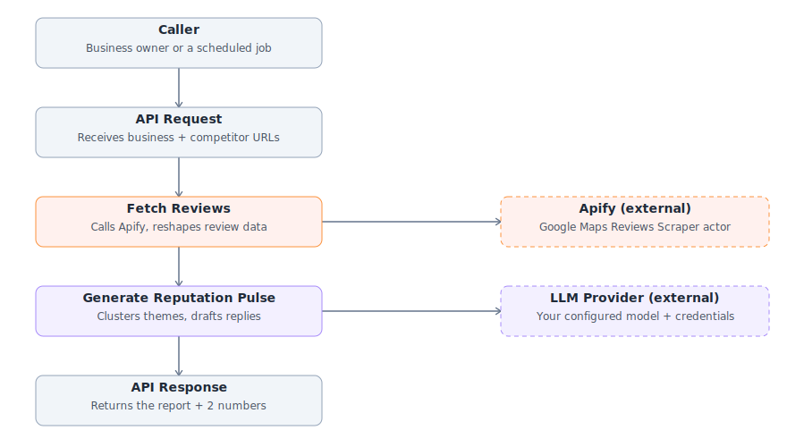

# GMapReviewAI

GMapReviewAI is an AI Reputation Copilot for local businesses built with Lamatic. It collects live Google Maps reviews, analyzes customer sentiment, highlights recurring issues and strengths, benchmarks competitors, and drafts professional responses for unanswered reviews—all in a concise, evidence-based report that helps business owners make faster, smarter decisions.

Built for the [Lamatic AgentKit Challenge](../../CHALLENGE.md).

---

## The problem

A local business — a cafe, a clinic, a salon, a gym — accumulates Google Maps reviews faster
than any single owner can read them. Nobody has time to read 40 new reviews a week and turn them
into a to-do list, and even fewer businesses systematically compare themselves to the competitor
two doors down. The reviews that most need a reply — the negative, unanswered ones — are exactly
the ones an overwhelmed owner avoids opening.

This is a narrow, concrete, recurring pain, not a "build me a research agent" problem — which is
what made it a good fit for a focused submission.

## Why this doesn't already exist in AgentKit

AgentKit already has several review- and research-adjacent kits, so this template was designed
to sit in a real gap rather than overlap them:

- **`review-analyzer`** is a browser extension that scores the trust level of **e-commerce
  product reviews** on the page you're currently viewing — shopper-facing, single-page, no
  external API.
- **`review-responder`** classifies and drafts replies to reviews that are already **supplied as
  input** — it doesn't fetch anything itself or compare against a competitor.
- **`reddit-scout`** searches Reddit threads for opinions about a product — a different platform,
  a different data shape, no ratings or competitive benchmarking.
- **`localboost-ai`** analyzes a local business's **own website** for lead-generation and outreach
  — not Google Maps reviews.
- **`founder-lens`** is a general startup/market research agent — not scoped to reviews or to a
  specific business's reputation.

None of them fetch live Google Maps review data, benchmark it against a named competitor, or draft
replies to specific unanswered reviews. That combination is what GMapReviewAI does.

## The approach

A single Lamatic flow, three steps after the trigger:

```
API Request  →  Fetch Reviews (Apify)  →  Generate GMapReviewAI (LLM)  →  API Response
```

1. **Fetch Reviews (Apify)** — a code node calls Apify's `compass/Google-Maps-Reviews-Scraper`
   Actor (46k+ users, 4.83★, 99.8% run success rate on the Apify Store) with the business's
   Google Maps URL plus any competitor URLs, all in **one** request. It groups the results by
   place, matches "the business" by name (Apify does not guarantee the dataset preserves input
   order — confirmed by testing, see Assumptions below), and reshapes everything into compact
   per-place summaries: aggregate rating, a capped sample of text-bearing reviews with any
   per-aspect Food/Service/Atmosphere ratings Google provides, and up to five recent negative
   reviews that have no owner response yet.
2. **Generate GMapReviewAI** — an LLM node reasons over that structured data (never the raw
   scrape) to produce a Markdown report: headline, what's working, what needs fixing, a
   competitive comparison (only if competitor data was supplied), and response drafts for the
   business's own unanswered negative reviews.
3. **API Response** — returns the full report plus two convenience numbers
   (`business_average_rating`, `business_total_reviews_fetched`).

Apify was the right tool here specifically because Lamatic's existing scraping integration
(Firecrawl, used by `article-summariser` and the `firecrawl-*` kits) does generic page-to-markdown
extraction — it has no concept of a Google Maps place, a star rating, an owner response, or a
per-aspect rating. Apify's Actor catalog has a purpose-built, actively maintained scraper for
exactly this structured data, which is what makes the theme-clustering and competitor-comparison
reasoning possible at all.




## The result

See **[`assets/sample-report.md`](./assets/sample-report.md)** for a complete, real worked
example. It is not a mockup — the Apify Actor call in `scripts/gmap-review-ai_code-node-310_code.ts`
was run live during development against two real Google Maps listings (Leopold Cafe and Cafe
Mondegar, both in Colaba, Mumbai), and the report was produced by hand-running that exact data
through the exact prompts in `prompts/`. A short excerpt:

> **Headline:** Leopold Cafe is holding a strong 4.2★ all-time aggregate across 32,641 Google
> reviews, and the 14 most recent reviews in this sample average 4.21★...
>
> **What Needs Fixing:** 1. Service lags food and atmosphere, even in happy visits — one 5-star
> review rated service 3/5 while rating food and atmosphere 5/5...

## Setup

You need a Lamatic account and an Apify account (Apify has a free tier that comfortably covers
testing this kit — a few hundred reviews costs well under $1).

1. **Get an Apify API token.** Sign up at [apify.com](https://apify.com) if you don't have an
   account, then copy your token from
   [console.apify.com/settings/integrations](https://console.apify.com/settings/integrations).
2. **Create a project in [Lamatic Studio](https://studio.lamatic.ai)** and add the token as a
   project secret named `APIFY_API_TOKEN` (**Settings → Secrets**) — not a repo `.env` value,
   since this is a template with no standalone app.
3. **Build the flow.** Fastest path: create a new flow, open the **Config** tab, and paste in
   [`assets/lamatic-flow-config.yaml`](./assets/lamatic-flow-config.yaml), then fill in the two
   placeholders (paste the script/prompt file contents where noted, and pick a model). If your
   Studio version doesn't support the Config-tab paste, build the same four nodes by hand:

   | Node | Type | Key settings |
   |---|---|---|
   | `API Request` | `graphqlNode` (trigger) | Advance schema — see `flows/GMapReviewAI.ts` header or the YAML file above |
   | `Fetch Reviews (Apify)` | `codeNode` | Code = contents of `scripts/gmap-review-ai_code-node-310_code.ts` |
   | `Generate GMapReviewAI` | `LLMNode` | System/user prompts = contents of the two files in `prompts/`; pick any chat-capable model |
   | `API Response` | `graphqlResponseNode` | Output mapping — see the YAML file above |

   Connect them in that order, plus the standard response edge from the trigger to `API Response`.
4. **Deploy the flow**, then test it with:
   ```json
   {
     "business_name": "Your Business Name",
     "business_maps_url": "https://www.google.com/maps/place/...",
     "competitor_maps_urls": [],
     "max_reviews_per_place": 30,
     "reviews_since": "3 months"
   }
   ```
5. Add one or more entries to `competitor_maps_urls` once the single-business report works, to see
   the comparison section appear.

## Assumptions & tradeoffs

- **Apify's dataset order is not guaranteed to match input order.** A live test run with the
  business URL listed first still returned the competitor's rows first in the dataset. The code
  node matches "the business" by name against the resolved place title instead of by position —
  worth knowing if you extend this kit.
- **`personalData: false` by default.** Google returns reviewer names as `null` under this Apify
  setting. Report quality is unaffected (theme-clustering never needed names); only response
  drafts degrade gracefully to a generic greeting instead of a personalized one. This was a
  deliberate privacy-by-default choice, with a documented opt-in escape hatch in the script.
- **Many Google Maps reviews have a star rating and no text.** In real samples pulled during
  development, roughly half of all reviews were rating-only. The code node counts every rating
  toward the aggregate numbers but only clusters themes from the subset that has text — a report
  built on a small business's early reviews will honestly say the sample is thin rather than
  overstate confidence (the system prompt enforces this).
- **This is a template, not a kit** — a single flow, no standalone app, no scheduling. Response
  drafts are just that: drafts. The flow does not post them back to Google Business Profile, which
  would need a separate OAuth-based integration and was left out to keep this contribution
  focused, per the challenge's own guidance that a smaller, well-executed idea beats a padded one.
- **Cost scales with `max_reviews_per_place` × number of places.** The Apify Actor is pay-per-event
  (roughly $0.0006 per review scraped); the defaults (30 reviews per place) keep a typical
  business + one competitor run well under a cent.

## Possible extensions

- **Trend over time:** store each run's headline stats via a Lamatic memory node and chart drift
  week over week, instead of only ever comparing within a single run's sample.
- **Other review platforms:** the same reshape-then-reason pattern works for App Store / Play
  Store reviews via a sibling Apify Actor — useful for software products rather than physical
  locations.
- **Scheduled delivery:** a second flow on a weekly trigger that calls this one and posts `report`
  to Slack or email, mirroring the pattern in `slack-ask-bot`.
- **Write-back:** posting the drafted responses to Google Business Profile via its own API, once a
  business has reviewed and approved a draft.

## Files

```
GMapReviewAI/
├── lamatic.config.ts                              # Kit metadata
├── agent.md                                        # Agent identity/capability doc
├── README.md                                        # This file
├── flows/gmap-review-ai                      # The flow graph
├── prompts/gmap-review-ai_llmnode-540_system_0.md
├── prompts/gmap-review-ai_llmnode-540_user_1.md
├── scripts/gmap-review-ai_code-node-310_code.ts        # Apify call + reshaping logic
├── model-configs/gmap-review-ai_llmnode-540_generative-model-name.ts
├── constitutions/default.md
└── assets/
    ├── sample-report.md                              # Real worked example
    └── lamatic-flow-config.yaml                      # 
```
