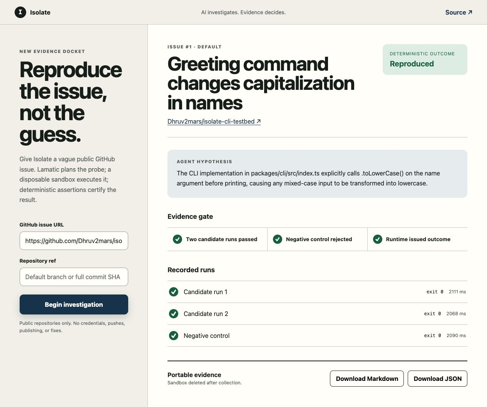
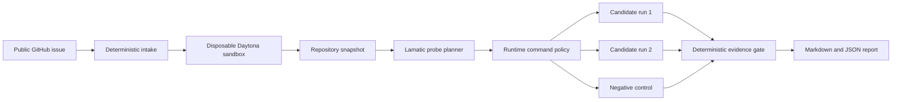

# Isolate

> Turn vague GitHub issues into verified reproduction evidence.

[Try the live demo](https://isolate-agentkit.vercel.app) ·
[Open the evaluation issue](https://github.com/Dhruv2mars/isolate-cli-testbed/issues/1) ·
[View the challenge PR](https://github.com/Lamatic/AgentKit/pull/291)



Issue reports often describe a symptom without preserving the repository state,
setup, command, or environment needed to observe it. Isolate investigates a
public GitHub issue in a disposable Daytona sandbox, uses a deployed Lamatic
flow to plan safe probes, and returns a portable evidence report.

The core boundary is simple: **the model investigates; the runtime verifies.**
The planner can form a hypothesis and select commands, but it cannot declare a
bug reproduced. Only the deterministic evidence gate owns that outcome.

## Try it in two minutes

1. Open the [live application](https://isolate-agentkit.vercel.app).
2. Leave the prefilled evaluation issue in place and select **Begin
   investigation**.
3. Wait while Isolate reads the issue, inspects the repository, asks Lamatic for
   a probe plan, and runs the plan in Daytona.
4. Review the hypothesis, two candidate runs, negative control, exit codes,
   durations, stdout, and stderr.
5. Download the complete report as Markdown or JSON.

The evaluation fixture deliberately provides a symptom and observed output,
but not a reproduction command. A successful run must discover the
repository-owned CLI invocation, reproduce the output twice, and reject it
under a nearby control condition.

## How it works



1. The runtime fetches and normalizes the public issue.
2. Daytona creates a private, expiring sandbox and checks out the requested
   repository ref.
3. Locked dependencies are installed without lifecycle scripts. Outbound
   networking is then blocked for probe execution.
4. The runtime captures a bounded repository snapshot. The deployed Lamatic
   flow returns a hypothesis, candidate command, and negative control.
5. A strict command policy permits only repository-owned package scripts and
   rejects shell escapes, output fabrication, file edits, and external network
   access.
6. Isolate resets mutable workspace state and runs the candidate twice, then
   runs the negative control against the same issue-derived assertion.
7. The runtime records bounded, redacted evidence and deletes the sandbox.

## Evidence contract

A `reproduced` outcome requires all three observations:

| Observation | Required result |
| --- | --- |
| Candidate run 1 | Issue-derived assertion passes |
| Candidate run 2 | The same assertion passes again |
| Negative control | The same assertion is rejected |

Other outcomes remain explicit:

| Outcome | Meaning |
| --- | --- |
| `reproduced` | The repeated candidate and negative control satisfy the deterministic gate. |
| `not_reproduced_under_tested_conditions` | The allowed probes did not satisfy the complete gate. |
| `blocked` | Isolate could not safely form or execute a machine-checkable investigation. |

Each completed report preserves the tested repository and ref, hypothesis,
commands, assertion results, exit codes, durations, stdout, and stderr.

## Lamatic integration

The exported `isolate-reproduction` flow is the investigation planner. It
receives normalized issue data plus a bounded repository snapshot and returns a
strict JSON probe plan. Its Gemini model credential stays centrally managed in
Lamatic Studio.

The runtime also exposes three authenticated MCP tools:

| Tool | Purpose |
| --- | --- |
| `echo` | Verify authenticated Lamatic-to-runtime connectivity. |
| `get_github_issue` | Fetch and normalize one public GitHub issue. |
| `certify_reproduction` | Own sandbox execution, evidence collection, and the final outcome. |

To use these tools from a Lamatic agent, save
`https://<your-deployment>/api/mcp` under **Connections → MCP/Tools** and set
the connection header to
`Authorization: Bearer <ISOLATE_RUNTIME_SECRET>`. Do not put the bearer secret
inside a prompt or inline code node.

## Run locally

Requirements: Bun and Node.js 20 or newer.

```bash
cd kits/isolate/apps
cp .env.example .env.local
bun install
bun run dev
```

Set these server-side values in `.env.local`:

| Variable | Purpose |
| --- | --- |
| `ISOLATE_REPRODUCTION_FLOW_ID` | Deployed Lamatic planner flow ID |
| `LAMATIC_API_URL` | Lamatic project API endpoint |
| `LAMATIC_PROJECT_ID` | Lamatic project ID |
| `LAMATIC_API_KEY` | Server-side Lamatic API credential |
| `DAYTONA_API_KEY` | Server-side Daytona sandbox credential |
| `ISOLATE_RUNTIME_SECRET` | Bearer secret for the MCP endpoint |

No repository or GitHub credential is required because the current scope is
public repositories only.

## Deploy your own

1. Import `flows/isolate-reproduction.ts` and its referenced constitution,
   prompts, and model configuration into Lamatic Studio.
2. Connect a Gemini credential in Studio, deploy the flow, and copy its flow
   ID and project API settings.
3. Select the one-click deploy link from `lamatic.config.ts` and provide the six
   environment values listed above.
4. Configure the deployed `/api/mcp` endpoint as a saved authenticated Lamatic
   MCP connection if you want an agent to call the runtime tools directly.
5. Add a deployment-wide edge rate limit for `/api/investigate`. The reference
   deployment uses Vercel Firewall plus an application-level concurrency bound.

## Verify the kit

```bash
cd kits/isolate/apps
bun install
bun test
bun run typecheck
bun run build
```

The test suite covers issue intake, plan validation and repair, command policy,
deadline and cleanup behavior, Daytona lifecycle handling, deterministic
certification, evidence rendering, HTTP error mapping, and authenticated MCP
contracts.

## Scope and safety

- Public GitHub repositories only.
- Initial support targets Node.js, TypeScript, Bun, and terminal/CLI issues.
- Issues must contain one exact `Observed stdout:` or `Observed stderr:`
  signature. Isolate may still form a hypothesis without one, but certification
  remains blocked until the reporter confirms a machine-checkable signature.
- Sandboxes are private, disposable, and limited to a 30-minute lifetime.
- Each probe is bounded to 40 seconds within a 150-second aggregate
  investigation budget.
- Captured stdout and stderr are redacted and capped at 64 KiB each.
- Repository and issue contents are treated as untrusted input.
- No repository credentials are mounted in the sandbox.
- No file editing, fix generation, pushes, pull requests, or package
  publication.

These constraints are intentional: Isolate proves whether the reported behavior
can be reproduced under stated conditions. It does not claim to diagnose every
repository or repair the bug.
