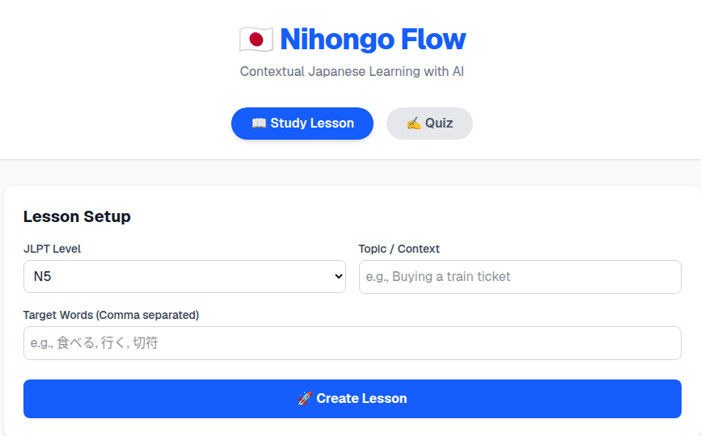
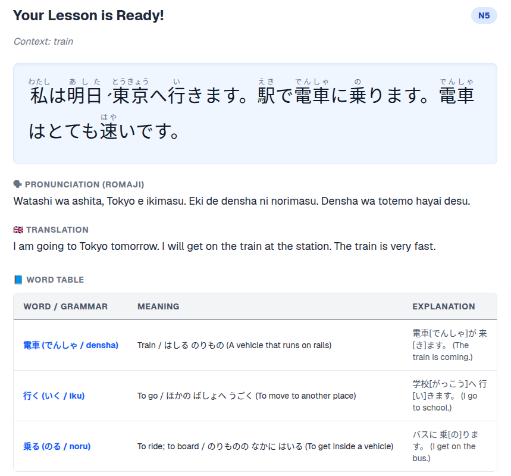
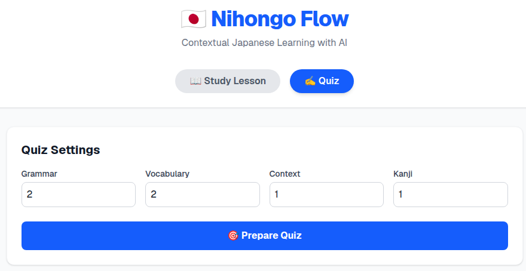
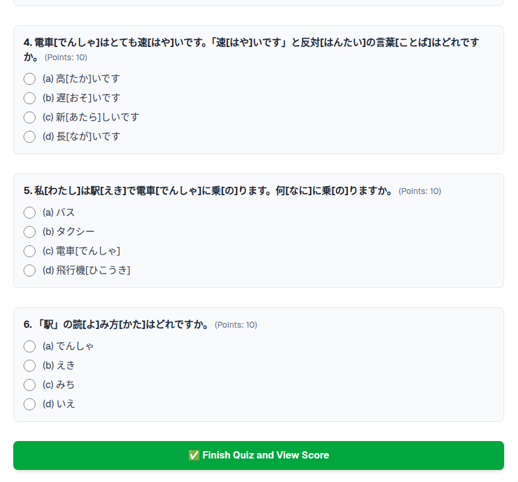
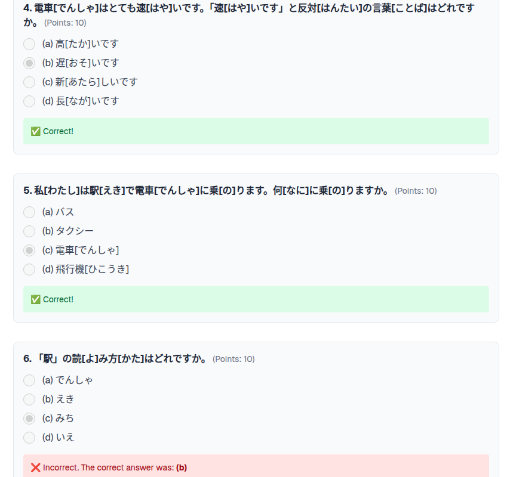

## 1. The Problem

Traditional Japanese language learning (such as JLPT preparation) suffers from a disconnect between vocabulary memorization and real-world reading practice. Flashcard apps teach words in isolation, while textbooks provide static reading passages with rigid, often unengaging contexts (e.g., generic office introductions). Learners lack a way to instantly generate reading materials and assessments that incorporate their specific target vocabulary into contexts that actually interest them, appropriately scaled to their current reading level.

## 2. The Approach

We built an AI-powered, two-step orchestration pipeline (Nihongo Flow) using Next.js and the Lamatic API to dynamically generate personalized study materials.

Step 1: Contextual Generation (Lesson Flow): The user inputs a JLPT level (e.g., N5), a topic of interest (e.g., "Buying a train ticket"), and a list of specific vocabulary words they struggle with. The LLM agent generates a coherent, level-appropriate Japanese story incorporating those words, returning a strict JSON payload with the text, romaji, English translation, and a micro-dictionary.

Step 2: Comprehension Assessment (Quiz Flow): The system feeds the newly generated text back into a second LLM agent to generate a structured multiple-choice quiz. The user specifies exactly how many questions they want across four linguistic dimensions (Grammar, Vocabulary, Context/Comprehension, and Kanji).

Frontend Processing: The Next.js UI parses the AI's bracketed text format (e.g., 漢字[ふりがな]) into semantic HTML <ruby> tags for reading, and attaches hover-state tooltips mapped directly from the AI-generated dictionary.

## 3. The Result

An interactive, zero-database web application that provides a complete "micro-learning loop." Users receive a fully customized, beautifully formatted Japanese reading lesson on any topic, complete with built-in furigana, instant vocabulary tooltips, and an auto-graded reading comprehension quiz. It bridges the gap between rote memorization and contextual reading practice in seconds.

## 4. Tradeoffs and Assumptions

### Tradeoffs:

Latency vs. Output Structure: Because the AI is heavily prompted to strictly adhere to a complex JSON schema and linguistic constraints, generation takes longer than standard chat completions (often 10–25 seconds). This required optimizing Next.js fetch policies (keepalive, no-store) and increasing serverless execution timeouts (maxDuration) to prevent connection drops on platforms like Vercel.

Flexibility vs. Reliability: The LLM is forced into a strict output structure to ensure the React frontend does not crash when parsing the UI. The tradeoff is that the AI cannot add conversational filler or unstructured explanations outside the bounds of the JSON keys.

### Assumptions:

LLM JLPT Accuracy: The system assumes the underlying LLM has an accurate, internal understanding of JLPT grading criteria (e.g., it will not accidentally inject N2 grammar into an N5 reading passage).

Formatting Consistency: The frontend parsing logic relies on the assumption that the AI will consistently use the Word[furigana] format. If the AI deviates from this syntax, the HTML <ruby> tags and vocabulary tooltips will fail to render correctly.

Stateless Architecture: We assume the user does not need long-term progress tracking across sessions, as the current architecture relies on React state rather than a persistent database to manage the active lesson and quiz data.


# AgentKit Collection (2 flows)

This AgentKit contains 2 flows:

1. **Lesson** (`flows/lesson.ts`)
2. **Quiz** (`flows/quiz.ts`)

## Prerequisites
Before running this project, ensure you have the following installed:
*   **Node.js** (v18 or higher recommended)
*   **npm** or **pnpm** package manager
*   A valid **Lamatic API Key** and **Project ID**

## Setup Instructions

1. **Initialize the Project Directory**
Navigate to your project folder and ensure your Next.js application is set up.

```bash
cd apps
npm install
```

Configure Environment Variables
Copy the example environment file to create your local environment settings.
```Bash

cp .env.example .env.local
```

Open .env.local and add your Lamatic API credentials:
```Kod snippet'i

LAMATIC_API_KEY=your_lamatic_api_key_here
```

Start the Development Server
```Bash

npm run dev
```

The application will be available at http://localhost:3000.

## Usage Examples

The frontend communicates with the Lamatic AgentKit through secure Next.js Server Actions. Here is how the flows are invoked programmatically:
### Example 1: Generating a Lesson

This action calls the Lesson Flow, passing the JLPT level, context, and target words to study.


```TypeScript

import { generateTextContext } from "@/actions/orchestrate";

const createLesson = async () => {
  const response = await generateTextContext(
    "N5", 
    "Ordering food at a restaurant", 
    ["食べる", "水", "メニュー"]
  );

  if (response.success) {
    console.log("Lesson Generated:", response.data);
    // response.data contains original text, translation, and dictionary
  }
};
```




### Example 2: Generating a Quiz

Once a lesson is generated, the resulting text is passed into the Quiz Flow along with the desired distribution of question types.
```TypeScript

import { generateQuestions } from "@/actions/orchestrate";

const createQuiz = async (lessonText: string) => {
  const response = await generateQuestions(
    "N5",
    "Ordering food at a restaurant",
    lessonText,
    6,
    {
      grammar: 2,
      vocabulary: 2,
      context: 1,
      kanji: 1
    }
  );

  if (response.success) {
    console.log("Quiz Generated:", response.data.Questions);
    // Render multiple choice questions to the UI
  }
};
```



