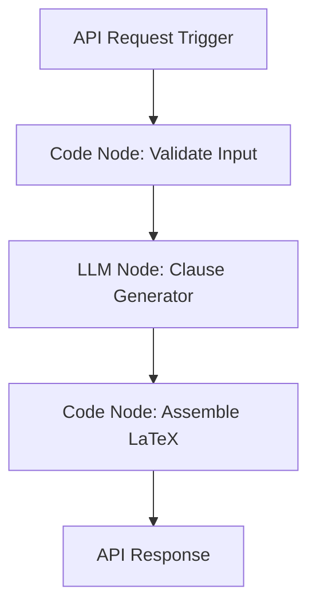

# MoU Drafter Agent Kit

<p align="center">
  
  
</p>

**MoU Drafter** is an AI-powered contract and Memorandum of Understanding (MoU) drafting assistant. It takes a structured form input, runs it through a 21-point risk-management validation process, and generates a LaTeX-formatted document that can be compiled to PDF in a local sandbox or opened directly in Overleaf.

It is designed to produce a strong first draft that encodes protective legal patterns drawn from real vendor work for human review — it is not legal advice.

---

## 🚀 What It Does

1. **Structured Form Intake**: Validates and normalizes 55 key agreement fields.
2. **21 Risk-Management Patterns**: Automatically gates and embeds clause protections:
   - Tie payment to milestone acceptance (versus lump-sum upfront risk).
   - Deemed-acceptance windows.
   - Mutual indemnity caps (1x fee multiplier) with gross-negligence carve-outs.
   - Liquidated damages / late-delivery credits (gated on US/Canada governing law).
   - Work-for-hire IP assignment and vendor pre-existing IP licensing.
   - Force Majeure with modern cyberattack and pandemic carve-outs.
   - 3-year confidentiality survival, subcontracting prior-consent, and marketing publicity approval.
3. **LaTeX Output**: Generates clean, typographic LaTeX using the `article` class with defined terms formatted in small caps (`\textsc`).
4. **PDF Compilation & Preview**: Compiles the LaTeX source to PDF through the development-only sandboxed compile route.
5. **Direct Integrations**: Provides immediate options to download `.tex`, `.pdf`, or open the document directly in Overleaf via deep-link.

---

## 🛠️ Tech Stack

- **Framework**: Next.js (App Router), React, TypeScript
- **Forms**: `react-hook-form` + `zod`
- **Styling**: Tailwind CSS, CSS variables
- **Lamatic Integration**: `lamatic` SDK client for running the deployed flow
- **PDF Compilation**: Sandboxed server-side `pdflatex` route in development, with Overleaf and `.tex` fallbacks

---

## 🔑 Setup & Installation

### 1. Environment Variables

Create a `.env.local` inside the `kits/mou-drafter/apps` folder:

```bash
MOU_DRAFTER_FLOW_ID = "YOUR_LAMATIC_FLOW_ID"
LAMATIC_API_URL = "YOUR_LAMATIC_API_ENDPOINT"
LAMATIC_PROJECT_ID = "YOUR_LAMATIC_PROJECT_ID"
LAMATIC_API_KEY = "YOUR_LAMATIC_API_KEY"
```

### 2. Run Locally

```bash
# Make sure Docker or a compatible container runtime is available to enable PDF preview
cd kits/mou-drafter/apps
npm install
npm run dev
# Open http://localhost:3000 in your browser
```

---

## 🧠 Lamatic Studio Flow Setup

To support this kit, your Lamatic flow (`mou-drafter`) must contain the following node graph:



### 1. Validate Input Node

- **Type**: Code Node
- **Script File**: Referenced at `@scripts/mou-drafter_validate-input.ts`
- **Input Variables**: Reads `triggerNode_1.output` fields.
- **Output**: Returns a normalized payload with derived defaults, deliverables formatted as a block string, and upstream warning arrays.

### 2. Clause Generator Node

- **Type**: LLM Node
- **Model**: `gemini-3-flash-preview` (preview) or `claude-sonnet-4-6` (fallback)
- **System Prompt**: Referenced at `@prompts/mou-drafter_clause-generator_system.md`
- **User Prompt**: Referenced at `@prompts/mou-drafter_clause-generator_user.md`
- **Output**: A JSON string containing the recitals, definitions, and selected clauses keyed by risk pattern.

### 3. Assemble LaTeX Node

- **Type**: Code Node
- **Script File**: Referenced at `@scripts/mou-drafter_assemble-latex.ts`
- **Input Variables**: Reads outputs from the validation code node and LLM node.
- **Output**: Assembles the final `.tex` string by substituting variables into the template, escaping LaTeX characters, and verifying the presence of pattern comments.

### 4. Response Node

- **Type**: Response Node
- **Output Mapping**:

  ```json
  {
    "latex": "{{codeNode_assemble_latex.output.latex}}",
    "clauseJson": "{{codeNode_assemble_latex.output.clauseJson}}",
    "warnings": "{{codeNode_assemble_latex.output.warnings}}",
    "patternReport": "{{codeNode_assemble_latex.output.patternReport}}"
  }
  ```

---

## 📜 21 Gated Protective Patterns

| Anchor                             | Protection                                              | Gating / Trigger Condition                    |
| ---------------------------------- | ------------------------------------------------------- | --------------------------------------------- |
| `payment-milestones`               | Ties fee payments to milestone completion               | `paymentSchedule === "milestone-based"`       |
| `acceptance-window`                | Deemed acceptance window for deliverables               | Mandatory                                     |
| `liquidated-damages`               | Daily late delivery credits                             | Gated on `jurisdictionFamily === "us-canada"` |
| `indemnity-mutual-cap`             | Caps indemnity exposure at 1x total fee                 | Mandatory                                     |
| `liability-cap`                    | Limit of liability aligned with indemnity               | Mandatory                                     |
| `ip-work-for-hire`                 | Standard work-for-hire ownership transfer               | Gated on `ipOwnership !== "not-applicable"`   |
| `termination-dual`                 | Convenience and for-cause termination rules             | Mandatory                                     |
| `force-majeure-carveouts`          | cyberattacks / pandemics are force majeure              | Mandatory                                     |
| `confidentiality-survival`         | Confidentiality obligations survive term                | Gated on `confidentialityRequired === true`   |
| `no-subcontract-consent`           | Requires written consent to outsource                   | Gated on `subcontractingAllowed === false`    |
| `insurance-named-insured`          | named-additional-insured requirement                    | Gated on `insuranceRequired === true`         |
| `data-protection-dpa-lite`         | Deletion-on-termination / 72h breach notice             | Gated on `dataProtectionRequired === true`    |
| `modifications-in-writing`         | Amendments require a written instrument                 | Mandatory                                     |
| `governing-law-venue-severability` | Severability, venue, and governing law                  | Mandatory                                     |
| `no-publicity`                     | Prevents vendor from using name in ads                  | Gated on `noPublicityRequired === true`       |
| `taxes-and-fees`                   | Tax treatment and late-payment interest                 | Mandatory                                     |
| `cancellation-charges`             | Event cancellation charges                              | Gated on `cancellationPolicy !== "none"`      |
| `guest-count-adjustments`          | Final guest count and extra-guest charges               | Gated on catering count/rate fields           |
| `food-safety-compliance`           | Food-safety and licensing compliance                    | Gated on `foodSafetyRequired === true`        |
| `allergen-handling`                | Allergen labelling and dietary handling                 | Gated on `allergyHandlingRequired === true`   |
| `event-logistics`                  | Event dates, time window, venue, and setup expectations | Gated on event-type engagement details        |

---

## ⚠️ Disclaimer

This tool generates a first-draft document based on software. It is **not** legal advice and does not substitute for review by a licensed attorney. Review the generated document and verify all terms in your jurisdiction before signature.
