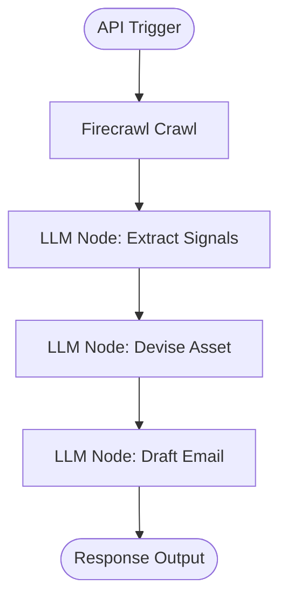

# Agent: Outreach Personalizer

## Purpose & Overview
The **Outreach Personalizer** agent is designed to construct hyper-personalized cold outreach pitches for job candidates. Instead of writing generic flattery, it acts as an analytical, eager candidate who does deep research to find concrete, high-specificity hooks. It crawls the target's public content, extracts technical signals, devises a small asset (which can be completed in < 2 hours), and builds a confident, direct cold email pitch.

---

## Workflow Steps

The agent's logic is defined across a multi-step chain in `flows/average-teenager.ts`:

1. **Firecrawl Node (`firecrawlNode_692`)**: Scrapes the company website, founder LinkedIn profile, or other URLs dynamically constructed from the trigger input.
2. **Signal Extraction (`LLMNode_276`)**: Parses the crawled markdown content to extract 3-5 concrete "noticed things" (e.g. a specific feature release, a bug, a technical post, or a design decision) and rates them with a specificity score from 1 to 5.
3. **Asset Suggestion (`LLMNode_996`)**: Connects the candidate's background with one of the extracted signals and suggests one small, concrete value-add asset (e.g. a mini bug list, a UX walkthrough, a content sample, or a competitor teardown) that the candidate can build quickly.
4. **Outreach Drafting (`LLMNode_696`)**: Selects the signal with the highest specificity score and drafts a direct, short cold outreach email around it.

---

## Agent Persona & Style Constraints

- **Tone**: Conversational, confident, direct, and non-corporate. Sounds like one builder writing to another.
- **Formality**: Low-to-moderate; avoids generic professional platitudes.
- **Length**: Strict constraint of 80 to 120 words.
- **Structure**:
  1. Hook based on the highest specificity signal (quotes/paraphrases the exact metric/name/result).
  2. Connection to the candidate's background.
  3. Description of the specific value-add asset.
  4. Ends with exactly: *"Would it make sense to speak for 10 minutes?"*
- **Banned Words & Phrases**:
  - *"I'd love to"*
  - *"could be really useful"*
  - *"I hope this finds you well"*
  - *"reach out"*
  - *"circle back"*
  - *"leverage"*
  - Em-dashes (`—` or `--`)

---

## API Inputs & Outputs

### Expected Inputs
The trigger accepts a JSON payload with the following fields:
- `company_url` (string): Target company website.
- `founder_linkedin_url` (string): Founder's LinkedIn profile.
- `candidate_context` (string): Context about the candidate's background, skills, and projects.

### Expected Outputs
The flow execution response contains:
- `status` (string): Execution status (e.g. `success`).
- `result` (object/string): The plain text cold outreach email, along with outputs from preceding nodes (signals and asset ideas) if mapped.
