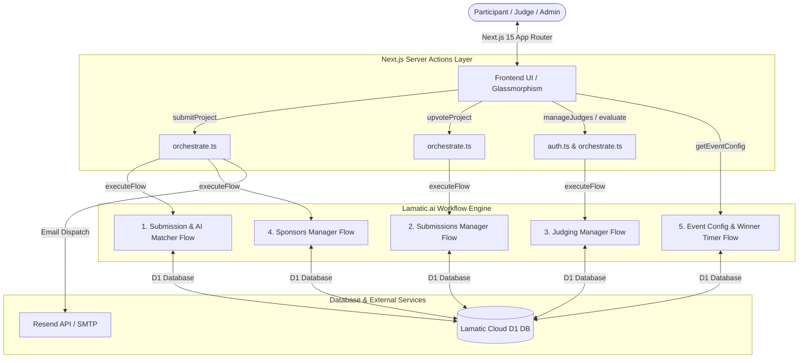

# ⚡ Peer Demo Showcase & AI Matcher Kit (Powered by Lamatic.ai)

> An enterprise-grade, multi-agent AI hackathon showcase & sponsor matching platform built with **Next.js 15**, **Lamatic.ai Flow Orchestration Engine**, **Framer Motion**, and **TailwindCSS**.

---

## 📹 Video Walkthrough (Loom)

[](https://www.loom.com/share/ee030ec4015d4bc299da327ec0dd34e5)

---

## 💡 Why This Kit Matters for Aman Sharma & the Lamatic.ai Team

As a co-founder of **Lamatic.ai**, **Aman Sharma** and the engineering team are building the future of agentic AI workflow orchestration. This project serves as a showcase demonstration and template for **Lamatic AgentKit**:

1. **Multi-Flow Enterprise Orchestration Showcase**:
   - Demonstrates how **5 decoupled Lamatic workflows** seamlessly interoperate to power a production-level web application (AI Matching, Submissions Management, Sponsor Auto-matching, Judging Engine, and Event Timers).
2. **Turnkey Community Showcase Kit**:
   - Serves as a flagship, ready-to-deploy **Lamatic AgentKit Template** that hackathons, tech conferences, and accelerator cohorts can clone to automate sponsor matching and project showcases.
3. **Showcasing Lamatic D1 Database & Condition Nodes**:
   - Proves Lamatic's capacity to handle multi-branch logic (`action == "upvote"`, `action == "list"`, `action == "update_status"`), D1 table queries, dynamic column updates, and GraphQL execution.
4. **Developer Productivity Benchmark**:
   - Replaces 1,000+ lines of custom backend Python/Node.js pipeline code with visual, maintainable Lamatic flows that run AI matching in seconds.

---

## 🏗️ System Architecture



---

## 🔥 Key Features & Capabilities

### 1. 🤖 AI-Powered GitHub Matching & Real-Time Pipeline Tracker
- **GitHub Repository Analysis**: Extracts key tech stack, project descriptions, and matches submissions against active sponsor tracks with detailed match justifications and assigned breakout table numbers.
- **Enterprise AI Pipeline Visualizer (`EnterpriseAIPipeline`)**: Renders an interactive 3-node pipeline visualizer displaying real-time execution status, step logs, latency metrics, and API status.

### 2. 🏆 Public Showcase Gallery (`/gallery`)
- **Interactive Project Cards**: Displays category badges, sponsor badges, tech stack pills, builder/team badges, upvotes, and direct GitHub/Live Demo links.
- **Filtering, Search & Pagination**: Search by project title or stack, filter by track/category/status, and paginate effortlessly.
- **Upvote Deduplication**: Optimistic upvotes backed by `localStorage` memory (`showcase_upvoted_ids`) to prevent duplicate upvotes on page refresh.

### 3. 🥇 Top 3 Winners Showcase Podium & Live Countdown Timers
- **Dynamic `HH:MM:SS` Timers**: Real-time 1-second interval countdown for both submission deadlines and official winner declarations.
- **Auto-Transition & Confetti**: Upon reaching `00:00:00`, the page auto-reloads and reveals an animated **Top 3 Winners Podium** (Gold 🥇, Silver 🥈, Bronze 🥉) with celebratory `canvas-confetti` explosions.

### 4. ⚖️ Judge Evaluation Portal (`/judge`)
- **Judge Authentication**: Secure login for designated event judges.
- **4-Criteria Scoring**: Rate shortlisted projects on Innovation, Execution, Impact, and Presentation (1–10) with custom notes.
- **Direct Repos & Live Demos**: Dedicated action buttons to inspect GitHub code and launch live demo links right from the scoring panel.

### 5. 🛡️ Admin Command Center (`/admin`)
- **Clearbit Logo Autocomplete**: Add sponsors with real-time company logo suggestions powered by Clearbit.
- **Sponsor Reassignment & Status Management**: Reassign sponsor tracks and update project statuses on the fly.
- **Judge Account Manager**: Create and remove judge accounts.
- **Inactivity Auto-Logout**: Automatic 15-minute inactivity security session timeout for Admin and Judge accounts.

---

## 🔌 The 5-Flow Lamatic.ai Blueprint

| Workflow | Flow ID / Env Key | Description |
| :--- | :--- | :--- |
| **1. AI Submission Matcher** | `LAMATIC_SUBMISSION_FLOW_ID` | Analyzes repo URL, extracts metadata, determines sponsor match & breakout table |
| **2. Submissions Manager** | `LAMATIC_SUBMISSIONS_MANAGER_FLOW_ID` | Handles CRUD operations, listing, status updates, and column-level upvotes |
| **3. Sponsors Manager** | `LAMATIC_SPONSORS_MANAGER_FLOW_ID` | Fetches active sponsor tracks and adds new sponsors to the database |
| **4. Judging Manager** | `LAMATIC_JUDGING_MANAGER_FLOW_ID` | Manages judge accounts, credentials, and criteria scoring records |
| **5. Event Config Engine** | `LAMATIC_EVENT_CONFIG_FLOW_ID` | Controls submission deadlines and dynamic winner declaration timers |

---

## 🛠️ Technology Stack

- **Framework**: [Next.js 15 (App Router)](https://nextjs.org/)
- **Language**: [TypeScript](https://www.typescriptlang.org/)
- **Styling**: [TailwindCSS](https://tailwindcss.com/) + Custom Glassmorphism UI
- **Animations**: [Framer Motion](https://www.framer.com/motion/)
- **AI & Flow Orchestration**: [Lamatic.ai SDK](https://lamatic.ai)
- **Icons**: [Lucide React](https://lucide.dev/)
- **Notifications & FX**: [Sonner](https://sonner.emilkowal.si/) & [Canvas Confetti](https://github.com/catdad/canvas-confetti)
- **Email Service**: [Resend API](https://resend.com/)

---

## ⚙️ Environment Variables Setup

Create an `apps/.env.local` file with the following variables:

```env
# Lamatic Credentials
LAMATIC_API_KEY=your_lamatic_api_key
LAMATIC_PROJECT_ID=your_lamatic_project_id
LAMATIC_API_URL=https://your-org.lamatic.dev
LAMATIC_SECRET_KEY=your_lamatic_secret_key

# Lamatic Flow IDs
LAMATIC_SUBMISSION_FLOW_ID=your_submission_flow_id
LAMATIC_SUBMISSIONS_MANAGER_FLOW_ID=your_submissions_manager_flow_id
LAMATIC_SPONSORS_MANAGER_FLOW_ID=your_sponsors_manager_flow_id
LAMATIC_JUDGING_MANAGER_FLOW_ID=your_judging_manager_flow_id
LAMATIC_EVENT_CONFIG_FLOW_ID=your_event_config_flow_id

# Security & Credentials
ADMIN_PASSWORD=your_admin_password

# Email Notifications (Resend)
RESEND_API_KEY=your_resend_api_key
RESEND_FROM="onboarding@resend.dev"
```

---

## 🚀 Quickstart Guide

1. **Clone the repository**:
   ```bash
   git clone https://github.com/Avad05/peer-demo-showcase.git
   cd peer-demo-showcase/apps
   ```

2. **Install dependencies**:
   ```bash
   npm install
   ```

3. **Run the development server**:
   ```bash
   npm run dev
   ```

4. **Access the application**:
   - **Public Submission**: `http://localhost:3000`
   - **Showcase Gallery**: `http://localhost:3000/gallery`
   - **Judge Portal**: `http://localhost:3000/judge/login`
   - **Admin Console**: `http://localhost:3000/admin/login`

---

## 👨‍💻 Author

Built with ❤️ for **Lamatic.ai** by **Avadhut Kaskar**.
