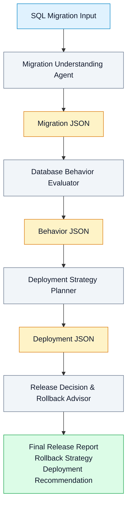

# AI Database Release Planner

## Overview

AI Database Release Planner is a multi-agent system for analyzing SQL database migrations and producing production-oriented release recommendations. It is designed to help teams understand the technical impact of a migration, assess runtime risk, and arrive at a release decision with rollback guidance.

## Problem Statement

Database migrations can introduce destructive changes, lock contention, table rewrites, downtime risk, and other production concerns that are not obvious from the SQL migration alone. This project addresses the need to evaluate those risks before a release is approved, so teams can make safer deployment decisions with a structured and repeatable process.

## High-Level Architecture

The system is divided into multiple agents because each stage answers a different question about the same migration. Separating the work keeps each agent focused on one responsibility, reduces overlap between stages, and makes the output easier to validate. The architecture also allows each agent to enrich the same JSON artifact in sequence without requiring earlier agents to solve later-stage concerns.

## System Pipeline

The pipeline begins with a SQL migration and ends with a final release report. First, the Migration Understanding Agent converts the migration into a structured JSON summary. Next, the Database Behavior Evaluator adds PostgreSQL runtime behavior analysis. Then, the Deployment Strategy Planner appends deployment recommendations, including release ordering and downtime considerations. Finally, the Release Decision & Rollback Advisor evaluates the accumulated information and produces the final release report.

## Agent Responsibilities

### Migration Understanding Agent

Purpose: Parse SQL migrations and create a structured representation of what changed.

Input: SQL migration.

Output: Migration JSON summary.

Responsibilities:
- Extract schema operations.
- Identify affected tables and columns.
- Detect destructive operations.
- Produce a structured JSON summary.

What it intentionally does NOT do:
- It does not evaluate PostgreSQL runtime behavior.
- It does not recommend deployment strategy.
- It does not make the final release decision.

### Database Behavior Evaluator

Purpose: Assess how the migration is likely to behave at runtime in PostgreSQL.

Input: Migration JSON.

Output: Behavior JSON with `behavior_analysis` appended.

Responsibilities:
- Analyze PostgreSQL runtime behavior.
- Evaluate locks.
- Detect table rewrites.
- Estimate blocking risk.
- Estimate production risk.

What it intentionally does NOT do:
- It does not re-parse the SQL migration.
- It does not choose the deployment strategy.
- It does not approve or reject the release.

### Deployment Strategy Planner

Purpose: Recommend the safest deployment approach for the evaluated migration.

Input: Behavior JSON.

Output: Deployment JSON with `deployment_strategy` appended.

Responsibilities:
- Recommend the safest deployment strategy.
- Decide deployment order.
- Estimate downtime.
- Suggest maintenance window requirements.

What it intentionally does NOT do:
- It does not rewrite the earlier analysis.
- It does not reassess PostgreSQL runtime behavior from scratch.
- It does not make the final release decision.

### Release Decision & Rollback Advisor

Purpose: Produce the final release recommendation and rollback guidance.

Input: Deployment JSON.

Output: Final Release Report with `release_plan` appended.

Responsibilities:
- Make the final release decision.
- Determine approval status.
- Recommend rollback strategy.

What it intentionally does NOT do:
- It does not replace the earlier analysis stages.
- It does not recalculate deployment strategy.
- It does not alter prior JSON content.

## Data Flow

Each agent receives the JSON produced by the previous stage and appends its own result without modifying earlier outputs. This preserves traceability across the pipeline and keeps the analysis chain readable from start to finish. The data flow is cumulative: SQL migration to migration JSON, then behavior JSON, then deployment JSON, and finally the release report.

## Design Principles

- Single Responsibility Principle: each agent performs one clearly bounded task.
- Separation of Concerns: schema analysis, runtime behavior assessment, deployment planning, and release approval are isolated from one another.
- Immutable JSON enrichment: each stage appends new information rather than rewriting prior stage output.
- Sequential pipeline architecture: later decisions depend on earlier findings in a fixed order.
- Consistent structured outputs: each stage follows the same defined JSON contract and processing sequence.
- Modular extensibility: individual agents can be improved or replaced without redesigning the full pipeline.

## Current Scope

This project currently covers a four-stage analysis pipeline for SQL database migrations with PostgreSQL behavior evaluation, deployment strategy planning, and a final release decision with rollback advice. It is focused on producing structured JSON at each stage and a final release report for production review.

## Future Improvements

- Support additional database engines beyond PostgreSQL.
- Add richer policy-based approval criteria for release decisions.
- Expand risk analysis with more detailed migration patterns.
- Introduce human review checkpoints for higher-risk changes.
- Provide more granular rollback recommendations for complex releases.
- Add broader reporting formats for downstream review workflows.

## Architecture Diagram

The SVG rendering of this diagram is saved at `assets/diagrams/architecture.svg`.

Each agent enriches the previous JSON without modifying earlier outputs, ensuring traceability and separation of concerns.
