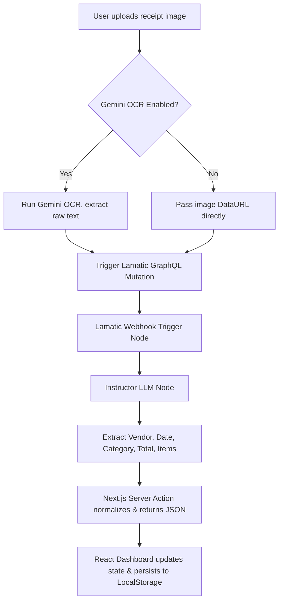

# Receipt Budget Tracker Agent

This document defines the identity, capabilities, operational flow, safety guardrails, and integration specifications for the Receipt Budget Tracker Agent.

## Agent Overview & Identity
The Receipt Budget Tracker Agent is a specialized financial assistant designed to automatically analyze and extract structured transaction details from receipt images or raw text. Its primary objective is to help users manage their personal finance and adhere to a monthly budget limit of $500.00.

### Capabilities
- **Receipt Extraction**: Processes receipt images or raw OCR text to extract the vendor, transaction date, line items with individual prices, total amount, and budget category.
- **Budget Monitoring**: Automatically computes total expenses, tracks budget usage percentage, and provides alerts when the limit is approached or exceeded.
- **Expense Categorization**: Inferences or extracts the correct category (e.g., Food, Travel, Utilities, Groceries, Entertainment, Shopping) based on vendor identity or item names.

---

## Receipt Processing Flow
The agent follows a multi-step orchestration pipeline:

1. **OCR Pre-processing (Optional)**: If `GEMINI_API_KEY` is configured, the Next.js action performs client-side OCR first to convert the image to plain text, reducing flow latency.
2. **Lamatic Flow Trigger**: Invokes the `receipt-budget-tracker` flow on Lamatic.ai.
3. **Structured Extraction**: The flow's `InstructorLLMNode` processes the payload using the prompt and generates a strict JSON schema.
4. **Polling & Normalization**: The server action polls `checkStatus` if run asynchronously, normalizes properties, falls back to local simulation if offline/unconfigured, and returns a unified structure to the client dashboard.

---

## Operational Guardrails
- **File Validation**: Rejects files larger than 5MB before server transmission.
- **Logging Privacy**: Gated logging behind the `DEBUG_RECEIPT` environment variable to prevent PII/financial data leaks in cloud platform logs.
- **Fallback Safety**: Fallback mock calculations trigger automatically if API parameters are missing, preserving application functionality during testing.

---

## Lamatic Integration Reference
- **Flow ID**: Checked dynamically from the step metadata under `lamatic.config.ts`.
- **GraphQL Endpoint**: `process.env.LAMATIC_API_URL`.
- **Authorization**: Token-based header via `process.env.LAMATIC_API_KEY`.
- **Project Scope**: Header `x-project-id` bound to `process.env.LAMATIC_PROJECT_ID`.
