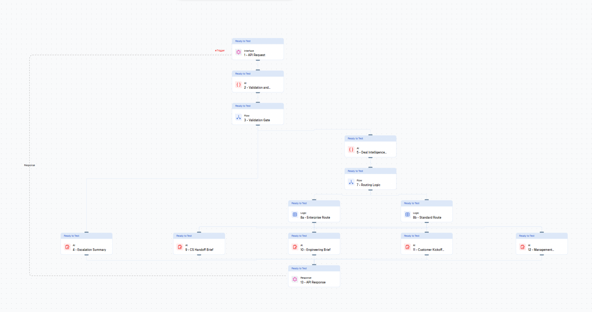
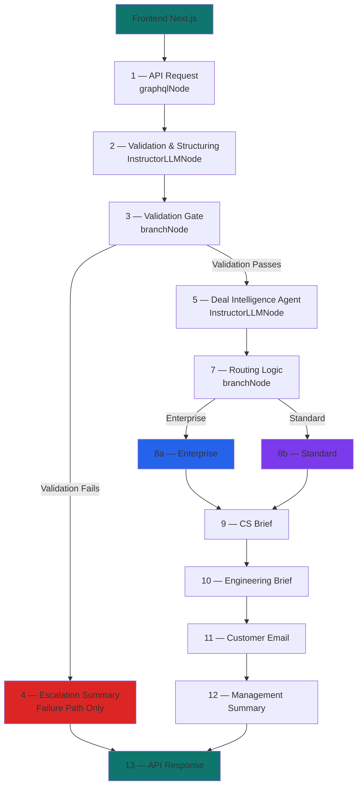

# 🚀 AI Sales → Customer Success Handoff Orchestrator

[](#)
[](#)
[](#)

An AI-powered onboarding orchestration kit built on Lamatic that automates the Sales → Customer Success handoff the moment a deal closes.

Paste raw deal data — sales transcript, CRM notes, integration requirements, promised timeline — and the workflow validates, scores complexity, detects risks, routes to the correct onboarding path, and generates four role-specific operational outputs in parallel. Under 10 seconds. Under $0.004 per run.

---

## 🌐 Live Demo

**Try it now:** https://sales-to-cs-handoff-automation.vercel.app/

Deploy your own with one click using Vercel — all environment variables are server-side protected.

---

## 📉 The Problem

The Sales → CS handoff is one of the most operationally fragile moments in B2B SaaS.

When a deal closes, onboarding context is scattered across:
- CRM notes written by sales reps in inconsistent formats
- Sales call transcripts with undocumented verbal commitments
- Slack threads between AE and SE
- Implementation discussions that never reached CS

What CS actually receives: a basic CRM notification with company name and deal value. No context. No risk flags. No implementation scope.

The result:
- CS chases the sales rep for context — hours of back and forth
- Engineering discovers integration requirements on the kickoff call
- Customers find out their promised timeline is unrealistic after signing
- Promise gaps surface as churn, not as pre-onboarding flags

---

## ✅ What This Kit Does

This Lamatic workflow automates the entire handoff intelligence layer immediately after a deal closes.

**One input. Five outputs. Under 10 seconds.**

| Output | Audience | What It Contains |
|--------|----------|-----------------|
| CS Handoff Brief | Customer Success Manager | Account overview, customer goals, promise audit, 30/60/90 day milestones, risk flags, confidence score |
| Engineering Brief | Implementation Team | Integration requirements, custom development scope, timeline reality check, technical dependencies, open questions |
| Customer Kickoff Email | The Customer | Personalized email referencing their actual pain points, confirmed next steps, honest timeline |
| Management Summary | Leadership | Deal snapshot, risk level, promise gaps, implementation concerns, recommended actions |
| Escalation Report | Onboarding Manager | Generated only on validation failure — explains what is missing and blocks downstream execution |

---

## 🧩 Workflow Image



---

## 🧠 Workflow Architecture



**Architecture philosophy:**
- LLM handles semantic reasoning — validation, intelligence, generation
- Branch nodes handle deterministic routing — no AI in business logic decisions
- Parallel nodes for the four outputs — all fire simultaneously, not sequentially
- Validation gate stops bad data before it enters the pipeline

---

## ⚙️ Node Breakdown

### Node 2 — Validation & Structuring Agent
`InstructorLLMNode` — structured JSON output

Validates payload completeness, detects missing fields, normalizes messy transcript data. Outputs `validation_status`, `continue_pipeline` boolean, and `reason`. If validation fails, pipeline routes to escalation and stops. Nothing downstream runs on bad data.

### Node 5 — Deal Intelligence Agent
`InstructorLLMNode` — structured JSON output

Core reasoning node. Takes validated deal data and produces:
- `complexity_score` (1-10)
- `onboarding_tier` (standard / enterprise)
- `confidence_score` (0-100)
- `onboarding_risks` (array of specific flags)
- `technical_requirements` (extracted from transcript)
- `customer_goals` (extracted from transcript)
- `promise_audit` (sales commitments vs deliverability)
- `onboarding_feasibility`

### Node 7 — Routing Logic
`branchNode` — deterministic, no AI

Routes to enterprise or standard path based on complexity score and tier. Routing is deterministic by design — business routing decisions must be explainable and auditable, not AI-driven.

### Nodes 9–12 — Parallel Output Generation
Four `LLMNode` instances firing simultaneously

Each node has isolated prompting logic, isolated tone, and isolated structure. CS brief is internal and operational. Engineering brief is technical and precise. Customer email is warm and personalized. Management summary is concise and high-signal.

---

## 📊 Real Output Example

From an actual test run with a $120,000 fintech deal (NovaPay Financial):

**Intelligence output:**
```json
{
  "validation_status": "passed",
  "complexity_score": 8,
  "onboarding_tier": "enterprise",
  "confidence_score": 95,
  "onboarding_risks": [
    "Integration with Salesforce and Zendesk",
    "Custom reporting dashboard",
    "Tight 2-week timeline"
  ]
}
```

**Risk flags detected from transcript:**
- PCI-DSS configuration timeline conflict — 4 to 6 weeks required, 45 day total window
- Unanswered follow-up email from CTO — active promise gap
- Custom dashboard complexity not scoped — typically 6 to 8 week professional services engagement
- Third-party QSA scoping call required before implementation can begin — not communicated to customer

**Execution metrics (from actual API response `_meta`):**
```
cs_brief total_time:          2.107 seconds   cost: $0.00071
engineering_brief total_time: 1.828 seconds   cost: $0.00062
customer_email total_time:    1.413 seconds   cost: $0.00052
management_summary total_time: 1.084 seconds  cost: $0.00049
escalation total_time:        1.871 seconds   cost: $0.00043

Total flow execution: under 10 seconds
Total cost per run:   $0.0033
```

---

## 🚨 Failure Handling

The validation gate blocks onboarding when critical information is missing.

**Test with empty payload:**
```json
{
  "company_name": "",
  "deal_value": "",
  "sales_transcript": "...",
  "crm_notes": "",
  "timeline": ""
}
```

**Result:**
```json
{
  "validation_status": "failed",
  "continue_pipeline": false,
  "validation_reason": "Missing required onboarding information",
  "escalation_summary": "Full escalation report with re-submission checklist..."
}
```

All downstream nodes skip. No partial or unreliable outputs generated.

---

## 🖥️ Frontend

Built as an operational onboarding dashboard — not a chatbot UI.

- Deal intake form with all five input fields
- Left panel: validation status, onboarding route badge, complexity and confidence score bars, risk flags
- Right panel: five tabbed outputs with one-click copy
- Pipeline halt alert when validation fails

**Stack:** Next.js 14, TypeScript, Tailwind CSS

---

## 📦 Tech Stack

| Layer | Technology |
|-------|-----------|
| Frontend | Next.js 14, TypeScript, Tailwind CSS |
| Workflow orchestration | Lamatic.ai |
| API | GraphQL via Lamatic graphqlNode |
| LLM | Groq Llama 3.3 70B Versatile |
| Structured output | Lamatic InstructorLLMNode |
| Routing | Lamatic branchNode |

---

## 🚀 Running Locally

**Install dependencies:**
```bash
npm install
```

**Configure environment:**
```env
NEXT_PUBLIC_LAMATIC_API_URL=your_lamatic_graphql_endpoint
NEXT_PUBLIC_LAMATIC_API_KEY=your_api_key
```

**Start frontend:**
```bash
npm run dev
```

---

## 🧪 Test Payloads

**Enterprise path (complex deal):**
```json
{
  "company_name": "Acme Corp",
  "deal_value": "85000",
  "sales_transcript": "Customer needs Salesforce and Zendesk integration. They want full migration support within 2 weeks. Dedicated onboarding manager requested. Custom reporting dashboard mentioned.",
  "crm_notes": "Enterprise deal. CFO involved. Expects white-glove treatment. Integration with internal data warehouse also discussed.",
  "timeline": "2 weeks"
}
```

**Standard path (simple deal):**
```json
{
  "company_name": "StartupXYZ",
  "deal_value": "2000",
  "sales_transcript": "Small team, just needs basic setup and a quick walkthrough.",
  "crm_notes": "Self-serve plan. No integrations needed.",
  "timeline": "4 weeks"
}
```

**Failure path (missing data):**
```json
{
  "company_name": "",
  "deal_value": "",
  "sales_transcript": "...",
  "crm_notes": "",
  "timeline": ""
}
```

---

## 📹 Demo

Live Demo: [Add Vercel link]

Video Walkthrough: [Add Loom link]

---

## 🏗️ Built for Lamatic AgentKit Challenge

This kit demonstrates how Lamatic can orchestrate operational AI workflows beyond simple text generation — combining validation, structured JSON extraction, deterministic routing, and parallel multi-team output generation into a single production-grade flow.

The focus is not AI generation. The focus is operational workflow orchestration.