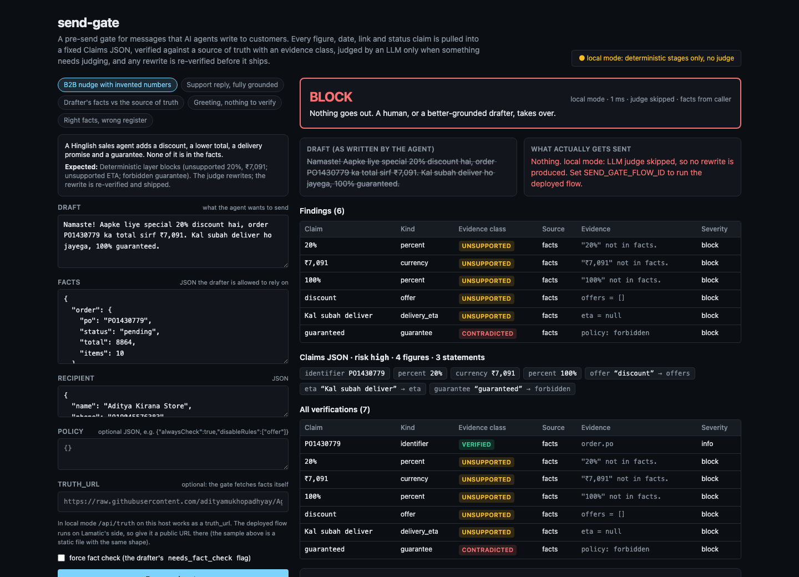

# send-gate

**A pre-send gate for messages that AI agents write to customers.** Before a draft goes out, every figure, date, link and status claim in it is pulled into a fixed Claims JSON, verified against a source of truth with an explicit evidence class, judged by an LLM only when something actually needs judging, and any rewrite is verified again before it ships. Nothing unverifiable about money, orders or delivery leaves the building.

Built for the [Lamatic AgentKit Challenge](../../CHALLENGE.md). Flow deployed and tested end to end in Lamatic Studio; the export in this folder is the real graph.



## The problem

Drafting agents are good at tone and bad at truth. A WhatsApp sales bot writing to a kirana store will happily add a "special 20% discount", round the order total down, promise delivery "kal subah" and sign off with "100% guaranteed". None of it is in the order record. In B2B commerce every one of those is a real liability: the customer holds you to it, and the business finds out from a complaint.

The usual fix is "ask another LLM to check it". That has two problems: a second model can hallucinate approval just as easily, and it costs a model call on every message including "Namaste, kuch madad chahiye?".

## What send-gate does differently

1. **A fixed Claims JSON for every draft.** Deterministic extraction of figures (currency, percent, count, identifier, phone, date, link) and statements (order placed, delivered, refund issued, offer, ETA, payment received, guarantee), each with the fact path that settles it. Same shape every time, so it can be logged, diffed and asserted on.
2. **Verification with evidence classes, not a score.** Each claim gets one of `verified`, `contradicted`, `unsupported`, `unverifiable`, plus the fact path used as evidence. "Order placed" against `order.status = "pending"` is *contradicted*, not merely unsupported. A phone number that is not the recipient's is contradicted against `recipient.phone`.
3. **The gate can fetch the truth itself.** Pass `truth_url` and the first Code node calls it with the identifiers found in the draft. Whatever comes back overrides the drafter's facts (`provenance: "tool"`), so a drafter cannot launder an invented number by inventing a matching fact.
4. **The judge runs only when needed.** `needsFactCheck` is computed from the claims (risk `none` takes a fast path with zero model calls). The drafter can also force it with `needs_fact_check`, and a policy can `alwaysCheck`.
5. **The rewrite is not trusted either.** The judge's rewrite goes through the same deterministic verifier. If the rewrite still invents a number, the verdict is `block` and `finalMessage` is `null`. Fails closed.
6. **One implementation.** `apps/lib/gate.js` is the library; both Code nodes in the flow carry a minified copy generated by `apps/scripts/emit-code-node.mjs`. The demo app runs the same code locally with no credentials.

## Flow

```
API Request ─► Code: claims + truth fetch + verify ─► Condition needsFactCheck?
                                                          │ true              │ else
                                                          ▼                   ▼
                                                   Generate JSON (judge)   Code: pass-through
                                                          └──────────┬─────────┘
                                                                     ▼
                                                   Code: decide + re-verify rewrite ─► API Response
```

| Node | Type | Role |
|---|---|---|
| `triggerNode_1` | API Request | `draft`, `facts`, `recipient`, `policy`, `needs_fact_check`, `truth_url` (all strings; JSON as text) |
| `codeNode_211` | Code | `extractClaims` → optional `truth_url` fetch → `mergeFacts` → `verifyClaims`. No model. |
| `conditionNode_874` | Condition | `{{codeNode_211.output.needsFactCheck}} == true` |
| `InstructorLLMNode_699` | Generate JSON | Semantic judge (Gemini Flash Lite): unsupported claims the rules cannot see (promises, causal explanations), plus a grounded rewrite. Schema-constrained. |
| `codeNode_504` | Code | Pass-through on the fast path so both branches join. |
| `codeNode_515` | Code | `decide`: merges judge findings, re-verifies the rewrite, fails closed. |
| `responseNode_triggerNode_1` | API Response | `verdict`, `finalMessage`, `claims`, `verifications`, `findings`, `counts`, `rewriteCheck`, `audit` |

## Input and output

Request payload (every field a string; the flow parses JSON itself):

```json
{
  "draft": "Namaste! Aapke liye special 20% discount hai, order PO1430779 ka total sirf ₹7,091. Kal subah deliver ho jayega, 100% guaranteed.",
  "facts": "{\"order\": {\"po\": \"PO1430779\", \"status\": \"pending\", \"total\": 8864, \"items\": 10}, \"offers\": [], \"eta\": null}",
  "recipient": "{\"name\": \"Aditya Kirana Store\", \"phone\": \"919045576383\"}",
  "policy": "",
  "needs_fact_check": "",
  "truth_url": ""
}
```

Response (abridged):

```json
{
  "verdict": "rewrite",
  "finalMessage": "Namaste! Aapka order PO1430779 pending status mein hai, total ₹8,864 hai. Delivery ka time confirm hote hi batayenge.",
  "claims": { "schemaVersion": "1", "risk": "high", "needsFactCheck": true, "figures": [ { "id": "f1", "kind": "identifier", "token": "PO1430779" }, { "id": "f2", "kind": "percent", "token": "20%" } ], "statements": [ { "rule": "offer", "factPath": "offers" }, { "rule": "eta", "factPath": "eta" }, { "rule": "guarantee", "never": true } ] },
  "findings": [
    { "claimId": "f2", "kind": "percent", "token": "20%", "status": "unsupported", "source": "facts", "severity": "block" },
    { "claimId": "s3", "kind": "guarantee", "status": "contradicted", "evidence": "policy: forbidden", "severity": "block" }
  ],
  "rewriteCheck": { "preVerdict": "allow", "findings": [] },
  "audit": { "needsFactCheck": true, "provenance": "facts", "judgeUsed": true, "judgeNotes": "…", "schemaVersion": "1" }
}
```

Verdicts: `allow` (send the draft), `rewrite` (send `finalMessage`, a re-verified rewrite), `block` (send nothing; `finalMessage` is `null`).

`policy` (optional JSON): `formalAddress` (default true), `allowUngroundedSmallCounts` (default true; single-digit counts pass), `disableRules: ["offer"]`, `statementRules: [{ id, kind, pattern, factPath, expect, never, message }]` to add domain rules, `allowedValues: [...]` for figures that are always fine, `alwaysCheck: true`.

## Running the demo

```bash
cd kits/send-gate/apps
cp .env.example .env.local   # optional, see below
npm install
npm run dev                  # http://localhost:3000
```

With an empty `.env.local` the app runs in **local mode**: the deterministic stages run in-process, no credentials, no model. Blocked drafts get no rewrite in this mode (that is the judge's job). Fill in `LAMATIC_API_KEY`, `LAMATIC_PROJECT_ID`, `LAMATIC_API_URL` and `SEND_GATE_FLOW_ID` and the same UI calls the deployed flow via the `lamatic` SDK.

Five scenarios are wired in: invented numbers in a Hinglish B2B nudge, a fully grounded refund reply, drafter facts overridden by `truth_url`, a greeting that takes the fast path, and correct facts in the wrong register with a foreign phone number.

`/api/truth` is a mock source of truth (three orders) with the request/response shape the gate expects: `GET /api/truth?ids=PO1430779&recipient=…` → `{ "order": {…}, "offers": [], "eta": null }`. The deployed flow runs on Lamatic's side, so it needs a public URL; `assets/truth/PO1430779.json` is a static stand-in with the same shape.

Calling the deployed flow directly:

```bash
curl -s "$LAMATIC_API_URL" \
  -H "Authorization: Bearer $LAMATIC_API_KEY" -H "x-project-id: $LAMATIC_PROJECT_ID" -H "content-type: application/json" \
  -d '{"query":"query($workflowId:String!,$payload:JSON!){executeWorkflow(workflowId:$workflowId,payload:$payload){status result}}","variables":{"workflowId":"'"$SEND_GATE_FLOW_ID"'","payload":{"draft":"Aapka order PO1430779 kal subah pahunch jayega.","facts":"{\"order\":{\"po\":\"PO1430779\",\"status\":\"pending\"},\"eta\":null}","recipient":"{\"name\":\"Aditya Kirana Store\"}","policy":"","needs_fact_check":"","truth_url":""}}}'
```

## Tests and the generated scripts

```bash
cd kits/send-gate/apps
npm test             # 22 node:test cases against lib/gate.js (claims shape, evidence classes, merge, decide)
npm run emit:check   # scripts/send-gate_code-node-{211,515}_code.ts are up to date with lib/gate.js
npm run emit         # regenerate them (terser; Studio caps a Code node at ~10,000 chars)
```

The Code-node scripts are minified because Studio caps a node at roughly 10,000 characters and the library plus glue is about 15,000 readable. Read `apps/lib/gate.js` and the two templates in `apps/scripts/emit-code-node.mjs`; the readable assembled versions land in `apps/scripts/out/` when you run `npm run emit`.

## Deploying the flow yourself

1. Import this kit in Lamatic Studio (flows, prompts, scripts and model config are referenced from the flow file).
2. Attach a Gemini credential to the Generate JSON node (`model-configs/`); any JSON-mode model works.
3. Test with the payload above, deploy, copy the flow id into `SEND_GATE_FLOW_ID`.

## Limits, honestly

- Figure extraction is regex-based and tuned for English and Hinglish commerce messages: rupee/percent/count, PO-style identifiers, Indian mobile numbers, common date forms. Other scripts (Devanagari numerals, Tamil) are not covered.
- Statement rules are patterns. They catch the common shapes ("order place ho gaya", "kal deliver", "refund processed") and hand the rest to the judge as `unresolved`. A determined drafter can phrase around them; the judge is the backstop, and the judge is a model.
- The gate verifies a message against facts. It does not decide whether the facts are correct, and it does not check tone beyond formal address and abusive language.
- Single-digit counts are tolerated by default ("2 cheezein"), because blocking every "2" is unusable. Turn it off with `allowUngroundedSmallCounts: false`.

## Structure

```
send-gate/
├── lamatic.config.ts                 kit metadata (step send-gate → SEND_GATE_FLOW_ID)
├── agent.md                          agent identity and integration reference
├── constitutions/default.md          fail-closed rules the flow and app obey
├── flows/send-gate.ts                Studio export: 7 nodes, meta, references
├── prompts/                          judge system + user prompt (Generate JSON node)
├── scripts/                          Code-node bodies (generated from apps/lib/gate.js)
├── model-configs/                    Gemini config for the judge
├── assets/truth/PO1430779.json       sample source-of-truth response
└── apps/                             Next.js demo + tests + generator
    ├── lib/gate.js                   the library (pure, no network, no model)
    ├── lib/local-runner.ts           the two Code nodes, in-process
    ├── lib/lamatic-client.ts         SDK call to the deployed flow
    ├── actions/orchestrate.ts        server action: flow if configured, else local
    ├── app/api/truth/route.ts        mock source of truth
    ├── tests/gate.test.mjs           node:test suite
    └── scripts/emit-code-node.mjs    library → Code-node scripts
```

## Tags

`guardrail` `fact-check` `hallucination` `customer-messaging` `deterministic` `hinglish`
