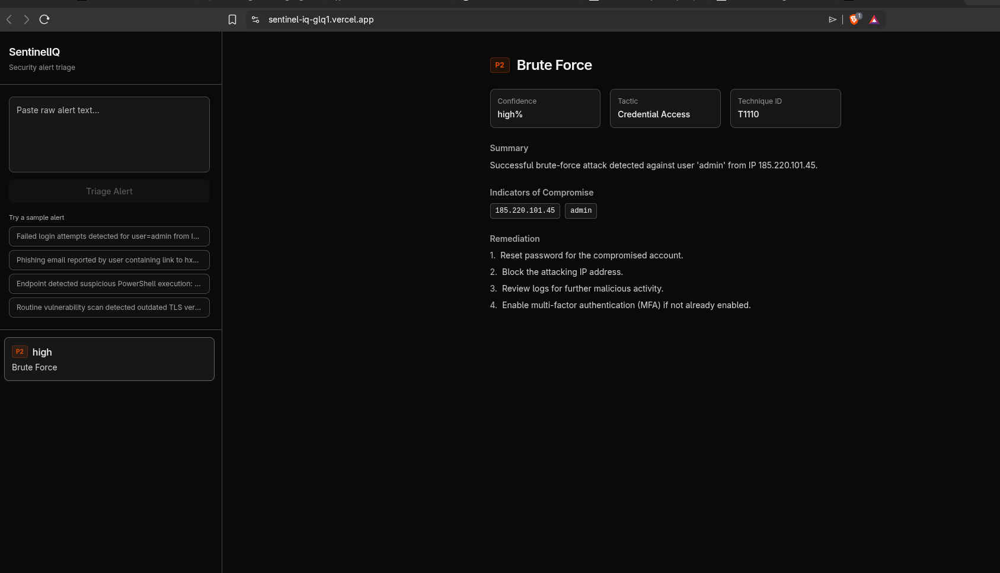

# SentinelIQ

Security incident triage agent built on Lamatic. Paste a raw alert, get a severity-scored, ATT&CK-mapped triage report back.

**Live demo:** https://sentinel-iq-glq1.vercel.app/

## What it does
1. Extracts IOCs from the alert text
2. Classifies severity (P1–P4) and maps it to MITRE ATT&CK
3. Generates a remediation summary
4. Displays the result in a triage queue dashboard

## Setup
\`\`\`bash
cd kits/sentinel-iq/apps
cp .env.example .env.local
npm install
npm run dev
\`\`\`

Fill in `.env.local` with your Lamatic API key, project ID, API URL, and the `SENTINEL_TRIAGE_FLOW_ID` from your deployed flow in Lamatic Studio.

## Flow
`flows/sentinel-triage.ts` — single flow: API trigger → IOC extraction code node → LLM triage node (Generate JSON) → API response.

## Note on demo LLM quota
This kit runs on Gemini's free tier for the demo deployment (20 requests/day). If you see a quota message in the UI, it's a rate limit, not a bug — swap in your own model credentials in Lamatic Studio to remove that cap.