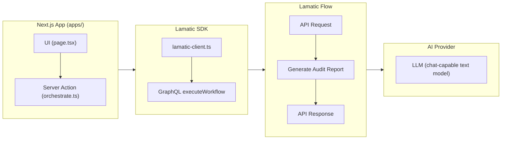
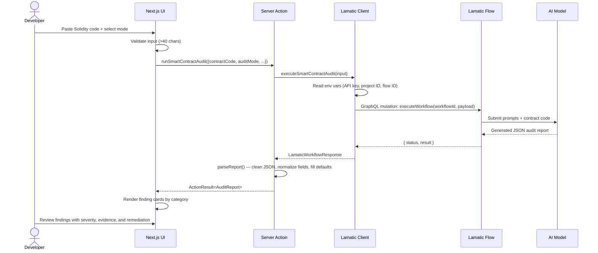
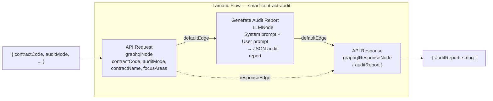
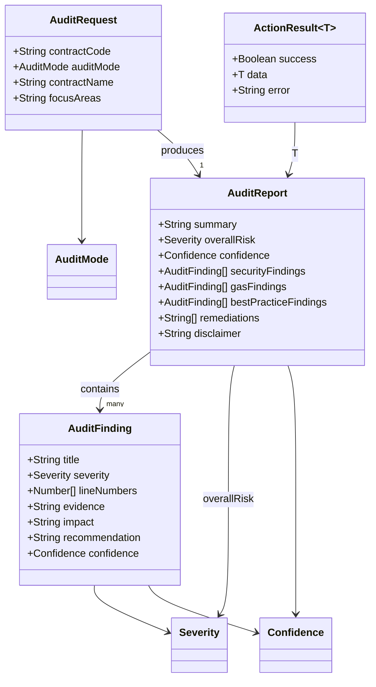
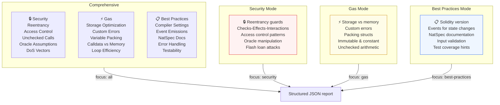
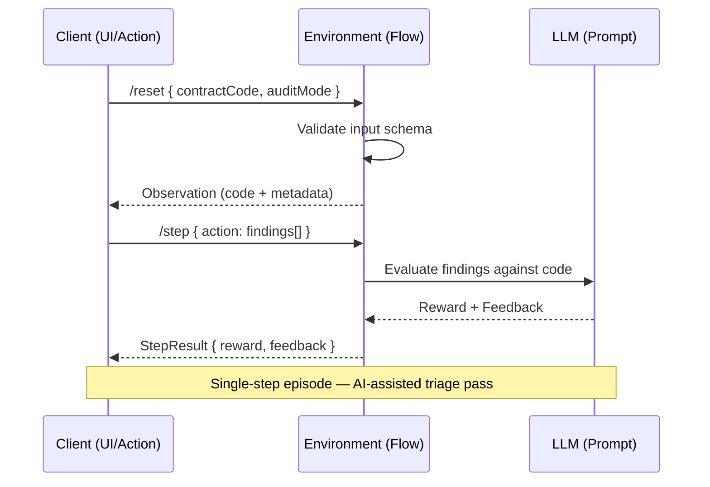

# Smart Contract Audit Copilot

Smart Contract Audit Copilot is a Lamatic-powered kit for first-pass Solidity contract review. Paste Solidity code, choose an audit mode, and get a structured report covering security vulnerabilities, gas optimizations, best-practice issues, and prioritized remediation steps.

This kit adapts the idea behind `ContractSLM`/SolidityGuard into the AgentKit format: instead of shipping a standalone Python RL environment, it provides a deployable Lamatic flow plus a focused Next.js app for developer triage.

## System Architecture



## Problem

Smart contract teams often need a quick, repeatable pre-audit pass before investing in deeper manual review. Generic chat prompts produce inconsistent output, while standalone audit tools can be hard to demo or integrate.

This kit gives developers a narrow workflow:

1. Paste Solidity source code.
2. Select `security`, `gas`, `best-practices`, or `comprehensive` mode.
3. Receive categorized findings with severity, evidence, impact, confidence, and fixes.

## Request Flow



## What It Does

- Reviews Solidity source for common vulnerability classes such as reentrancy, access control gaps, unchecked calls, oracle assumptions, and denial-of-service risks.
- Surfaces gas optimization opportunities such as storage access reduction, custom errors, packing, calldata usage, and avoidable work.
- Flags maintainability and best-practice issues such as compiler settings, events, NatSpec, error handling, and testability gaps.
- Returns structured JSON so the app can render triage-ready cards.
- Keeps an audit disclaimer visible because this is AI-assisted review, not a replacement for a full professional audit.

## Kit Type

This is an AgentKit `kit` because it includes:

- one Lamatic flow in `flows/smart-contract-audit.ts`
- a runnable Next.js app in `apps/`
- externalized prompts, model config, constitution, docs, and env examples

## Flow



### Input

```json
{
  "contractCode": "pragma solidity ^0.8.20; contract Vault { ... }",
  "contractName": "Vault",
  "auditMode": "comprehensive",
  "focusAreas": "reentrancy, access control, gas"
}
```

### Output

```json
{
  "auditReport": "{\"summary\":\"...\",\"overallRisk\":\"high\",\"securityFindings\":[...]}"
}
```

The app parses `auditReport` and normalizes missing arrays to safe defaults.

## Data Model



### Types

```typescript
type AuditMode = "security" | "gas" | "best-practices" | "comprehensive";
type Severity = "critical" | "high" | "medium" | "low" | "info";
type Confidence = "high" | "medium" | "low";
```

## Audit Mode Taxonomy



## Audit Episode Flow



## Environment Variables

Create `apps/.env.local` from `apps/.env.example`:

```bash
SMART_CONTRACT_AUDIT_FLOW_ID="your-deployed-smart-contract-audit-flow-id"
LAMATIC_API_URL="https://your-project-endpoint.lamatic.ai"
LAMATIC_PROJECT_ID="your-lamatic-project-id"
LAMATIC_API_KEY="your-lamatic-api-key"
```

## Lamatic Setup

1. Sign in to Lamatic Studio.
2. Create or open a Lamatic project.
3. Import the `smart-contract-audit` flow from `flows/smart-contract-audit.ts`.
4. Configure a chat-capable text generation model for `Generate Audit Report`.
5. Deploy the flow.
6. Copy the deployed flow ID into `SMART_CONTRACT_AUDIT_FLOW_ID`.

## Run Locally

```bash
cd kits/smart-contract-audit-copilot/apps
npm install
cp .env.example .env.local
npm run dev
```

Open `http://localhost:3000`.

## Project Structure

```text
kits/smart-contract-audit-copilot/
|-- lamatic.config.ts        # Kit metadata (name, type, steps, links)
|-- agent.md                 # Agent identity + capability doc
|-- README.md                # This file
|-- constitutions/
|   `-- default.md           # Guardrails (identity, safety, data handling, tone)
|-- flows/
|   `-- smart-contract-audit.ts  # Self-contained Lamatic flow (meta, nodes, edges)
|-- prompts/
|   |-- smart-contract-audit_system.md  # System prompt for audit behavior
|   `-- smart-contract-audit_user.md    # User prompt with contract code
|-- model-configs/
|   `-- smart-contract-audit_generate-report.ts  # LLM model configuration
|-- .env.example             # Environment variable template
`-- apps/
    |-- package.json         # Next.js app dependencies
    |-- next.config.mjs
    |-- tsconfig.json
    |-- lib/
    |   |-- types.ts         # TypeScript type definitions
    |   `-- lamatic-client.ts    # Lamatic SDK / GraphQL client
    |-- actions/
    |   `-- orchestrate.ts   # Server action: validation + parsing
    `-- app/
        |-- globals.css      # Tailwind styles
        `-- page.tsx         # Main UI: form, report cards, error states
```

## Important Limitations

- This kit does not execute exploits, run symbolic analysis, or formally verify contracts.
- Results depend on the submitted code and may miss inherited contracts, imported libraries, deployment assumptions, or protocol context.
- Use the output as developer triage before deeper manual review.

## Author

Built by Tanay Mitra as an AgentKit challenge contribution.
