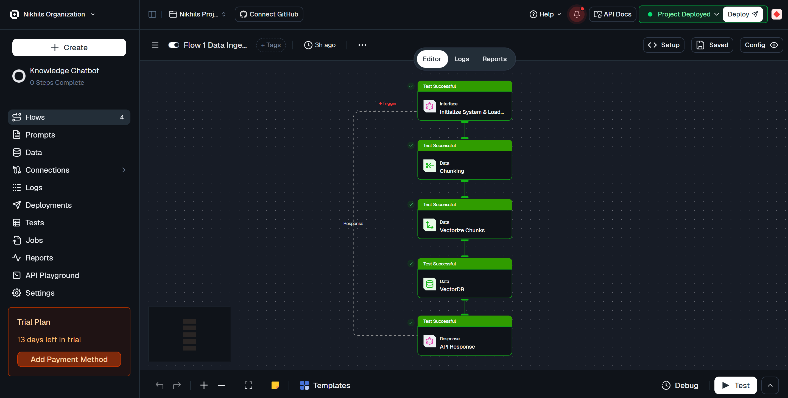
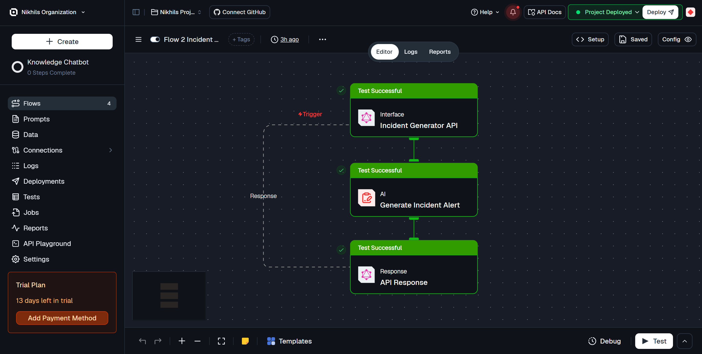
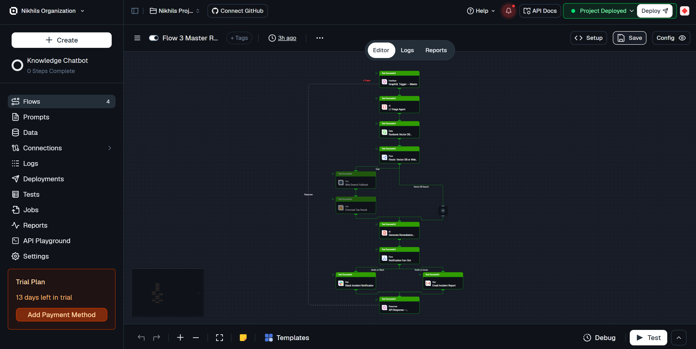

# 🚨 SRE Command Center

An AI-powered Site Reliability Engineering Command Center that **simulates, triages, and auto-remediates production incidents** using a 3-flow Micro-Flow Architecture on Lamatic.ai.

---

## 🔴 Live Demo & Walkthrough Video

> **🌐 Live Application:** [https://lamatic-sre-command-center.vercel.app/](https://lamatic-sre-command-center.vercel.app/) 🚀  
> **🎥 Watch 2-Min Walkthrough Video:** [https://www.loom.com/share/89656cb630e548039c1c646f91b5f2b8](https://www.loom.com/share/89656cb630e548039c1c646f91b5f2b8) 📺

---

## 🎯 Problem Statement

Production incidents are chaotic. SRE teams waste precious minutes manually triaging alerts, searching through runbooks, and drafting remediation steps — all while the clock ticks on P1 severity issues.

**This kit automates the entire L1 → L2 triage pipeline:**
1. **Simulate** realistic production incidents from natural language descriptions
2. **Triage** automatically: classify category, form root cause hypotheses, route to the right knowledge source
3. **Remediate** with step-by-step Markdown reports, CLI commands, prevention recommendations, and escalation paths

---

## ✨ Features

| Feature | Description |
|---------|-------------|
| 🎭 **Incident Simulation** | Generate realistic Datadog/PagerDuty-style alerts from plain English |
| 🔍 **Auto-Triage** | L1 classification by type, severity, blast radius & confidence |
| 📚 **RAG Runbook Retrieval** | Semantic search of your indexed engineering runbooks |
| 🌐 **Web Fallback** | Firecrawl web search for novel/unknown incidents |
| 📝 **Markdown Reports** | Complete remediation reports with CLI commands & escalation paths |
| ⚡ **Live Terminal** | Real-time animated agent thought process visualization |
| 🚨 **SRE Command Center UI** | 1-Screen zero-scroll dark mode glassmorphic Next.js interface |
| 📬 **Automated Fan-Out** | Instant incident notifications dispatched to Slack (#sre-incident-alerts) & Gmail |

---

## 🏗️ Architecture: 3-Flow Micro-Flow Design

```text
┌─────────────────────────────────────────────────────────┐
│                  SRE COMMAND CENTER                     │
│                                                         │
│  Flow 1: Data Ingestion                                 │
│  ├─ Input: runbook text + source + tags                 │
│  ├─ Process: chunk → embed → upsert to Vector DB        │
│  └─ Output: { status, chunks_indexed }                  │
│                                                         │
│  Flow 2: Incident Generator                             │
│  ├─ Input: natural language prompt                      │
│  ├─ Process: LLM → structured alert JSON                │
│  └─ Output: alert object (exact Datadog/PagerDuty schema)│
│                                                         │
│  Flow 3: Master Responder                               │
│  ├─ Input: alert JSON from Flow 2                       │
│  ├─ Agent 1: L1 Triage (classify + route decision)      │
│  ├─ Router: Vector DB OR Web Search                     │
│  ├─ Agent 2: Report Generator (Markdown output)         │
│  ├─ Fan-Out: Slack (#sre-incident-alerts) & Gmail Alert │
│  └─ Output: { report, triage_category, retrieval_source }│
└─────────────────────────────────────────────────────────┘
```

### 📸 Lamatic Studio Flow Diagrams

| Flow 1: Data Ingestion | Flow 2: Incident Generator | Flow 3: Master Responder |
| :---: | :---: | :---: |
|  |  |  |

---

## 🛠 Tech Stack

| Layer | Technology |
|-------|-----------|
| **Frontend** | Next.js 14 (App Router), Tailwind CSS v3, Framer Motion |
| **Icons** | Lucide React |
| **Markdown** | react-markdown + remark-gfm |
| **Backend** | Lamatic.ai Flows (GraphQL API) |
| **Vector DB** | Lamatic Vector DB (semantic runbook search) |
| **Web Search** | Firecrawl (novel incident fallback) |
| **LLM** | GPT-4o via Lamatic |

---

## 📦 Prerequisites

- Node.js 18+
- npm 9+
- Lamatic account ([lamatic.ai](https://lamatic.ai))
- 3 deployed Lamatic flows (see setup below)

---

## ⚙️ Setup

### Step 1: Clone & Install

```bash
git clone https://github.com/Lamatic/AgentKit.git
cd AgentKit/kits/sre-command-center/apps
npm install
```

### Step 2: Configure Environment

```bash
cp .env.example .env.local
```

Edit `.env.local` with your Lamatic credentials:

```env
LAMATIC_API_KEY=your_api_key
LAMATIC_PROJECT_ID=your_project_id
LAMATIC_API_URL=https://your-project.lamatic.ai
LAMATIC_FLOW_INGESTION_ID=flow_1_id
LAMATIC_FLOW_GENERATOR_ID=flow_2_id
LAMATIC_FLOW_RESPONDER_ID=flow_3_id
```

### Step 3: Build Flows in Lamatic Studio

1. Sign in to [studio.lamatic.ai](https://studio.lamatic.ai)
2. Create 3 flows using the exported definitions in `flows/`
3. Deploy each flow and copy the Flow IDs into your `.env.local`

### Step 4: Run

```bash
npm run dev
```

Open [http://localhost:3000](http://localhost:3000)

---

## 🎮 Usage

### The 4-Step SRE Experience

1. **🔵 Initialize** — Click "Initialize System & Load Runbooks" to seed the Vector DB
2. **🔴 Attack** — Choose a preset scenario (DB Crash, API Timeout, OOM Kill) or type your own
3. **⚙️ Watch** — Terminal shows live agent reasoning: triage → route → retrieve → generate
4. **📋 Read** — Receive a complete Markdown remediation report with CLI commands

---

## 📂 Project Structure

```text
sre-command-center/
├── lamatic.config.ts          # Kit metadata & flow registry
├── agent.md                   # ARIA agent identity document
├── README.md                  # This file
├── .gitignore
├── demo/                      # Screenshots & workflow diagrams
├── flows/
│   ├── data-ingestion.ts      # Flow 1: Runbook → Vector DB
│   ├── incident-generator.ts  # Flow 2: Prompt → Alert JSON
│   └── master-responder.ts    # Flow 3: Alert → Triage → Report
├── prompts/
│   ├── incident_generator_system.md   # Flow 2 LLM system prompt
│   └── master_responder_system.md     # Flow 3 LLM system prompt
└── apps/                      # Next.js 14 SRE Command Center App
    ├── .env.example           # Environment variable template
    ├── actions/
    │   └── orchestrate.ts     # Convention: server actions calling flows
    ├── lib/
    │   ├── lamatic.ts         # Centralized Lamatic GraphQL API client
    │   ├── lamatic-client.ts  # Convention adapter importing lamatic.config
    │   ├── types.ts           # Shared TypeScript interfaces
    │   └── constants.ts       # Attack presets, runbook samples & UI styling
    ├── hooks/
    │   └── useIncidentFlow.ts # Core state machine hook
    ├── app/
    │   ├── layout.tsx
    │   ├── page.tsx           # Slim modular orchestrator
    │   ├── globals.css
    │   └── api/
    │       ├── initialize/route.ts
    │       ├── generate/route.ts
    │       └── resolve/route.ts
    └── components/
        ├── icons/
        │   └── LamaticLogo.tsx
        ├── layout/
        │   └── Navbar.tsx
        ├── panels/
        │   ├── WelcomeHero.tsx
        │   ├── InitializationPanel.tsx
        │   ├── AttackPanel.tsx
        │   └── ResolutionCard.tsx
        └── terminal/
            └── AgentTerminal.tsx
```

---

## 🔗 Lamatic Flow Details

| Flow | Trigger | Purpose |
|------|---------|---------|
| `data-ingestion` | Webhook | One-time setup: index runbooks into Vector DB |
| `incident-generator` | GraphQL | Per-request: prompt → structured alert JSON |
| `master-responder` | GraphQL | Per-request: alert → triage → RAG/search → Markdown report |

---

## 🌐 Deployment

[](https://vercel.com/new/clone?repository-url=https%3A%2F%2Fgithub.com%2FLamatic%2FAgentKit&root-directory=kits%2Fsre-command-center%2Fapps)

Deploy on Vercel manually:

1. Import your forked repo into Vercel
2. Set root directory: `kits/sre-command-center/apps`
3. Add all environment variables from `.env.example`
4. Deploy

---

## 👨‍💻 Author

**Nikhil Rajput**
Built as a Lamatic AgentKit Challenge submission.

---

## ⭐ Star the repo if this kit helped you!
