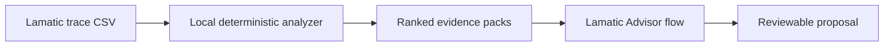

# TraceShift

TraceShift is a production trace-to-flow optimization kit for Lamatic. It analyzes successful workflow executions, discovers repeated node paths, quantifies where latency and model cost accumulate, and turns the strongest finding into a human-reviewable optimization proposal.

It answers a question most observability tools stop short of answering:

> “This flow works—but what repeated production behavior can we safely simplify?”

## The problem

Teams can inspect logs and individual traces, but improving a working agent still means manually comparing many requests, finding repeated paths, adding up durations and cost, and guessing which change is worth testing. A single trace explains one run. It does not prove that a pattern is frequent enough, stable enough, or expensive enough to optimize.

TraceShift converts a window of production evidence into ranked, reviewable candidates:

- exact-input cache boundaries;
- probabilistic nodes worth prototyping as deterministic Code Nodes;
- expensive model nodes worth benchmarking against a smaller model; and
- dominant multi-node paths worth extracting as reusable subflows.

## Why this is different

TraceShift is intentionally scoped between testing, monitoring, and debugging:

| Existing AgentKit capability | Primary question | TraceShift difference |
|---|---|---|
| FlowBench | “Did my candidate flow regress before deployment?” | TraceShift mines already-successful production behavior for the next optimization. |
| Agent Failure Investigator | “Why did this failed trace fail?” | TraceShift aggregates many successful and failed requests, then mines only the successful set for repeated behavior. |
| Flow Launch Auditor | “Is the described/exported flow ready to launch?” | TraceShift measures runtime paths, latency, tokens, and cost from exported traces. |

The differentiator is not generic log summarization. It is **cross-run, success-path mining that produces an evidence pack for a specific flow change**.

## How it works



1. **Parse locally.** The browser parses the Lamatic CSV; the raw file is not uploaded by this app.
2. **Group by `requestId`.** Lamatic exports multiple rows per execution. `trace_id` can differ between rows, so TraceShift deliberately uses the shared request ID.
3. **Separate outcomes.** Failed requests remain visible in run counts but are excluded from optimization mining.
4. **Fingerprint payloads.** Raw node inputs and outputs are replaced with local equality fingerprints and structural shapes.
5. **Measure recurrence and impact.** Path share, p50/p95 latency, tokens, cost, exact-input repetition, and output repetition are computed deterministically.
6. **Rank candidates.** Every candidate includes observed evidence, a scenario estimate, assumptions, known risk, and validation gates.
7. **Ask Lamatic.** Only the selected aggregate evidence pack is sent to `trace-shift-advisor`, an Instructor LLM flow that returns a structured implementation brief. It never receives the CSV or raw payloads.

## Deterministic analysis vs. AI judgment

TraceShift follows a strict division of labor:

| Deterministic TypeScript | Lamatic Instructor LLM |
|---|---|
| CSV parsing and schema validation | Concise recommendation wording |
| Request grouping and status classification | Risk framing |
| Path, latency, token, and cost aggregation | Engineer-readable rationale |
| Input/output equality fingerprinting | Validation-plan refinement |
| Candidate scoring and savings scenarios | Structured proposal output |

The model cannot change measured numbers, create candidates, or mutate a deployed flow.

## Built-in proof set

The dashboard opens with a synthetic, Lamatic-shaped export so the complete experience is reviewable without credentials. It contains 154 span rows across 32 requests:

- 29 successful and 3 failed runs;
- a dominant path used by 24 successful requests;
- four repeating exact inputs at `Catalog Lookup` with stable output fingerprints;
- a low-output-diversity `Intent Router` suitable for a Code Node shadow test; and
- a model-heavy `Draft Answer` node suitable for a model-rightsizing benchmark.

With this proof set, the highest-confidence recommendation is an exact-input cache at `Catalog Lookup`: 24 calls in stable repeat groups, 20 redundant calls, and 35 measured redundant seconds. The displayed 31.5-second savings is explicitly a scenario based on a 90% latency reduction for cache hits—not a claimed post-change measurement.

## Required CSV fields

Use **Lamatic Studio → Logs → Traces → Export CSV**. TraceShift recognizes the current camelCase fields and common snake_case aliases.

| Field | Use |
|---|---|
| `requestId` | Required execution grouping key |
| `execution_type`, `event_message` | Canonical span classification with descriptive-message fallback (`StartedExecution`, `NodeExecution`, `FinishedExecution`) |
| `timestamp` | Orders node spans within each request |
| `status`, `severity_text` | Separates failed requests |
| `workflowName`, `nodeName`, `nodeId`, `nodeSlug` | Builds paths and node aggregates |
| `timeTakenSeconds` | Latency evidence |
| `model_usage`, `model_cost` | Token and cost evidence when available |
| `input`, `output` | Local equality/shape fingerprints; raw values are not retained in the report |

The app accepts files up to 5 MB and 100,000 rows per analysis window.

## Run locally

```bash
cd kits/traceshift/apps
cp .env.example .env.local
npm install
npm run dev
```

Open `http://localhost:3000`. The deterministic dashboard works immediately with the proof set or an uploaded CSV.

To enable the Lamatic proposal reviewer, configure:

| Variable | Source |
|---|---|
| `LAMATIC_API_KEY` | Lamatic Studio → Settings → API Keys |
| `LAMATIC_PROJECT_ID` | Lamatic Studio → Settings → Project |
| `LAMATIC_API_URL` | Lamatic Studio → API Docs → Endpoint |
| `TRACESHIFT_ADVISOR_FLOW_ID` | Deployed `trace-shift-advisor` flow details |

Then import/configure `flows/trace-shift-advisor.ts` in Studio, select a model credential for its Instructor LLM node, and deploy it.

## Validation

```bash
cd kits/traceshift/apps
npm test
npm run lint
npm run build
```

Tests cover request grouping, failure exclusion, candidate generation, raw-payload removal, schema rejection, current `execution_type` exports, and older snake_case exports.

## Safety and privacy

- Raw CSV parsing happens in the browser.
- The in-memory report stores fingerprints and aggregates instead of raw node input/output values.
- The advisor receives only the selected candidate’s aggregate evidence, assumptions, and risks.
- Trace content is treated as untrusted data in both the app and the Lamatic constitution.
- Downloads are generated locally as JSON or Markdown.
- Every savings number is labeled as either observed evidence or a scenario estimate.
- Every proposal requires shadow testing, a correctness gate, a rollback condition, and human approval.

## Deliberate limits

- TraceShift does not connect directly to a live Logs API; it analyzes a user-selected CSV window.
- Fingerprints establish observed equality, not semantic equivalence.
- A repeated output does not by itself prove that deterministic rules are safe.
- Model-rightsizing estimates are hypotheses until an evaluation and canary are run.
- Subflow extraction claims maintainability value only; it does not claim automatic latency savings.
- TraceShift never edits, deploys, or rolls back a production flow.

## Author

Bhavya Bafna — [@bhavyabafnaa](https://github.com/bhavyabafnaa)
