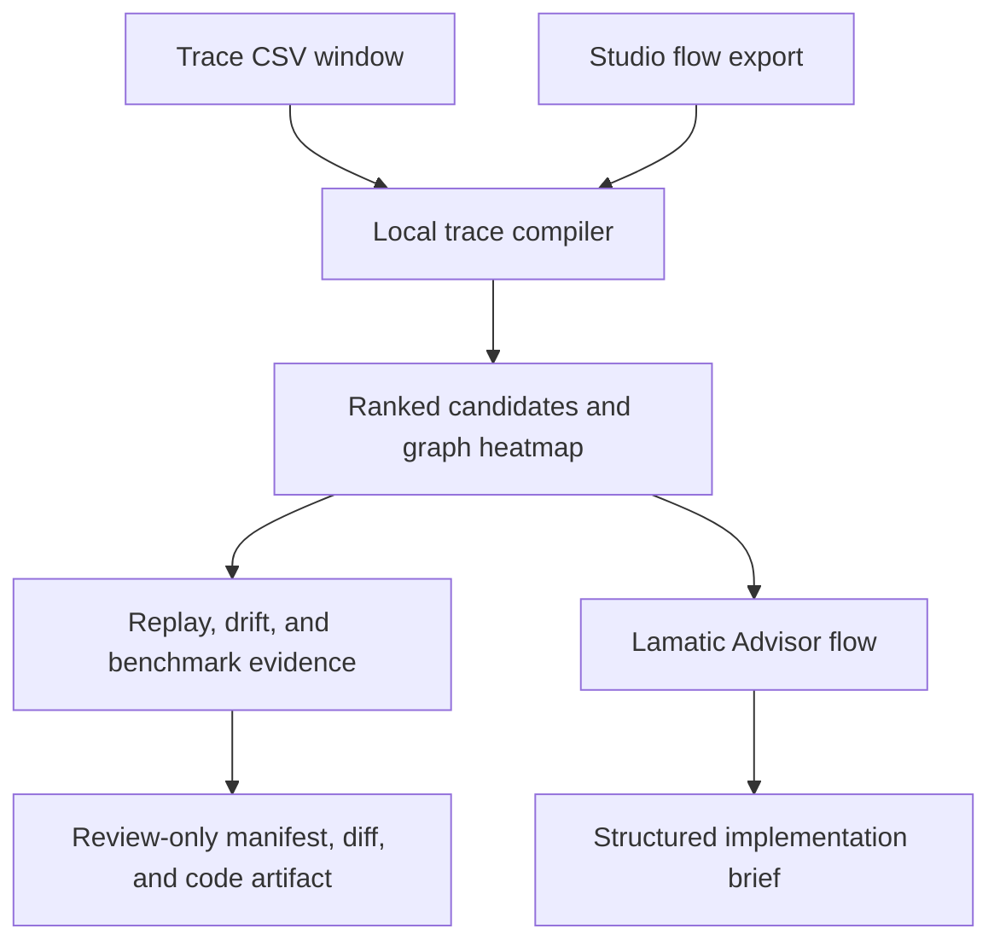

# TraceShift

TraceShift is a trace-to-flow optimization compiler for Lamatic. It joins a Lamatic trace export to the actual Studio flow graph, identifies repeated successful behavior, backtests the safest optimization, and produces a review-only change package tied to a real node ID.

It answers a question that dashboards usually leave to an engineer:

> “This flow works. Which change is supported by production evidence, and how can we test it safely?”

## What it does

TraceShift turns two ordinary Lamatic exports into an engineering decision:



- Reconstructs executions by `requestId`, even when rows arrive out of order.
- Excludes failed runs from optimization mining while keeping them in reliability metrics.
- Deduplicates exported rows by Lamatic row ID.
- Replaces raw inputs and outputs with equality and shape fingerprints.
- Maps trace node names to node IDs from a Studio TypeScript flow export.
- Draws a latency, cost, or traffic heatmap over the real flow topology.
- Ranks exact-cache, deterministic Code Node, model-rightsizing, and reusable-subflow candidates.
- Scores confidence from sample size, Wilson lower bounds, output stability, data coverage, and explicit blockers.
- Replays exact-input caching chronologically against historical calls and rejects output mismatches.
- Compares baseline and current trace windows for latency, cost, path, and node drift.
- Generates a versioned optimization manifest, readable proposed diff, and cache-boundary TypeScript artifact.
- Sends only one aggregate evidence pack to a deployed Lamatic Instructor LLM for a structured review.

## Why this is different

TraceShift is not a log summarizer and it is not another failure explainer. Its unit of work is a proposed flow change backed by cross-run evidence.

| Existing AgentKit capability | Primary question | TraceShift difference |
|---|---|---|
| FlowBench | “Did my candidate flow regress before deployment?” | TraceShift discovers the candidate from already-running behavior and compiles the evidence for it. |
| Agent Failure Investigator | “Why did this failed trace fail?” | TraceShift aggregates a window, separates failures, and mines successful paths for optimization. |
| Flow Launch Auditor | “Is this flow ready to launch?” | TraceShift joins runtime measurements to the exported Studio graph and targets a concrete node ID. |

The main differentiator is the closed evidence loop:

**observed trace pattern → mapped Studio node → historical replay → confidence gates → reviewable patch package**

## Proof included in the kit

The dashboard opens with a synthetic, Lamatic-shaped two-window dataset and a matching Studio-shaped flow export. No account or key is needed to inspect the deterministic compiler.

| Evidence | Built-in result |
|---|---|
| Trace window | 154 rows, 32 requests, 29 successful and 3 failed |
| Dominant successful path | 24 runs |
| Exact-cache target | `Catalog Lookup` |
| Historical calls / exact keys | 24 / 4 |
| Cache replay | 20 hits, 4 misses, 0 output mismatches |
| Historical node time | 42.0s before, 7.1s replayed |
| Measured replay saving | 34.9s in the selected historical window |
| Current-window drift | Synthetic `Draft Answer` latency and cost regression for comparison |

The 34.9-second result is a chronological historical simulation using a declared 5ms cache lookup cost. It is not presented as a production deployment result. The separate CPU benchmark executes the same deterministic workload before and after exact-input caching and verifies 100% output agreement; its timings are measured on the reviewer’s machine.

## Deterministic compiler vs. Lamatic judgment

| Local deterministic TypeScript | Lamatic Instructor LLM |
|---|---|
| CSV parsing, validation, deduplication, grouping | Concise recommendation wording |
| Graph-export parsing and trace-to-node mapping | Risk framing from supplied evidence |
| Path, latency, token, cost, and drift calculations | Engineer-readable rationale |
| Statistical confidence and cache replay gates | Validation-plan refinement |
| Manifest, proposed diff, and code artifact generation | Structured implementation brief |

The model cannot create measurements, select hidden raw data, mutate a flow, import a patch, or deploy anything.

## Use it

1. In Lamatic Studio, export a trace window from **Logs → Traces → Export CSV**.
2. Export the matching flow as TypeScript from Studio.
3. Open TraceShift and upload the trace CSV. Parsing stays in the browser.
4. Upload the flow export to map observed behavior to the topology and real node IDs.
5. Select a ranked candidate and inspect its confidence reasons and blockers.
6. For an exact-cache candidate, inspect the chronological replay gates and measured result.
7. Optionally upload an earlier CSV as the baseline window to see drift.
8. Download the manifest, proposed diff, and code artifact for engineering review.
9. Ask the Lamatic Advisor for the structured recommendation and rollback plan.

## Input support

TraceShift recognizes current camelCase Lamatic fields and common snake_case aliases.

| Field | Use |
|---|---|
| `id` | Optional row deduplication key |
| `requestId` | Required execution grouping key |
| `execution_type`, `event_message` | Span classification with descriptive-message fallback |
| `timestamp` | Orders node spans within each execution |
| `status`, `severity_text` | Outcome classification |
| `workflowName`, `nodeName`, `nodeId`, `nodeSlug` | Flow, path, and node aggregation |
| `timeTakenSeconds` | Latency evidence |
| `model_usage`, `model_cost` | Token and cost evidence when available |
| `input`, `output` | Local equality and shape fingerprints; raw values are not retained |

Trace CSV uploads are limited to 5 MB and 100,000 rows. Studio flow exports are limited to 2 MB and parsed as JSON-compatible exported arrays without `eval` or dynamic module execution.

## Run locally

```bash
cd kits/traceshift/apps
cp .env.example .env.local
npm install
npm run dev
```

Open `http://localhost:3000`. The compiler, replay, drift analysis, artifacts, and benchmark work with the built-in proof set without Lamatic credentials.

To enable the proposal reviewer, configure:

| Variable | Source |
|---|---|
| `LAMATIC_API_KEY` | Lamatic Studio → Settings → API Keys |
| `LAMATIC_PROJECT_ID` | Lamatic Studio → Settings → Project |
| `LAMATIC_API_URL` | Lamatic Studio → API Docs → Endpoint |
| `TRACESHIFT_ADVISOR_FLOW_ID` | Deployed `trace-shift-advisor` flow details |
| `TRACESHIFT_ADVISOR_ACCESS_TOKEN` | A random secret of at least 20 characters; reviewers enter it before calling the paid Advisor |
| `TRACESHIFT_ADVISOR_RATE_LIMIT` | Optional per-instance requests per caller per minute; defaults to `6` |

Import or recreate `flows/trace-shift-advisor.ts`, choose the Groq `openai/gpt-oss-120b` credential for the Instructor LLM node, and deploy it. The deterministic dashboard remains public, while the credentialed Advisor action requires the access token and enforces a server-side request quota.

### Vercel note

Set the Vercel project Root Directory to `kits/traceshift/apps`. Because the required `lamatic.config.ts` is one directory above the app, also enable **Include source files outside of the Root Directory** in the project’s Build Step settings. Vercel exposes that option in the dashboard rather than `vercel.json`; `apps/next.config.mjs` already gives Turbopack the matching parent root.

## Reproduce the evidence

```bash
cd kits/traceshift/apps
npm test
npm run benchmark
npm run lint
npm run build
```

The test suite covers analysis, cache replay, confidence math, drift, graph parsing and mapping, artifact generation, the real workload benchmark, duplicate rows, out-of-order spans, multi-flow windows, malformed inputs, and untrusted content.

## Generated change package

The compiler downloads three complementary artifacts:

- `traceshift-optimization-manifest.json`: versioned evidence, target flow fingerprint, target node ID, gates, and approval state;
- `traceshift-proposed-flow.diff`: a readable review summary of the proposed operation and replay evidence; and
- `traceshift-cache-boundary.ts`: a portable exact-input cache boundary with canonical keys and fallback to the original node.

These artifacts are deliberately marked `importReady: false` and `approvalRequired: true`. They are inputs to implementation and review, not a hidden deployment mechanism.

## Safety and privacy

- Raw CSV and flow parsing happen in the browser.
- Reports retain fingerprints and aggregates, not raw node payloads.
- Trace text is treated as untrusted data, never as instructions.
- Only the selected aggregate evidence pack reaches the Advisor flow.
- The paid Advisor endpoint requires an app-owner access token and applies a server-side request quota.
- Cache proposals fail closed on historical output mismatches.
- Scenario estimates, replay measurements, and live benchmark measurements have separate labels.
- Generated patches require equivalence testing, rollback conditions, and human approval.
- TraceShift never edits, imports, deploys, or rolls back a production flow.

## Deliberate limits

- TraceShift analyzes selected CSV windows rather than connecting directly to the live Logs API.
- Fingerprint equality proves observed byte-level structure after normalization, not semantic equivalence.
- Historical replay is evidence for a shadow test, not authorization to cache in production.
- Model-rightsizing remains a hypothesis until an evaluation and canary are run.
- Subflow extraction claims maintainability value only; it does not claim automatic performance savings.
- Generated code still needs adaptation to the target flow’s storage, TTL, invalidation, and tenant boundaries.

## Author

Bhavya Bafna — [@bhavyabafnaa](https://github.com/bhavyabafnaa)
