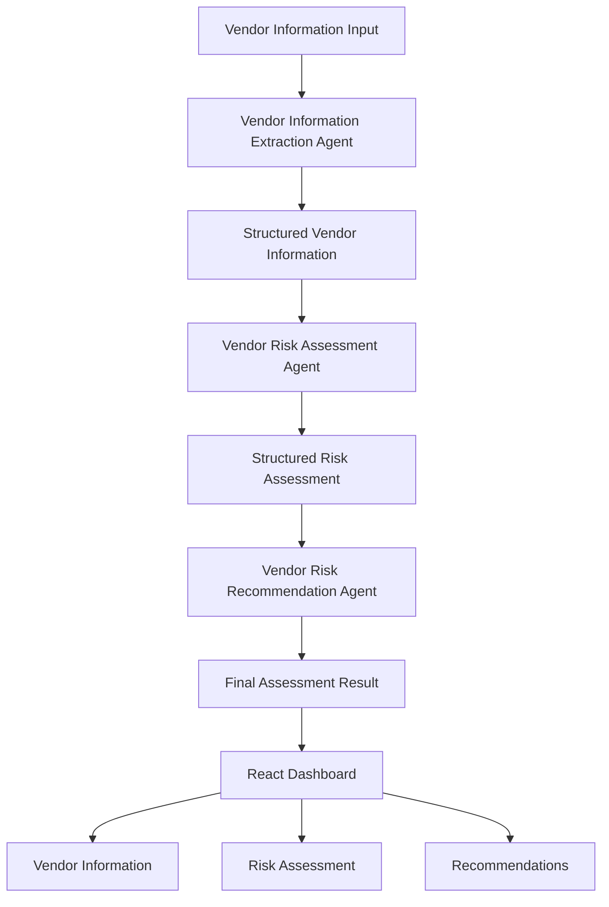
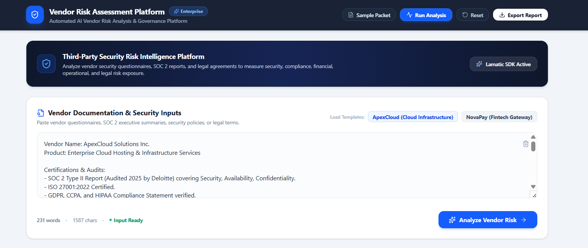
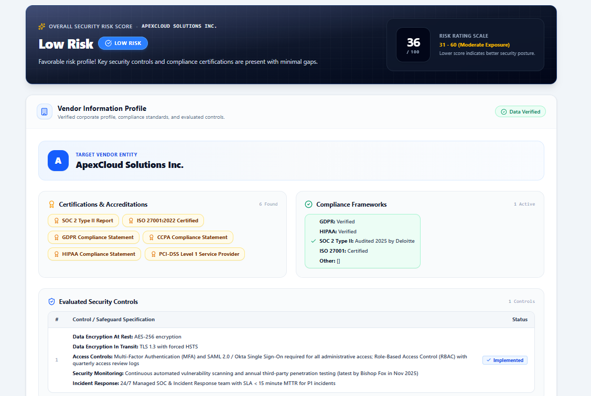
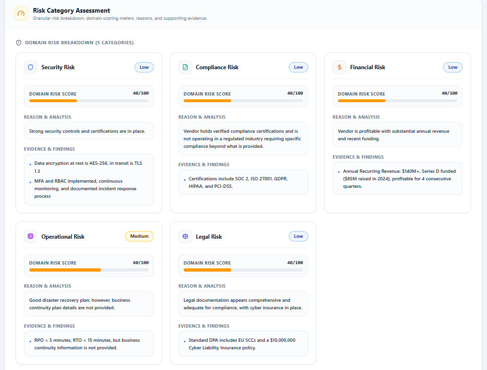
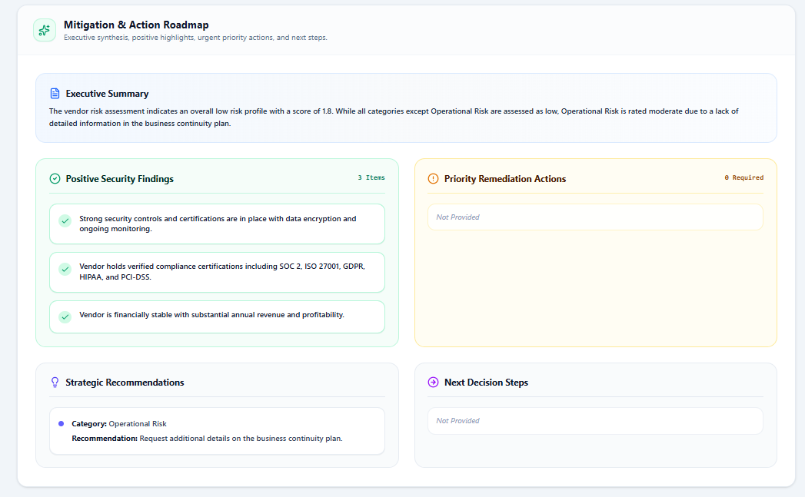

# 🛡️ Vendor Risk Assessment Agent (AgentKit)

<p align="center">


</p>

## AgentKit Overview

This AgentKit provides an enterprise-ready multi-agent workflow for third-party vendor due diligence.

The kit contains:

- Lamatic workflow definitions
- Prompt templates
- Model configurations
- Constitutions
- A React dashboard for interacting with the workflow

The workflow consists of three AI agents:

1. Vendor Information Extraction
2. Vendor Risk Assessment
3. Recommendation Generation

An AI-powered Vendor Risk Assessment platform built using **Lamatic AgentKit**. The application analyzes unstructured vendor security questionnaires, extracts key vendor information, evaluates risk across multiple categories, and generates enterprise-ready recommendations through a multi-agent AI workflow.

Designed for enterprise third-party risk management, the system demonstrates how multiple AI agents can collaborate to automate vendor due diligence while maintaining structured, explainable outputs.

---

## 🚀 Demo

**🌐 Live Application:**

https://vendor-risk-assessment-agent.vercel.app/

**Github Repository**

https://github.com/Rishabh150102/vendor-risk-assessment-agent


---

## ✨ Features

- 🤖 Multi-Agent AI workflow powered by Lamatic AgentKit
- 📄 Intelligent extraction of vendor information from unstructured text
- 🔒 Security risk assessment based on enterprise security controls
- 📋 Compliance evaluation with industry-aware logic
- 💰 Financial risk analysis
- ⚙️ Operational risk analysis
- ⚖️ Legal risk assessment
- 📈 Overall vendor risk scoring
- 💡 AI-generated enterprise recommendations
- 🎨 Modern responsive dashboard
- ⚡ Real-time analysis with loading indicators
- 🧩 Structured JSON outputs for every agent

---

## 🏗️ Architecture



## 🤖 AI Workflow

The application uses a three-stage AI workflow built with Lamatic AgentKit.

### Agent 1 — Vendor Information Extraction

Extracts structured vendor information from the user's input, including:

- Vendor details
- Security controls
- Compliance information
- Financial information
- Operational information
- Legal information

### Agent 2 — Vendor Risk Assessment

Analyzes the structured vendor data and evaluates:

- Security Risk
- Compliance Risk
- Financial Risk
- Operational Risk
- Legal Risk

The agent generates an overall risk score and provides evidence for every decision.

### Agent 3 — Recommendation Agent

Generates business-focused recommendations based on the assessed risks, including:

- Executive Summary
- Positive Findings
- Priority Actions
- Recommendations
- Next Steps

---

## 🔄 How It Works

1. Enter vendor information into the application.
2. The Vendor Information Extraction Agent converts the unstructured text into structured JSON.
3. The Risk Assessment Agent evaluates the vendor across:
   - Security
   - Compliance
   - Financial
   - Operational
   - Legal
4. The Recommendation Agent generates business-focused recommendations based on the assessed risks.
5. The dashboard displays the complete assessment in an easy-to-read format.

---

## 🛠️ Tech Stack

### Frontend

- React 19
- TypeScript
- Vite
- Tailwind CSS

### AI & Orchestration

- Lamatic AgentKit
- OpenAI GPT-4o-mini

### Frontend

- React 19
- TypeScript
- Vite
- Tailwind CSS

### Deployment

- Vercel

### Version Control

- Git
- GitHub

---

## ⚙️ Installation

```bash
git clone https://github.com/Rishabh150102/vendor-risk-assessment-agent.git

cd vendor-risk-assessment-agent

npm install

npm run dev
```

---

## 🔑 Environment Variables

Create a `.env` file in the project root.

```env
VITE_LAMATIC_PROJECT_ENDPOINT=

VITE_LAMATIC_PROJECT_ID=

VITE_LAMATIC_PROJECT_API_KEY=

VITE_LAMATIC_FLOW_ID=
```

---

## AgentKit Structure

```text
vendor-risk-assessment-agent/
├── apps/
├── flows/
├── prompts/
├── model-configs/
├── constitutions/
├── lamatic.config.ts
├── agent.md
└── README.md
```

---

## 📂 Project Structure

```
src/
 ├── components/
 ├── hooks/
 ├── lib/
 ├── services/
 ├── types/
 ├── App.tsx
 └── main.tsx

public/

package.json

vite.config.ts
```

---

## 📸 Screenshots

### Home



### Vendor Information



### Risk Assessment



### Recommendations



---

## 📝 Example Input

```text
Vendor Name: Acme Corporation

SOC 2 Type II

ISO 27001

AES-256

TLS 1.3

RBAC

MFA

99.99% uptime

GDPR Compliant
```

---

## 🚀 Future Improvements

- PDF Upload Support
- DOCX Upload Support
- Assessment History
- Export Report as PDF
- Authentication
- Vendor Comparison

---

## 🤝 Contributing

Contributions, issues, and feature requests are welcome.

Feel free to fork the repository and submit a pull request.

---

## 📄 License

This project is licensed under the MIT License. 