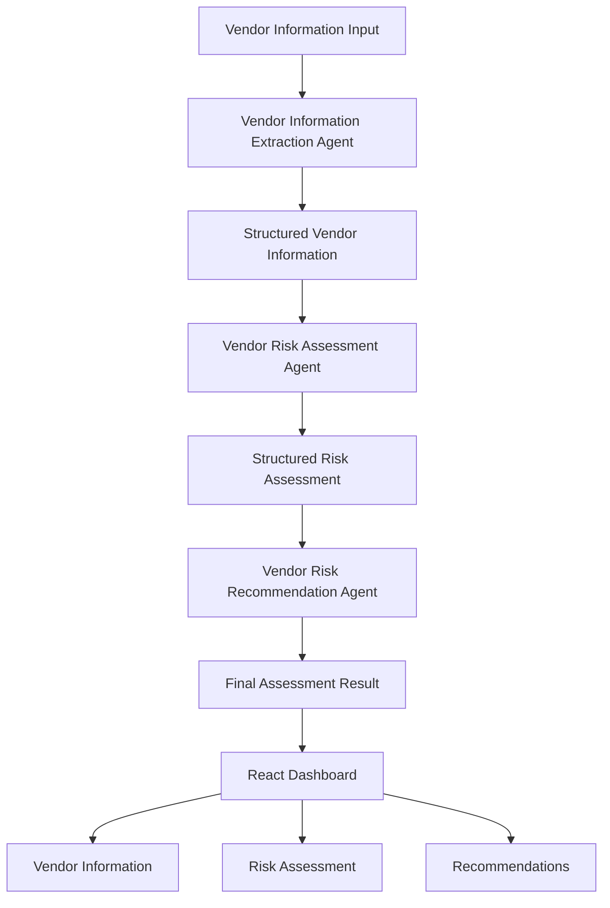

# 🛡️ Vendor Risk Assessment Agent (AgentKit)

<p align="center">


</p>

---

# AgentKit Overview

This AgentKit provides an enterprise-ready multi-agent workflow for third-party vendor due diligence.

The kit contains:

- Lamatic workflow definitions
- Prompt templates
- Model configurations
- Constitutions
- React dashboard for interacting with the workflow

The workflow consists of three AI agents:

1. Vendor Information Extraction
2. Vendor Risk Assessment
3. Recommendation Generation

The application transforms unstructured vendor questionnaires into structured vendor information, evaluates enterprise risk across multiple domains, and generates actionable business recommendations using a multi-agent AI workflow.

Designed for enterprise Third-Party Risk Management (TPRM), this project demonstrates how multiple AI agents can collaborate while maintaining structured, explainable outputs.

---

# 🚀 Demo

### 🌐 Live Application

https://vendor-risk-assessment-agent.vercel.app/

### GitHub Repository

https://github.com/Rishabh150102/vendor-risk-assessment-agent

---

# ✨ Features

- 🤖 Multi-Agent workflow powered by Lamatic AgentKit
- 📄 Intelligent extraction of vendor information
- 🔒 Security Risk Assessment
- 📋 Compliance Risk Assessment
- 💰 Financial Risk Assessment
- ⚙️ Operational Risk Assessment
- ⚖️ Legal Risk Assessment
- 📈 Overall Vendor Risk Score
- 💡 AI-generated enterprise recommendations
- 🎨 Modern responsive dashboard
- ⚡ Real-time analysis
- 🧩 Structured JSON outputs from every agent

---

# 🏗️ Architecture



---

# 🤖 AI Workflow

## Agent 1 — Vendor Information Extraction

Extracts structured vendor information including:

- Vendor Details
- Security Controls
- Compliance Information
- Financial Information
- Operational Information
- Legal Information

---

## Agent 2 — Vendor Risk Assessment

Evaluates:

- Security Risk
- Compliance Risk
- Financial Risk
- Operational Risk
- Legal Risk

Generates:

- Overall Risk Score
- Risk Categories
- Supporting Evidence
- Assessment Reasoning

---

## Agent 3 — Recommendation Agent

Generates:

- Executive Summary
- Positive Findings
- Priority Actions
- Recommendations
- Next Steps

---

# 🔄 How It Works

1. User enters vendor information.
2. Vendor Information Extraction Agent converts the input into structured JSON.
3. Vendor Risk Assessment Agent evaluates the vendor across Security, Compliance, Financial, Operational and Legal domains.
4. Recommendation Agent generates business-focused recommendations.
5. React dashboard displays the complete assessment.

---

# 🛠️ Tech Stack

## Frontend

- React 19
- TypeScript
- Vite
- Tailwind CSS

## AI & Orchestration

- Lamatic AgentKit
- OpenAI GPT-4o-mini

## Deployment

- Vercel

## Version Control

- Git
- GitHub

---

# ⚙️ Installation

Clone the AgentKit repository and navigate to the Vendor Risk Assessment Agent application.

```bash
git clone https://github.com/Rishabh150102/Lamatic-AgentKit.git

cd Lamatic-AgentKit/kits/vendor-risk-assessment-agent/apps

npm install

npm run dev
```

---

# 🔑 Environment Variables

Create a `.env` file inside the `apps/` directory.

```env
VITE_LAMATIC_PROJECT_ENDPOINT=

VITE_LAMATIC_PROJECT_ID=

VITE_LAMATIC_PROJECT_API_KEY=

VITE_LAMATIC_FLOW_ID=
```

---

# 📂 AgentKit Structure

```text
vendor-risk-assessment-agent/
├── apps/
├── flows/
├── prompts/
├── model-configs/
├── constitutions/
├── lamatic.config.ts
├── agent.md
└── README.md
```

---

# 📂 Application Structure

```text
apps/
├── src/
│   ├── components/
│   ├── data/
│   ├── App.tsx
│   ├── main.tsx
│   ├── types.ts
│   └── utils.ts
├── assets/
├── screenshot/
├── package.json
├── vite.config.ts
└── tsconfig.json
```

---

# 📸 Screenshots

## Home


## Vendor Information


## Risk Assessment


## Recommendations


---

# 📝 Example Input

```text
Vendor Name: Acme Corporation

SOC 2 Type II
ISO 27001

AES-256
TLS 1.3

RBAC
MFA

99.99% uptime

GDPR Compliant
```

---

# 🚀 Future Improvements

- PDF Upload Support
- DOCX Upload Support
- Assessment History
- Export Report as PDF
- Authentication
- Vendor Comparison

---

# 🤝 Contributing

Contributions, issues, and feature requests are welcome.

Please fork the repository and submit a Pull Request.

---

# 📄 License

This project is submitted as part of the Lamatic AgentKit contribution and follows the licensing terms of the AgentKit repository.